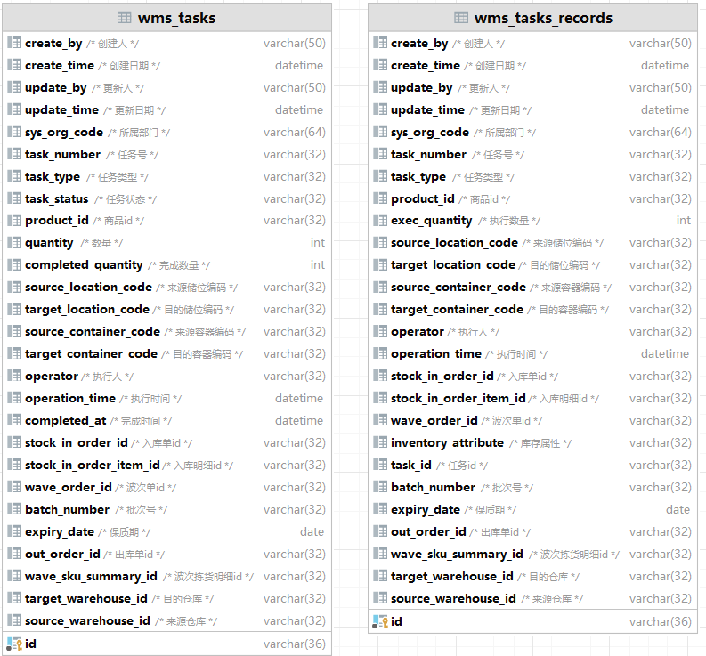
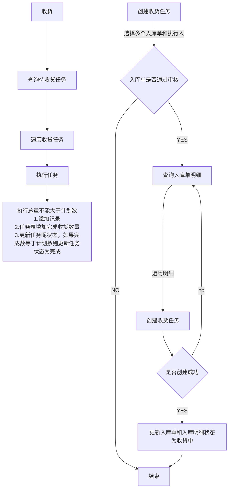

# 收货管理
## 表设计
收货有收货任务，上架有上架任务，拣货有拣货任务，每次任务的执行需要记录任务的执行结果，这里将不同的任务抽取成统一的任务表与任务记录表。

**任务表**：记录了收货任务、上架任务、拣货任务的信息

**任务记录表**：记录了在收货、上架、拣货任务的执行记录。

任务与任务记录关系：一对多

举例：一个收货任务可能会分多次收货，同样一个上架任务也可以分多次上架

```mermaid
flowchart TD

    A[创建收货任务]-->|选择多个入库单和执行人|B{入库单是否通过审核}-->|YES|C[查询入库单明细]

    B--------->|NO|D[结束]

    C-->|遍历明细|e[创建收货任务]-->f{是否创建成功}----->|no|C

    f-->|YES|g[更新入库单和入库明细状态为收货中]-->D

    a1[收货]-->b1[查询待收货任务]-->c1[遍历收货任务]-->d1[执行任务]-->d2[执行总量不能大于计划数<br>1.添加记录<br>2.任务表增加完成收货数量<br>3.更新任务呢状态，如果完成数等于计划数则更新任务状态为完成]
```