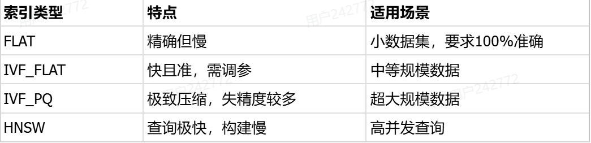

# 基础题

## 1. Python的基本数据类型和数据容器

   基本类型：int（整数）、float（浮点)、Str(字符串)、bool（布尔）

   数据容器：list（列表）、tuple（元组）、set（集合）、dict（字典）、None类型

## 2. 接收参数时，\* args 和 \* \* kwargs的区别？

   \*args:接收任意数量的非关键字参数并打包为元组。

   \*\*kwargs：接收任意数量的关键字参数并打包为字典。

## 3. Python这块有用什么框架吗？web框架用了吗？

   Python这块，我们项目中有用到很多框架。比如LangChain和LangGraph，主要用来与AI大模型平台对接。Web框架选用FastAPI进行接口开发，以供业务系统调用。
   
## 4. 简述一下向量数据库的原理和支持的索引结构。
向量数据库的核心原理就是将文本图像这类非结构化数据转化为高维空间中的向量。通常情况下，语义相似的内容在向量空间内距离更近。检索时采用ANN快速近似最近邻搜索，可通过构建索引结构，快速定位候选集以选出top-k。

有以下四种索引结构：

相似度检索本质上是寻找语义相似的结果，核心思想是通过将数据转化为高维向量，通过计算向量间数学距离来衡量相似性。
原理是：选择相似度量方法后通过一个向量模型将数据转化为向量。检索时，先进行索引加速，在执行查询。