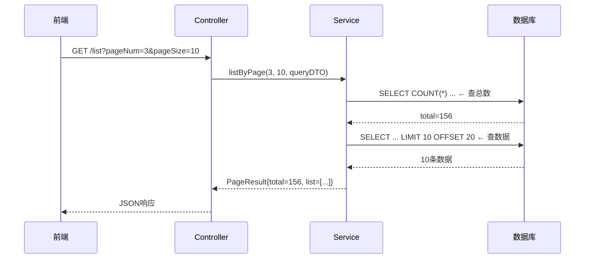
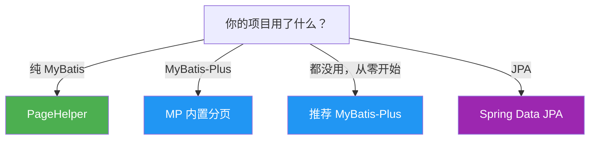
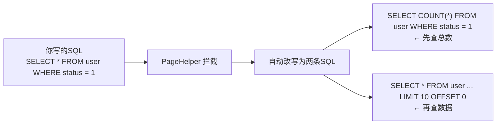
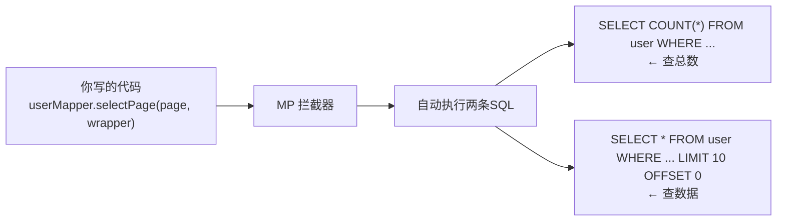
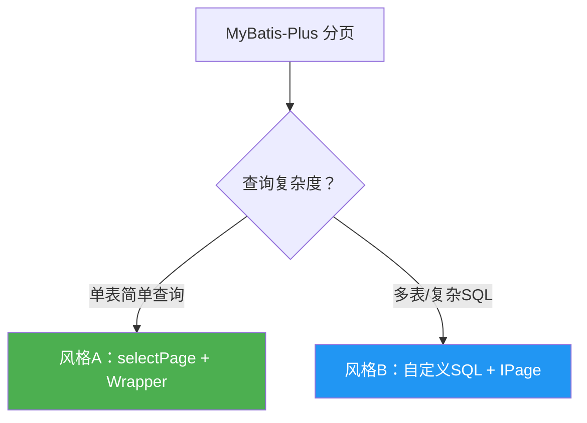
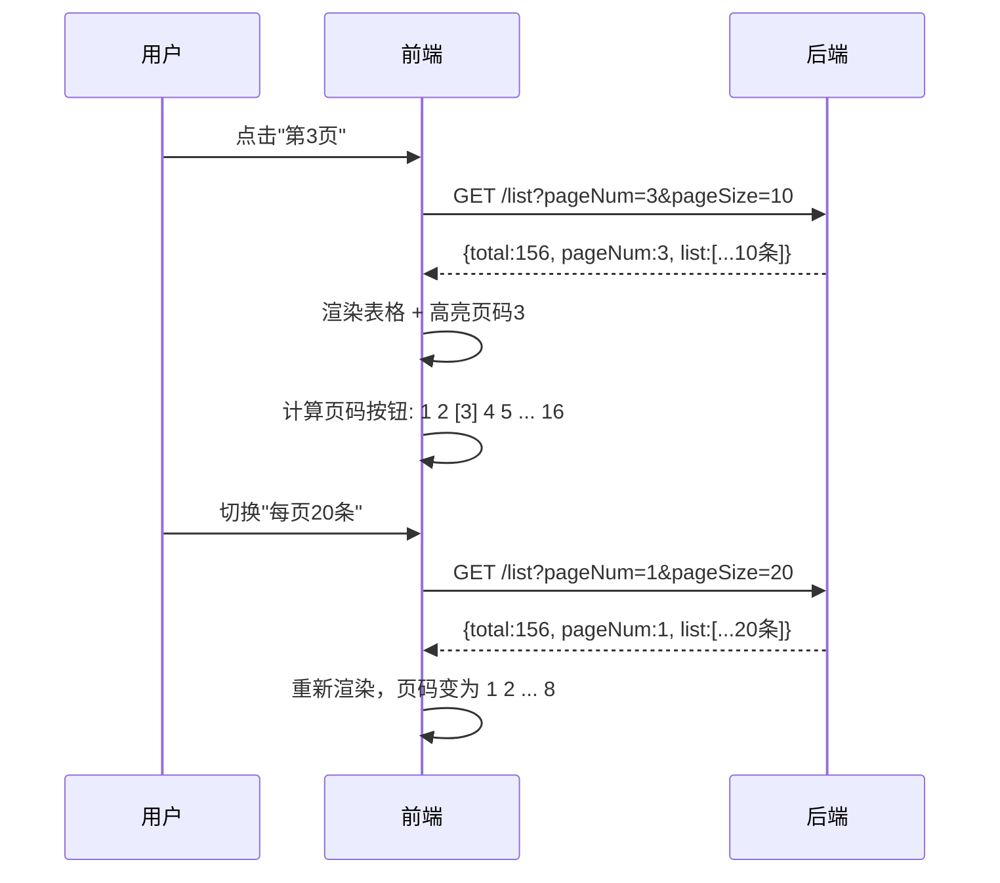
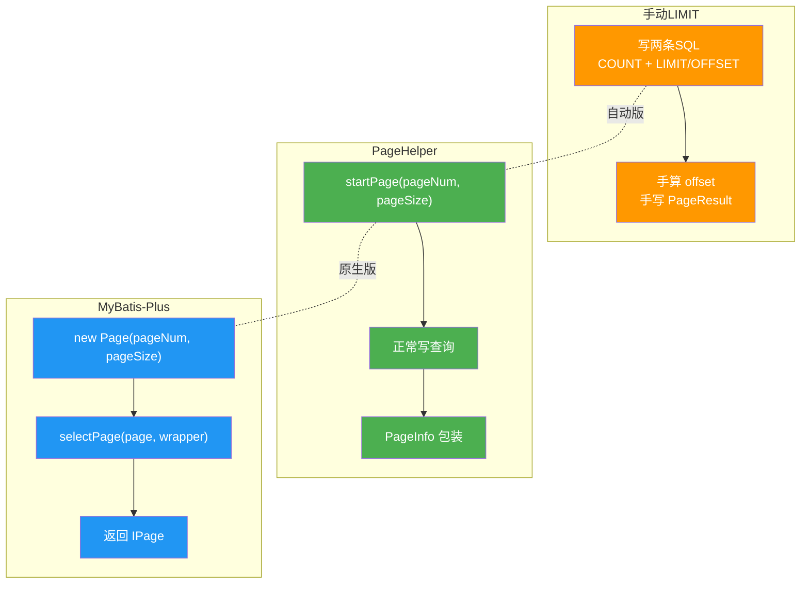

# Spring Boot 分页查询完全指南

> 深入浅出，覆盖手动分页 + PageHelper + MyBatis-Plus 三大方案，从原理到实战

---

## 一、先搞懂：分页到底在做什么？

> [!tip] 为什么必须分页？
> 一张表 10 万条数据，不分页直接查——**内存炸了、前端卡了、数据库慢了**。分页就是只取你需要的那一页，而不是全部。

### 1.1 生活中的分页

你翻书——一本书 500 页，你不会一次性读完，而是一页一页翻。

数据库也一样：一张表 10 万条数据，不可能一次性全查出来，否则：
- **内存炸了**：10 万个对象塞进 JVM
- **前端卡了**：10 万行数据渲染到浏览器
- **数据库慢了**：一次性查 10 万条，IO 压力巨大

### 1.2 分页的本质

分页就是回答两个问题：

| 问题          | SQL 表达      | Java 表达                             |
| ----------- | ----------- | ----------------------------------- |
| **取多少条？**   | `LIMIT 10`  | `pageSize = 10`                     |
| **从第几条开始？** | `OFFSET 20` | `pageNum = 3` → 跳过前 2 页 × 10 = 20 条 |

```sql
-- 第3页，每页10条
SELECT * FROM user ORDER BY id LIMIT 10 OFFSET 20;
```

### 1.3 分页查询的三个核心参数

```
请求参数（前端传过来）：
┌──────────┬────────────────────┐
│ pageNum  │ 当前第几页（从1开始）│
│ pageSize │ 每页多少条          │
└──────────┴────────────────────┘

响应数据（后端返回）：
┌──────────┬────────────────────┐
│ list     │ 当前页的数据列表     │
│ total    │ 总条数（用于算总页数）│
│ pages    │ 总页数              │
└──────────┴────────────────────┘
```

> **为什么要返回 total？** 前端需要根据 total 计算总页数来渲染分页组件：`总页数 = ceil(total / pageSize)`

### 1.4 分页执行流程



---

## 二、方案全景图

```
Spring Boot 分页方案
├── 手动 LIMIT（最原始，理解原理用，不推荐生产）
├── PageHelper（MyBatis 生态最主流）
├── MyBatis-Plus 内置分页（MyBatis-Plus 项目首选）
└── Spring Data JPA（JPA 项目用，本文不展开）
```

| 方案 | 适用场景 | 侵入性 | 学习成本 |
|------|---------|--------|---------|
| 手动 LIMIT | 理解原理 | 无 | 最低 |
| PageHelper | MyBatis 项目 | 低（插件式） | 低 |
| MyBatis-Plus 分页 | MyBatis-Plus 项目 | 无（内置） | 低 |
| Spring Data JPA | JPA 项目 | 无 | 中 |



> [!warning] 不要在同一项目中混用多种分页方案
> 虽然技术上可以共存，但维护成本高，容易出问题（比如 PageHelper 和 MP 插件同时拦截 SQL）。

---

## 三、方案零：手动 LIMIT 分页（理解原理）

### 3.1 核心思路

手动分页就两步：
1. 先查总数 → 算出总页数
2. 再用 `LIMIT + OFFSET` 查当前页数据

```sql
-- 第1步：查总数
SELECT COUNT(*) FROM user WHERE status = 1;

-- 第2步：查数据（假设第3页，每页10条）
SELECT * FROM user WHERE status = 1 ORDER BY id LIMIT 10 OFFSET 20;
```

### 3.2 完整代码示例

#### Mapper 层

```java
@Mapper
public interface UserMapper {

    // 查总数
    int selectCount(@Param("query") UserQueryDTO queryDTO);

    // 查分页数据
    List<UserVO> selectPageList(@Param("query") UserQueryDTO queryDTO,
                                @Param("offset") int offset,
                                @Param("pageSize") int pageSize);
}
```

#### Mapper XML

```xml
<!-- 查总数 -->
<select id="selectCount" resultType="int">
    SELECT COUNT(*) FROM user
    <where>
        <if test="query.username != null and query.username != ''">
            AND username LIKE CONCAT('%', #{query.username}, '%')
        </if>
        <if test="query.status != null">
            AND status = #{query.status}
        </if>
    </where>
</select>

<!-- 查分页数据 -->
<select id="selectPageList" resultType="com.example.vo.UserVO">
    SELECT id, username, email, status, create_time AS createTime
    FROM user
    <where>
        <if test="query.username != null and query.username != ''">
            AND username LIKE CONCAT('%', #{query.username}, '%')
        </if>
        <if test="query.status != null">
            AND status = #{query.status}
        </if>
    </where>
    ORDER BY create_time DESC
    LIMIT #{pageSize} OFFSET #{offset}
</select>
```

#### Service 层

```java
@Service
public class UserServiceImpl implements UserService {

    @Autowired
    private UserMapper userMapper;

    @Override
    public PageResult<UserVO> listByPage(Integer pageNum, Integer pageSize, UserQueryDTO queryDTO) {
        // 1. 参数防御
        if (pageNum == null || pageNum < 1) pageNum = 1;
        if (pageSize == null || pageSize < 1) pageSize = 10;
        if (pageSize > 100) pageSize = 100;

        // 2. 查总数
        int total = userMapper.selectCount(queryDTO);

        // 3. 算偏移量：offset = (pageNum - 1) * pageSize
        int offset = (pageNum - 1) * pageSize;

        // 4. 查当前页数据
        List<UserVO> list = userMapper.selectPageList(queryDTO, offset, pageSize);

        // 5. 封装结果
        return PageResult.of(total, pageNum, pageSize, list);
    }
}
```

#### PageResult 封装

```java
@Data
public class PageResult<T> {
    private Long total;       // 总条数
    private Integer pages;    // 总页数
    private Integer pageNum;  // 当前页
    private Integer pageSize; // 每页条数
    private List<T> list;     // 数据列表

    public static <T> PageResult<T> of(long total, int pageNum, int pageSize, List<T> list) {
        PageResult<T> result = new PageResult<>();
        result.setTotal(total);
        result.setPageNum(pageNum);
        result.setPageSize(pageSize);
        result.setPages((int) Math.ceil((double) total / pageSize));
        result.setList(list);
        return result;
    }
}
```

### 3.3 手动分页的问题

> [!danger] 为什么不推荐生产使用？

| 问题           | 说明                                                    |
| ------------ | ----------------------------------------------------- |
| **SQL 重复**   | 查总数和查数据的 WHERE 条件要写两遍，容易不一致                           |
| **容易算错**     | offset 计算手写，一不小心就翻车                                   |
| **COUNT 性能** | 没有优化手段，大数据量直接卡死                                       |
| **方言不通用**    | MySQL 用 `LIMIT/OFFSET`，Oracle 用 `ROWNUM`，换个数据库 SQL 全改 |

> [!tip] 理解了手动分页，你就能秒懂 PageHelper 和 MP 分页
> 它们本质上就是**帮你自动完成了上面这几步**：自动算 offset、自动拼 LIMIT、自动查 COUNT。

---

## 四、方案一：PageHelper（MyBatis 生态）

<iframe src="//player.bilibili.com/player.html?bvid=BV19V411B7en&page=1" width="100%" height="500" scrolling="no" border="0" frameborder="no" framespacing="0" allowfullscreen="true"> </iframe>

> [!info] 视频教程：Spring Boot 整合 PageHelper 实现分页

### 4.1 原理

PageHelper 是一个 **MyBatis 拦截器插件**，它的工作流程：



**核心机制**：利用 MyBatis 的 `Interceptor` 机制，在 SQL 执行前拦截，自动拼接 `LIMIT` 和 `OFFSET`，并额外执行一条 `COUNT` 查询。

> [!tip] 对比手动分页
> 回顾第三节的手动分页，PageHelper 帮你做了完全一样的事，只是**自动化**了——你不用写 COUNT、不用算 offset、不用拼 LIMIT。

### 4.2 引入依赖

```xml
<!-- PageHelper Spring Boot Starter -->
<dependency>
    <groupId>com.github.pagehelper</groupId>
    <artifactId>pagehelper-spring-boot-starter</artifactId>
    <version>2.1.0</version>
</dependency>
```

> `pagehelper-spring-boot-starter` 会自动配置，无需手动注册插件。

### 4.3 配置（可选）

```yaml
# application.yml
pagehelper:
  helper-dialect: mysql        # 数据库方言，可选 mysql/oracle/postgresql 等
  reasonable: true             # 合理化：pageNum<1 查第一页，pageNum>总页数查最后一页
  support-methods-arguments: true  # 支持通过 Mapper 接口参数传递分页参数
```

### 4.4 核心用法：3 步走

```java
// 第1步：设置分页参数（必须在查询之前调用）
PageHelper.startPage(pageNum, pageSize);

// 第2步：正常写查询（不要自己加 LIMIT，PageHelper 会自动加）
List<User> list = userMapper.selectList(queryDTO);

// 第3步：包装成分页结果
PageInfo<User> pageInfo = new PageInfo<>(list);
```

**就这么简单！** PageHelper 自动帮你做了两件事：
1. 把你的 SQL 拼上了 `LIMIT ? OFFSET ?`
2. 额外执行了一条 `SELECT COUNT(*)` 获取总条数

> [!warning] startPage 必须紧跟查询
> `PageHelper.startPage()` 通过 ThreadLocal 存储，**只对紧接的第一条查询生效**。中间插了其他查询，分页会作用到错误的方法上。

### 4.5 完整代码示例

#### DTO：查询条件

```java
@Data
public class UserQueryDTO {
    private String username;   // 模糊搜索
    private Integer status;    // 精确匹配
    private String startTime;  // 创建时间范围-起
    private String endTime;    // 创建时间范围-止
}
```

#### VO：返回给前端的数据

```java
@Data
public class UserVO {
    private Long id;
    private String username;
    private String email;
    private Integer status;
    private String createTime;
}
```

#### Controller 层

```java
@RestController
@RequestMapping("/user")
public class UserController {

    @Autowired
    private UserService userService;

    /**
     * 分页查询用户列表
     * @param pageNum  当前页码，默认1
     * @param pageSize 每页条数，默认10
     * @param queryDTO 查询条件
     */
    @GetMapping("/list")
    public Result<PageInfo<UserVO>> list(
            @RequestParam(defaultValue = "1") Integer pageNum,
            @RequestParam(defaultValue = "10") Integer pageSize,
            UserQueryDTO queryDTO) {
        PageInfo<UserVO> page = userService.listByPage(pageNum, pageSize, queryDTO);
        return Result.success(page);
    }
}
```

#### Service 层

```java
public interface UserService {
    PageInfo<UserVO> listByPage(Integer pageNum, Integer pageSize, UserQueryDTO queryDTO);
}
```

```java
@Service
public class UserServiceImpl implements UserService {

    @Autowired
    private UserMapper userMapper;

    @Override
    public PageInfo<UserVO> listByPage(Integer pageNum, Integer pageSize, UserQueryDTO queryDTO) {
        // 1. 参数防御
        if (pageNum == null || pageNum < 1) pageNum = 1;
        if (pageSize == null || pageSize < 1) pageSize = 10;
        if (pageSize > 100) pageSize = 100; // 防止一次查太多

        // 2. 设置分页（必须紧挨着查询，中间不能插其他查询！）
        PageHelper.startPage(pageNum, pageSize);

        // 3. 执行查询
        List<UserVO> list = userMapper.selectList(queryDTO);

        // 4. 包装结果
        return new PageInfo<>(list);
    }
}
```

#### Mapper 层

```java
@Mapper
public interface UserMapper {
    List<UserVO> selectList(@Param("query") UserQueryDTO queryDTO);
}
```

#### Mapper XML

```xml
<?xml version="1.0" encoding="UTF-8" ?>
<!DOCTYPE mapper PUBLIC "-//mybatis.org//DTD Mapper 3.0//EN"
        "http://mybatis.org/dtd/mybatis-3-mapper.dtd">
<mapper namespace="com.example.mapper.UserMapper">

    <select id="selectList" resultType="com.example.vo.UserVO">
        SELECT id, username, email, status, create_time AS createTime
        FROM user
        <where>
            <if test="query.username != null and query.username != ''">
                AND username LIKE CONCAT('%', #{query.username}, '%')
            </if>
            <if test="query.status != null">
                AND status = #{query.status}
            </if>
            <if test="query.startTime != null and query.startTime != ''">
                AND create_time &gt;= #{query.startTime}
            </if>
            <if test="query.endTime != null and query.endTime != ''">
                AND create_time &lt;= #{query.endTime}
            </if>
        </where>
        ORDER BY create_time DESC
        <!-- 不要在这里加 LIMIT！PageHelper 会自动加 -->
    </select>

</mapper>
```

### 4.6 PageInfo 核心字段一览

```json
{
  "total": 156,
  "list": [
    { "id": 1, "username": "张三", "email": "zhangsan@qq.com", "status": 1, "createTime": "2025-01-15" }
  ],
  "pageNum": 3,
  "pageSize": 10,
  "pages": 16,
  "size": 10,
  "startRow": 21,
  "endRow": 30,
  "prePage": 2,
  "nextPage": 4,
  "isFirstPage": false,
  "isLastPage": false,
  "hasPreviousPage": true,
  "hasNextPage": true,
  "navigatePages": 8,
  "navigatepageNums": [1, 2, 3, 4, 5, 6, 7, 8]
}
```

前端最常用的字段：`total`、`list`、`pageNum`、`pageSize`、`pages`。

### 4.7 自定义分页返回（推荐）

PageInfo 字段太多，实际项目中通常只返回前端需要的：

```java
@Data
public class PageResult<T> {
    private Long total;      // 总条数
    private Integer pages;   // 总页数
    private Integer pageNum; // 当前页
    private Integer pageSize;// 每页条数
    private List<T> list;    // 数据列表

    public static <T> PageResult<T> of(PageInfo<T> pageInfo) {
        PageResult<T> result = new PageResult<>();
        result.setTotal(pageInfo.getTotal());
        result.setPages(pageInfo.getPages());
        result.setPageNum(pageInfo.getPageNum());
        result.setPageSize(pageInfo.getPageSize());
        result.setList(pageInfo.getList());
        return result;
    }
}
```

Service 中使用：

```java
PageHelper.startPage(pageNum, pageSize);
List<UserVO> list = userMapper.selectList(queryDTO);
PageInfo<UserVO> pageInfo = new PageInfo<>(list);
return PageResult.of(pageInfo);  // 返回精简版
```

---

## 五、方案二：MyBatis-Plus 内置分页

<iframe src="//player.bilibili.com/player.html?bvid=BV1TUeez7EXJ&page=1" width="100%" height="500" scrolling="no" border="0" frameborder="no" framespacing="0" allowfullscreen="true"> </iframe>

> [!info] 视频教程：MyBatis-Plus 分页封装与优化

### 5.1 原理

MyBatis-Plus 内置了分页插件 `MybatisPlusInterceptor`，原理与 PageHelper 类似，也是通过 MyBatis 拦截器改写 SQL。但它是 MyBatis-Plus 原生方案，与 MP 的其他功能配合更好。



### 5.2 引入依赖

```xml
<dependency>
    <groupId>com.baomidou</groupId>
    <artifactId>mybatis-plus-boot-starter</artifactId>
    <version>3.5.5</version>
</dependency>
```

### 5.3 配置分页插件（必须！）

```java
@Configuration
public class MybatisPlusConfig {

    /**
     * 注册分页插件
     * 不加这个配置，selectPage 不会生效！
     */
    @Bean
    public MybatisPlusInterceptor mybatisPlusInterceptor() {
        MybatisPlusInterceptor interceptor = new MybatisPlusInterceptor();
        // 添加分页插件，指定数据库类型为 MySQL
        interceptor.addInnerInterceptor(
            new PaginationInnerInterceptor(DbType.MYSQL)
        );
        return interceptor;
    }
}
```

> [!danger] 新手最常犯的错
> 忘了配这个 Bean，结果 `selectPage` 返回全部数据，分页完全没生效。这是 MP 分页排错**第一检查点**。

### 5.4 核心用法

MyBatis-Plus 分页有两种风格：**内置方法**和**自定义 SQL**。



---

#### 风格 A：使用 MP 内置方法（简单查询）

适用场景：单表查询，条件不复杂。

```java
@RestController
@RequestMapping("/user")
public class UserController {

    @Autowired
    private UserService userService;

    @GetMapping("/list")
    public Result<IPage<UserVO>> list(
            @RequestParam(defaultValue = "1") Integer pageNum,
            @RequestParam(defaultValue = "10") Integer pageSize,
            @RequestParam(required = false) String username,
            @RequestParam(required = false) Integer status) {

        IPage<UserVO> page = userService.listByPage(pageNum, pageSize, username, status);
        return Result.success(page);
    }
}
```

```java
@Service
public class UserServiceImpl extends ServiceImpl<UserMapper, User> implements UserService {

    @Override
    public IPage<UserVO> listByPage(Integer pageNum, Integer pageSize, String username, Integer status) {
        // 1. 构建分页对象（注意：页码从1开始，和JPA不同）
        Page<UserVO> page = new Page<>(pageNum, pageSize);

        // 2. 构建查询条件
        LambdaQueryWrapper<User> wrapper = new LambdaQueryWrapper<>();
        wrapper.like(StringUtils.isNotBlank(username), User::getUsername, username)
               .eq(status != null, User::getStatus, status)
               .orderByDesc(User::getCreateTime);

        // 3. 执行分页查询
        return baseMapper.selectPage(page, wrapper);
    }
}
```

> [!tip] 关键语法：条件构造器的 `condition` 参数
> ```java
> wrapper.like(StringUtils.isNotBlank(username), User::getUsername, username)
> //      ↑ 条件表达式          ↑ 只有为true才拼接这个条件
> // 等价于 MyBatis XML 中的 <if test="username != null and username != ''">
> ```

#### 风格 B：自定义 SQL + 分页（复杂查询）

适用场景：多表关联、复杂统计、需要手写 SQL。

```java
@Mapper
public interface UserMapper extends BaseMapper<User> {

    /**
     * 自定义SQL分页查询
     * 第一个参数必须是 IPage，MP 会自动识别并分页
     */
    IPage<UserVO> selectUserPage(
            IPage<UserVO> page,           // 必须是第一个参数！
            @Param("query") UserQueryDTO queryDTO
    );
}
```

```xml
<!-- Mapper XML -->
<select id="selectUserPage" resultType="com.example.vo.UserVO">
    SELECT
        u.id, u.username, u.email, u.status, u.create_time AS createTime,
        d.name AS deptName
    FROM user u
    LEFT JOIN dept d ON u.dept_id = d.id
    <where>
        <if test="query.username != null and query.username != ''">
            AND u.username LIKE CONCAT('%', #{query.username}, '%')
        </if>
        <if test="query.status != null">
            AND u.status = #{query.status}
        </if>
    </where>
    ORDER BY u.create_time DESC
    <!-- 不需要加 LIMIT，MP 自动加 -->
</select>
```

Service 层调用：

```java
@Override
public IPage<UserVO> listByPageComplex(Integer pageNum, Integer pageSize, UserQueryDTO queryDTO) {
    Page<UserVO> page = new Page<>(pageNum, pageSize);
    return userMapper.selectUserPage(page, queryDTO);
}
```

### 5.5 IPage 核心字段

```json
{
  "records": [           // 当前页数据（注意：不是 list，是 records）
    { "id": 1, "username": "张三" }
  ],
  "total": 156,          // 总条数
  "size": 10,            // 每页条数
  "current": 3,          // 当前页
  "pages": 16,           // 总页数
  "hasPrevious": true,   // 是否有上一页
  "hasNext": true        // 是否有下一页
}
```

> [!warning] PageInfo 用 list，IPage 用 records
> PageHelper 的 `PageInfo` 数据字段叫 `list`，MyBatis-Plus 的 `IPage` 数据字段叫 `records`，别搞混了！

### 5.6 统一 PageResult 封装（推荐）

两种方案都建议封装为统一的 `PageResult`，前端只需要对接一种格式：

```java
@Data
public class PageResult<T> {
    private Long total;       // 总条数
    private Integer pages;    // 总页数
    private Integer pageNum;  // 当前页
    private Integer pageSize; // 每页条数
    private List<T> list;     // 数据列表（统一叫 list）

    // 从 PageHelper 的 PageInfo 转换
    public static <T> PageResult<T> of(PageInfo<T> pageInfo) {
        PageResult<T> result = new PageResult<>();
        result.setTotal(pageInfo.getTotal());
        result.setPages(pageInfo.getPages());
        result.setPageNum(pageInfo.getPageNum());
        result.setPageSize(pageInfo.getPageSize());
        result.setList(pageInfo.getList());
        return result;
    }

    // 从 MyBatis-Plus 的 IPage 转换
    public static <T> PageResult<T> of(IPage<T> page) {
        PageResult<T> result = new PageResult<>();
        result.setTotal(page.getTotal());
        result.setPages((int) page.getPages());
        result.setPageNum((int) page.getCurrent());
        result.setPageSize((int) page.getSize());
        result.setList(page.getRecords());  // records → list
        return result;
    }
}
```

> [!tip] 一个 PageResult 适配两种方案
> 无论底层用 PageHelper 还是 MP，前端拿到的格式完全一致，切换方案时前端零改动。

---

## 六、两种方案对比与选择

| 对比项 | PageHelper | MyBatis-Plus 分页 |
|--------|-----------|-------------------|
| **适用项目** | 纯 MyBatis 项目 | MyBatis-Plus 项目 |
| **依赖** | pagehelper-spring-boot-starter | mybatis-plus-boot-starter（已内置） |
| **额外配置** | 基本无需 | 需注册 MybatisPlusInterceptor Bean |
| **使用方式** | `startPage()` + 正常查询 | `selectPage(page, wrapper)` 或自定义SQL |
| **返回类型** | `PageInfo<T>` | `IPage<T>` |
| **自定义SQL** | 零侵入，原有SQL不变 | 首参必须为 `IPage` |
| **数据字段** | `list` | `records` |
| **页码起始** | 从 1 开始 | 从 1 开始 |
| **能否共存** | 可以，但不推荐 | 可以，但不推荐 |

### 选择建议

```
你的项目用了什么？
├── 纯 MyBatis → 选 PageHelper
├── MyBatis-Plus → 选 MP 内置分页
└── 都没用，从零开始 → 推荐 MyBatis-Plus（功能更全，分页内置）
```

> [!warning] 不要在同一项目中混用两种分页方案
> 虽然技术上可以共存，但维护成本高，两个拦截器可能同时拦截 SQL 导致异常。

---

## 七、常见坑与最佳实践

### 坑1：PageHelper.startPage 和查询之间插了其他查询

```java
// ❌ 错误：中间插了别的查询，分页会作用到错误的方法上
PageHelper.startPage(1, 10);
int count = roleMapper.selectCount();    // 这条被分页了！
List<User> list = userMapper.selectList(); // 这条反而没有分页

// ✅ 正确：startPage 紧跟目标查询，中间不要有任何其他查询
PageHelper.startPage(1, 10);
List<User> list = userMapper.selectList(); // 这条被分页 ✓
```

> [!warning] ThreadLocal 机制
> `PageHelper.startPage()` 通过 `ThreadLocal` 存储分页参数，**只对紧接着的第一条查询生效**。中间插任何查询都会"吞掉"分页设置。

### 坑2：MyBatis-Plus 忘了注册分页插件

```java
// ❌ 没有配置 MybatisPlusInterceptor，selectPage 返回全部数据
// ✅ 必须加配置类注册分页插件（见 5.3 节）
```

### 坑3：页码和每页条数不校验

```java
// ❌ 前端传 pageNum=-1 或 pageSize=999999，直接进 SQL 导致异常或慢查询
// ✅ 加防御
if (pageNum == null || pageNum < 1) pageNum = 1;
if (pageSize == null || pageSize < 1) pageSize = 10;
if (pageSize > 100) pageSize = 100;
```

> [!tip] 更优雅的方式：用 JSR303 校验注解
> ```java
> public class PageRequest {
>     @Min(value = 1, message = "页码不能小于1")
>     private Integer pageNum = 1;
>
>     @Min(value = 1, message = "每页条数不能小于1")
>     @Max(value = 100, message = "每页条数不能超过100")
>     private Integer pageSize = 10;
> }
> ```
> Controller 加 `@Valid` 即可自动校验，不用手写 if。

### 坑4：自定义 SQL 分页不生效（MP）

```java
// ❌ Mapper 方法第一个参数不是 IPage
IPage<UserVO> selectUserPage(@Param("query") UserQueryDTO queryDTO);

// ✅ 第一个参数必须是 IPage 类型
IPage<UserVO> selectUserPage(IPage<UserVO> page, @Param("query") UserQueryDTO queryDTO);
```

### 坑5：COUNT 查询性能问题（大数据量）

当表数据量很大时（百万级+），`COUNT(*)` 本身就很慢。

```java
// PageHelper 方案：关闭自动 COUNT，手动优化
PageHelper.startPage(pageNum, pageSize, false); // 第3个参数 false = 不自动查 COUNT
int total = userMapper.selectCountOptimized(queryDTO); // 自己写优化的计数SQL

// MyBatis-Plus 方案：Page 对象可以设置
Page<User> page = new Page<>(pageNum, pageSize);
page.setSearchCount(false); // 关闭自动 COUNT
```

### 坑6：排序字段不要直接拼接前端传入值

> [!danger] SQL 注入风险！
> 前端传 `orderBy=status`，后端直接拼进 SQL → 攻击者可传 `orderBy=1;DROP TABLE user--`

```java
// ❌ 直接拼接，有 SQL 注入风险
String sql = "SELECT * FROM user ORDER BY " + orderBy;

// ✅ 白名单校验
private static final Set<String> ALLOWED_ORDER = Set.of("id", "create_time", "status");

public String safeOrder(String orderBy) {
    if (!ALLOWED_ORDER.contains(orderBy)) {
        return "id"; // 默认排序
    }
    return orderBy;
}
```

### 最佳实践清单

```
✅ 1.  统一分页返回格式（封装 PageResult）
✅ 2.  校验 pageNum 和 pageSize 的范围
✅ 3.  限制 pageSize 最大值（防慢查询）
✅ 4.  不要在 startPage 和查询之间插其他查询（PageHelper）
✅ 5.  注册分页插件（MP）
✅ 6.  自定义SQL首参必须为 IPage（MP）
✅ 7.  查询条件用 DTO 接收，不要用 Map
✅ 8.  返回数据用 VO，不要直接返回实体类
✅ 9.  排序字段必须明确，不要依赖数据库默认排序
✅ 10. 排序字段用白名单校验，不要直接拼接前端传入值
✅ 11. 大数据量场景关注 COUNT 性能
```

---

## 八、前端配合要点

分页不是后端的事，前端也需要配合。以下是常见的前端分页组件交互：

### 8.1 请求格式

```
GET /user/list?pageNum=2&pageSize=10&username=张&status=1
```

### 8.2 前端期望的响应格式

```json
{
  "code": 200,
  "message": "success",
  "data": {
    "total": 156,
    "pages": 16,
    "pageNum": 2,
    "pageSize": 10,
    "list": [
      { "id": 11, "username": "张三", "status": 1 }
    ]
  }
}
```

### 8.3 前端分页组件需要什么

| 前端需要 | 后端提供 | 用途 |
|---------|---------|------|
| `total` | 总条数 | 计算总页数 |
| `pageNum` | 当前页 | 高亮当前页码 |
| `pageSize` | 每页条数 | 切换每页条数 |
| `list` | 数据 | 渲染表格 |

### 8.4 前后端分页交互流程



---

## 九、快速上手模板

### 场景：你有一个 MyBatis-Plus 项目，要实现用户分页查询

**第1步**：确保已注册分页插件（5.3节）

**第2步**：定义 DTO 和 VO

```java
@Data
public class UserQueryDTO {
    private String username;
    private Integer status;
}

@Data
public class UserVO {
    private Long id;
    private String username;
    private String email;
    private Integer status;
    private String createTime;
}
```

**第3步**：Mapper

```java
@Mapper
public interface UserMapper extends BaseMapper<User> {
    // 简单查询用内置 selectPage 即可，不需要写方法

    // 复杂查询才需要自定义
    IPage<UserVO> selectUserPage(IPage<UserVO> page, @Param("query") UserQueryDTO queryDTO);
}
```

**第4步**：Service

```java
@Service
public class UserServiceImpl extends ServiceImpl<UserMapper, User> implements UserService {

    // 简单查询
    @Override
    public IPage<UserVO> listSimple(Integer pageNum, Integer pageSize, UserQueryDTO queryDTO) {
        Page<User> page = new Page<>(pageNum, pageSize);
        LambdaQueryWrapper<User> wrapper = new LambdaQueryWrapper<>();
        wrapper.like(StringUtils.isNotBlank(queryDTO.getUsername()), User::getUsername, queryDTO.getUsername())
               .eq(queryDTO.getStatus() != null, User::getStatus, queryDTO.getStatus())
               .orderByDesc(User::getCreateTime);
        return baseMapper.selectPage(page, wrapper);
    }

    // 复杂查询
    @Override
    public IPage<UserVO> listComplex(Integer pageNum, Integer pageSize, UserQueryDTO queryDTO) {
        Page<UserVO> page = new Page<>(pageNum, pageSize);
        return userMapper.selectUserPage(page, queryDTO);
    }
}
```

**第5步**：Controller

```java
@RestController
@RequestMapping("/user")
public class UserController {

    @Autowired
    private UserService userService;

    @GetMapping("/list")
    public Result<IPage<UserVO>> list(
            @RequestParam(defaultValue = "1") Integer pageNum,
            @RequestParam(defaultValue = "10") Integer pageSize,
            UserQueryDTO queryDTO) {
        IPage<UserVO> page = userService.listSimple(pageNum, pageSize, queryDTO);
        return Result.success(page);
    }
}
```

**完成！** 启动项目，访问 `/user/list?pageNum=1&pageSize=10` 即可看到分页结果。

---

## 十、三种方案一图对比



---

## 十一、总结速查表

```
╔══════════════════════════════════════════════════════════════╗
║                    分页查询速查表                            ║
╠══════════════════════════════════════════════════════════════╣
║                                                              ║
║  【手动 LIMIT】                                              ║
║   1. 查总数：SELECT COUNT(*) ...                             ║
║   2. 算偏移：offset = (pageNum-1) * pageSize                 ║
║   3. 查数据：SELECT ... LIMIT #{pageSize} OFFSET #{offset}   ║
║   4. 封装 PageResult                                        ║
║                                                              ║
║  【PageHelper】                                              ║
║   1. 引入 pagehelper-spring-boot-starter                    ║
║   2. PageHelper.startPage(pageNum, pageSize)                ║
║   3. 执行查询（紧跟startPage）                               ║
║   4. new PageInfo<>(list) 包装结果                           ║
║                                                              ║
║  【MyBatis-Plus】                                            ║
║   1. 注册 MybatisPlusInterceptor + PaginationInnerInterceptor║
║   2. 简单查询：selectPage(page, wrapper)                     ║
║   3. 复杂查询：Mapper 首参为 IPage + 自定义SQL               ║
║   4. 返回 IPage<T>                                          ║
║                                                              ║
║  【必须注意】                                                ║
║   • 校验 pageNum/pageSize 范围                               ║
║   • 限制 pageSize 最大值                                     ║
║   • PageHelper 的 startPage 紧跟查询，中间不插代码           ║
║   • MP 必须注册分页插件，否则不生效                          ║
║   • 自定义 SQL 分页，首参必须是 IPage                        ║
║   • 排序字段用白名单校验，防 SQL 注入                        ║
║   • 封装统一的 PageResult 返回格式                           ║
║                                                              ║
╚══════════════════════════════════════════════════════════════╝
```
