# Mermaid 语法速查

## 流程图 (Flowchart)

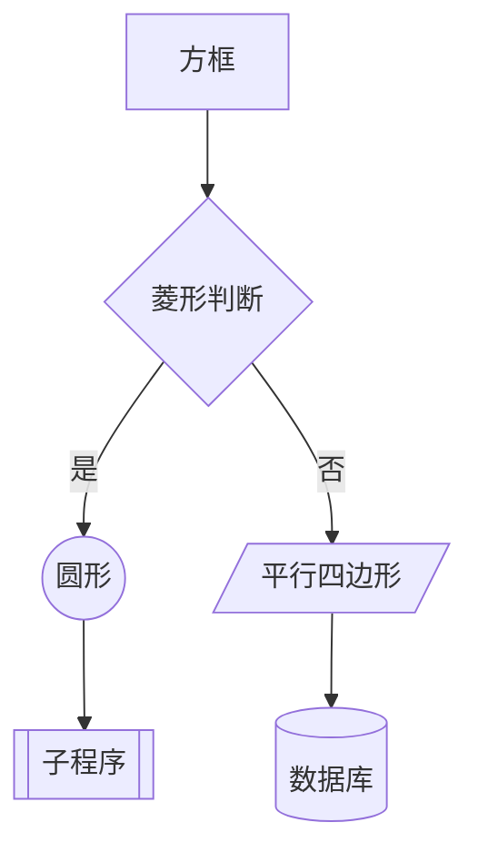

### 方向

| 关键字 | 方向 |
|--------|------|
| `TB` / `TD` | 从上到下 |
| `BT` | 从下到上 |
| `LR` | 从左到右 |
| `RL` | 从右到左 |

### 节点形状

| 语法 | 形状 |
|------|------|
| `A[文本]` | 方框 |
| `A(文本)` | 圆角矩形 |
| `A((文本))` | 圆形 |
| `A{文本}` | 菱形 |
| `A[/文本/]` | 平行四边形 |
| `A[\文本\]` | 反向平行四边形 |
| `A[[文本]]` | 子程序 |
| `A[(文本)]` | 数据库圆柱 |
| `A>文本]` | 旗帜 |
| `A{{文本}}` | 六边形 |

### 连线样式

| 语法 | 样式 |
|------|------|
| `A --> B` | 实线箭头 |
| `A --- B` | 实线无箭头 |
| `A -.- B` | 虚线无箭头 |
| `A -.-> B` | 虚线箭头 |
| `A ==> B` | 粗线箭头 |
| `A --文本--> B` | 带标签实线 |
| `A -.文本.-> B` | 带标签虚线 |
| `A ==文本==> B` | 带标签粗线 |

### 子图

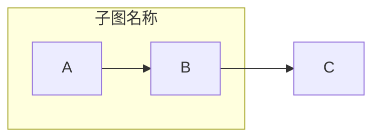

---

## 序列图 (Sequence Diagram)

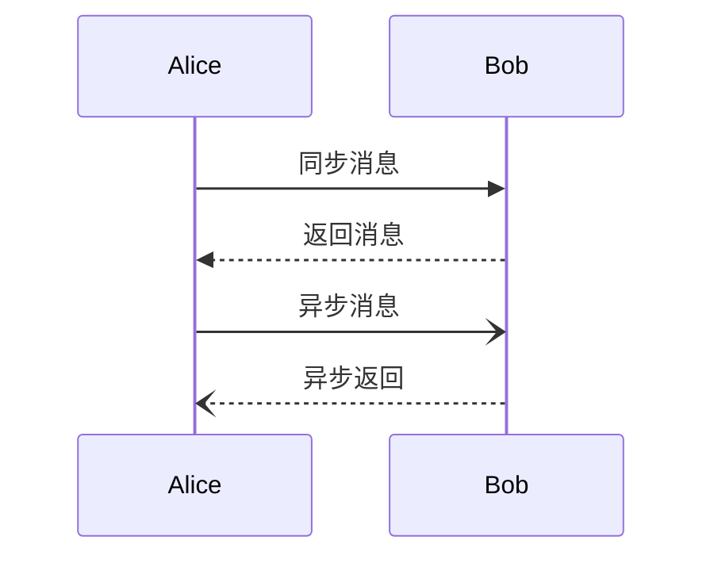

### 消息类型

| 语法 | 样式 |
|------|------|
| `->` | 实线无箭头 |
| `->>` | 实线箭头 |
| `-->>` | 虚线箭头 |
| `--)` | 开放箭头(异步) |
| `--)` | 虚线开放箭头 |
| `-x` | 叉号(阻止) |

### 高级用法

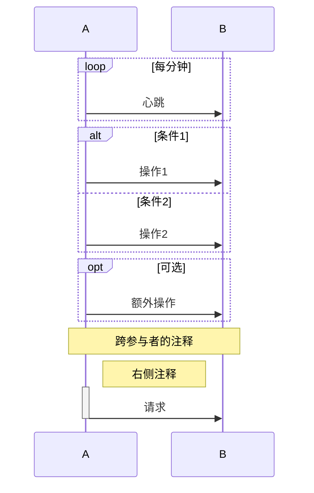

---

## 类图 (Class Diagram)

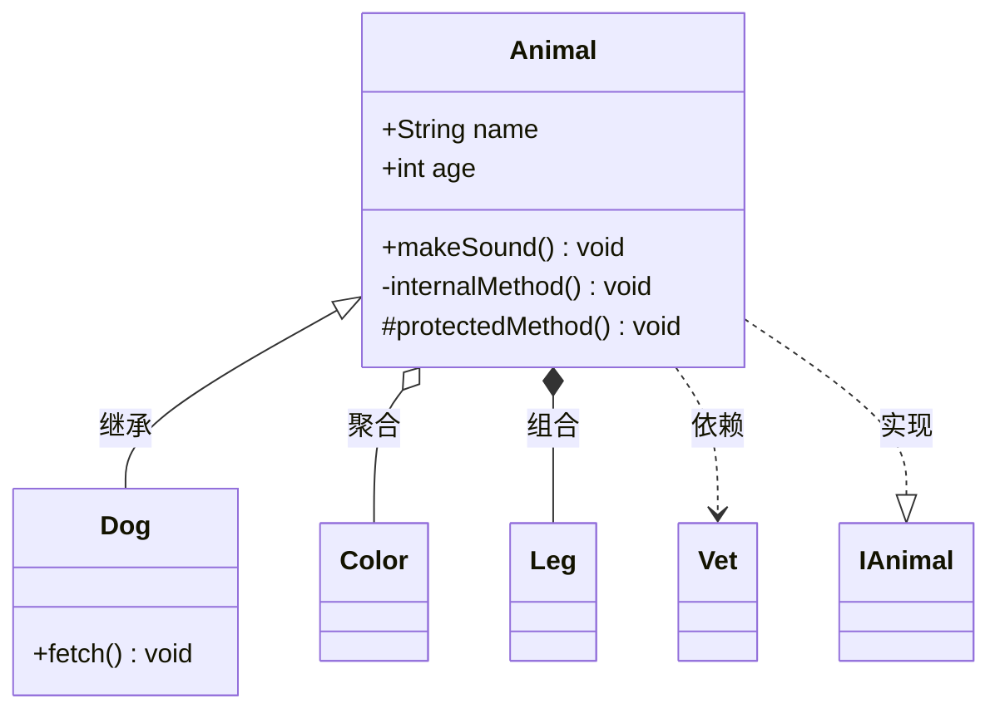

### 关系

| 语法 | 关系 |
|------|------|
| `<\|--` | 继承 |
| `*\--` | 组合 |
| `o--` | 聚合 |
| `-->` | 关联 |
| `-->` | 依赖 |
| `..\|>` | 实现 |
| `--` | 链接(实线) |
| `..` | 链接(虚线) |

### 可见性

| 符号 | 含义 |
|------|------|
| `+` | public |
| `-` | private |
| `#` | protected |
| `~` | package/internal |

---

## 状态图 (State Diagram)

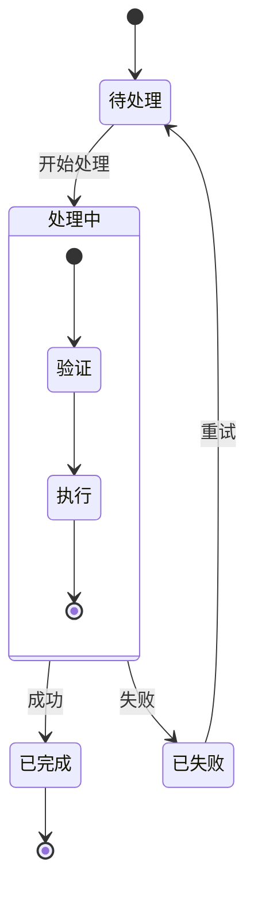

---

## ER 图 (Entity Relationship)

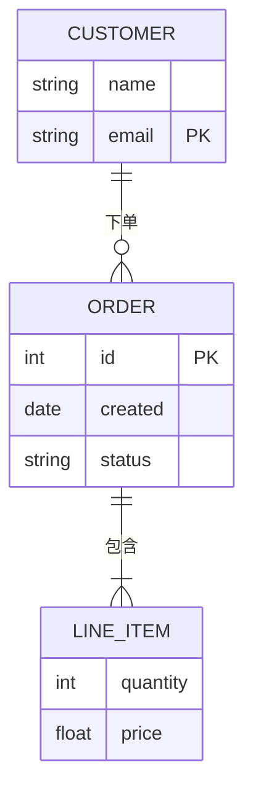

### 关系基数

| 语法 | 含义 |
|------|------|
| `\|\|--\|{` | 一对一 |
| `\|\|--o{` | 一对零或多 |
| `\|\|--\|{` | 一对一或多 |
| `o{--o{` | 零或多对零或多 |

---

## 甘特图 (Gantt)

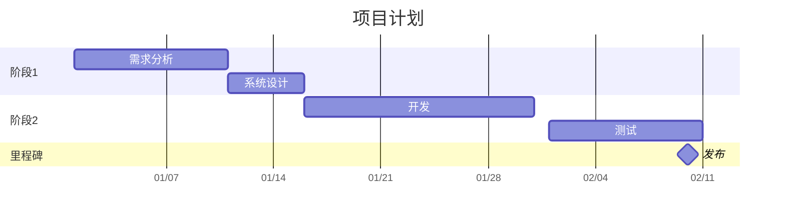

### 任务状态

| 语法 | 状态 |
|------|------|
| `:active,` | 活跃 |
| `:done,` | 完成 |
| `:crit,` | 关键 |

---

## 饼图 (Pie)

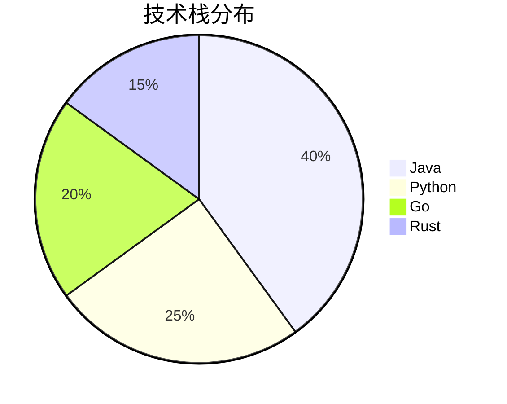

---

## 思维导图 (Mindmap)

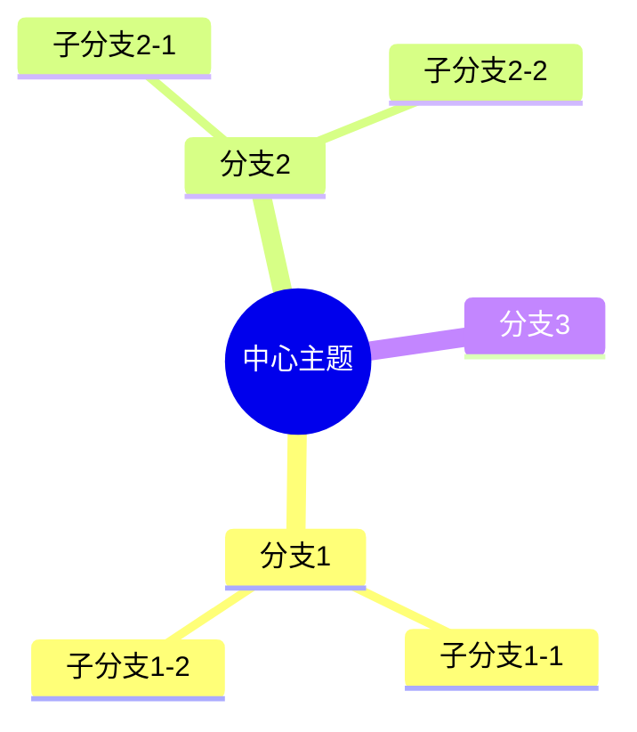

---

## Git 图 (Gitgraph)

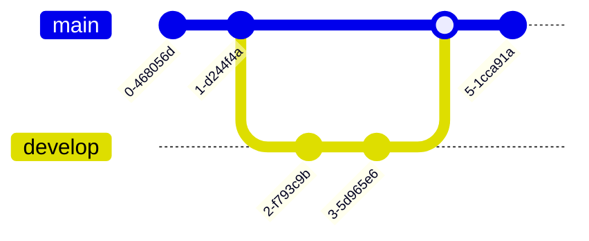

---

## 用户旅程图 (Journey)

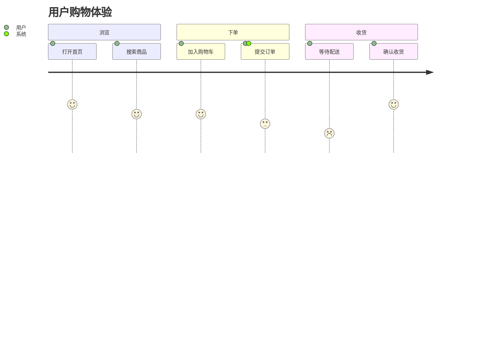

> 分数 1-5 表示满意度，1 最低，5 最高

---

## 通用技巧

- **特殊字符**: 用引号包裹含特殊字符的文本 `"A --> B"`
- **HTML 实体**: 支持 `&nbsp;`, `&amp;`, `&lt;` 等
- **样式**: 使用 `style A fill:#f9f,stroke:#333` 自定义节点样式
- **classDef**: `classDef className fill:#f9f,stroke:#333` 定义可复用样式类
- **注释**: `%% 这是注释`
