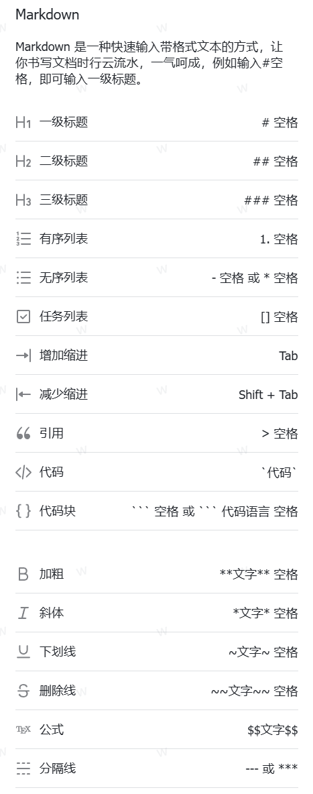
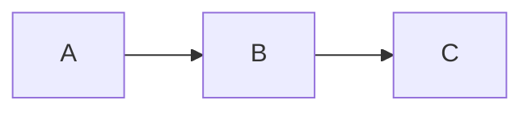

# Obsidian 语法速查

## 基础 Markdown

### 标题

```markdown
# 一级标题
## 二级标题
### 三级标题
#### 四级标题
##### 五级标题
###### 六级标题
```

### 文本格式

| 语法 | 效果 |
|------|------|
| `**粗体**` | **粗体** |
| `*斜体*` | *斜体* |
| `***粗斜体***` | ***粗斜体*** |
| `~~删除线~~` | ~~删除线~~ |
| `==高亮==` | 高亮(Obsidian 专属) |
| \`行内代码\` | `行内代码` |

### 列表

```markdown
- 无序列表项 1
  - 嵌套项
  - 嵌套项
- 无序列表项 2

1. 有序列表项 1
2. 有序列表项 2

- [ ] 待办事项(未完成)
- [x] 待办事项(已完成)
```

### 链接与图片

| 语法                  | 说明                |
| ------------------- | ----------------- |
| `[[笔记名]]`           | 内部链接(Obsidian 专属) |
| `[[笔记名\|显示文本]]`     | 别名链接              |
| `[[笔记名#标题]]`        | 链接到标题             |
| `[[笔记名#标题\|显示文本]]`  | 带别名的标题链接          |
| `[[笔记名#^块ID]]`      | 链接到块              |
| `[显示文本](URL)`       | 外部链接              |
| `![[图片名.png]]`      | 嵌入图片(Obsidian)    |
| `![[图片名.png\|300]]` | 嵌入并指定宽度           |
| ``       | 标准 Markdown 图片    |

### 引用

```markdown
> 引用文本
> > 嵌套引用
```

### 分隔线

```markdown
---
```

### 代码块

````markdown
```语言
代码内容
```
````

支持的语言标识: `python`, `java`, `javascript`, `json`, `yaml`, `sql`, `bash`, `html`, `css`, `mermaid` 等

---

## Obsidian 专属功能

### Callout (标注块)

```markdown
> [!note] 笔记标题
> 笔记内容

> [!tip] 提示
> 有用的提示信息

> [!warning] 注意
> 需要特别注意的内容

> [!danger] 危险
> 可能导致问题的操作

> [!info] 信息
> 一般性说明

> [!example] 示例
> 示例代码或步骤

> [!quote] 引用
> 引用内容

> [!abstract] 摘要
> 概括性内容

> [!question] 问题
> 常见问题解答

> [!success] 成功
> 成功提示

> [!failure] 失败
> 失败提示

> [!bug] Bug
> 已知问题

> [!todo] 待办
> 待办事项
```

#### Callout 修饰符

```markdown
> [!note]+ 可折叠(默认展开)
> 内容

> [!note]- 可折叠(默认收起)
> 内容

> [!note] 嵌套
> > [!tip] 嵌套的 callout
> > 内容
```

### 属性 (Properties / YAML Front Matter)

```yaml
---
title: 笔记标题
tags:
  - 标签1
  - 标签2
aliases:
  - 别名1
  - 别名2
created: 2024-01-01
modified: 2024-01-15
status: draft
cssclasses:
  - custom-class
---
```

### 标签

| 语法 | 说明 |
|------|------|
| `#标签` | 行内标签 |
| `#父/子` | 嵌套标签 |
| Front Matter `tags` | 属性标签 |

### 嵌入内容

| 语法 | 说明 |
|------|------|
| `![[笔记名]]` | 嵌入整篇笔记 |
| `![[笔记名#标题]]` | 嵌入某个章节 |
| `![[笔记名#^块ID]]` | 嵌入某个块 |
| `![[图片.png]]` | 嵌入图片 |
| `![[音频.mp3]]` | 嵌入音频 |
| `![[视频.mp4]]` | 嵌入视频 |
| `![[PDF名.pdf]]` | 嵌入 PDF |
| `![[PDF名.pdf#page=5]]` | 嵌入 PDF 指定页 |

### 数学公式 (LaTeX)

| 语法 | 说明 |
|------|------|
| `$E = mc^2$` | 行内公式 |
| `$$E = mc^2$$` | 块级公式 |

```markdown
$$
\frac{\partial f}{\partial x} = \lim_{h \to 0} \frac{f(x+h) - f(x)}{h}
$$

$$
\int_{0}^{\infty} e^{-x^2} dx = \frac{\sqrt{\pi}}{2}
$$

$$
\begin{pmatrix}
a & b \\
c & d
\end{pmatrix}
$$
```

### 脚注

```markdown
这是一段文本[^1]

[^1]: 这是脚注内容

也可以行内定义^[这是行内脚注]
```

### 表格

```markdown
| 列1 | 列2 | 列3 |
|-----|:----:|----:|
| 左对齐 | 居中 | 右对齐 |
| 内容 | 内容 | 内容 |
```

> `:-` 左对齐, `:-:` 居中, `-:` 右对齐

### Mermaid 图表

````markdown

````

> 详见 `mermaid-cheatsheet.md`

---

## 快捷键与操作

### 编辑

| 快捷键            | 功能     |
| -------------- | ------ |
| `Ctrl+B`       | 粗体     |
| `Ctrl+I`       | 斜体     |
| `Ctrl+K`       | 插入链接   |
| `Ctrl+Enter`   | 切换待办状态 |
| `Ctrl+]`       | 增加缩进   |
| `Ctrl+[`       | 减少缩进   |
| `Ctrl+Shift+K` | 删除段落   |
| `Ctrl+D`       | 删除当前行  |

### 导航

| 快捷键 | 功能 |
|--------|------|
| `Ctrl+O` | 快速打开 |
| `Ctrl+G` | 搜索 |
| `Ctrl+Shift+F` | 全局搜索 |
| `Ctrl+E` | 切换编辑/预览 |
| `Ctrl+P` | 命令面板 |
| `Ctrl+N` | 新建笔记 |
| `Ctrl+Tab` | 切换标签页 |

### 常用命令 (命令面板)

- `Obsidian Sync: ...` — 同步操作
- `Switcher: Open quick switcher` — 快速切换
- `Graph view: Open graph view` — 图谱视图
- `Daily notes` — 每日笔记
- `Template: Insert template` — 插入模板

---

## 高级功能

### 模板 (Templates)

在设置中指定模板文件夹，模板文件可使用以下变量:

| 变量 | 说明 |
|------|------|
| `{{title}}` | 笔记标题 |
| `{{date}}` | 当前日期 |
| `{{date:YYYY-MM-DD}}` | 格式化日期 |
| `{{time}}` | 当前时间 |
| `{{time:HH:mm}}` | 格式化时间 |

### Dataview 查询 (需安装插件)

```markdown
```dataview
TABLE file.mtime AS 修改时间, tags AS 标签
FROM "文件夹名"
WHERE contains(tags, "标签")
SORT file.mtime DESC
```

```dataview
LIST
FROM #标签
WHERE file.mtime >= date(today) - dur(7 days)
```

```dataview
TASK
WHERE !completed
SORT due ASC
```
```

### 自定义 CSS 片段

在 `.obsidian/snippets/` 文件夹中创建 `.css` 文件:

```css
/* 自定义 callout 颜色 */
.callout[data-callout="custom"] {
    --callout-color: 255, 165, 0;
    --callout-icon: lucide-star;
}

/* 自定义字体 */
.markdown-source-view {
    font-family: 'JetBrains Mono', monospace;
}
```

### 块引用与块 ID

```markdown
这是一段文字 ^block-id

引用: ![[笔记名#^block-id]]
```

> 在段落末尾加 `^块ID`，即可通过 `[[笔记名#^块ID]]` 引用

---

## 文件组织建议

| 方式 | 说明 |
|------|------|
| 文件夹 | 传统层级结构 |
| 链接 | 双向链接形成网状结构 |
| 标签 | 跨文件夹分类 |
| MOC (Map of Content) | 索引笔记连接相关主题 |
| 属性 | 结构化元数据查询 |
