# i昆明·春城健康项目理解与源码学习指南

> **定位**：这不是一份简单的 README，而是一份“对着源码学项目”的项目理解文档。
>
> **主要依据**：当前仓库的 `ikunming-health` 项目结构、`ikunming-chuncheng-health` 架构/需求/数据模型/接口设计文档，以及当前后端、医生端、管理后台、患者 H5 与数据库迁移目录中的实际代码组织。
>
> **阅读目标**：读完后，你应该能够回答四个问题：
> 1. 这个项目到底解决什么业务问题？
> 2. 请求从哪个前端进入，经过哪些 Controller / Service / Repository，最终落到哪些数据？
> 3. 为什么这个项目要这样设计，而不是简单做几个 CRUD？
> 4. 如果现在让我接一个需求，我应该去哪几个模块、哪几张表、哪条流程、哪组测试里找入口？
>
> **重要说明**：本文严格区分“源码/文档明确存在的内容”和“为了帮助理解做出的架构推断”。对于尚未冻结或文档之间存在冲突的地方，会明确标出“待确认”。

---

# 目录

1. [项目一句话理解](#1-项目一句话理解)
2. [先建立全局认知：它不是普通医疗 CRUD](#2-先建立全局认知它不是普通医疗-crud)
3. [项目边界与仓库组织](#3-项目边界与仓库组织)
4. [当前工程结构](#4-当前工程结构)
5. [三端一后端整体架构](#5-三端一后端整体架构)
6. [技术栈总览](#6-技术栈总览)
7. [后端代码分层与模块职责](#7-后端代码分层与模块职责)
8. [前端与后端如何对应](#8-前端与后端如何对应)
9. [统一身份体系：整个项目最重要的基础设施之一](#9-统一身份体系整个项目最重要的基础设施之一)
10. [用户、患者、家属三个概念到底有什么区别](#10-用户患者家属三个概念到底有什么区别)
11. [家庭绑定与授权模型](#11-家庭绑定与授权模型)
12. [预约业务流程](#12-预约业务流程)
13. [检查报告、AI 报告、诊断意见报告的关系](#13-检查报告ai-报告诊断意见报告的关系)
14. [医生端业务闭环与签名](#14-医生端业务闭环与签名)
15. [积分、订单与费用拆分](#15-积分订单与费用拆分)
16. [管理服务与专科管理能力](#16-管理服务与专科管理能力)
17. [问卷 / 量表与风险准入](#17-问卷--量表与风险准入)
18. [文件与对象存储](#18-文件与对象存储)
19. [认证与安全模型](#19-认证与安全模型)
20. [数据模型总览](#20-数据模型总览)
21. [核心数据表逐个理解](#21-核心数据表逐个理解)
22. [领域关系 ER 图](#22-领域关系-er-图)
23. [核心业务时序图合集](#23-核心业务时序图合集)
24. [状态机：为什么这个项目大量使用 status](#24-状态机为什么这个项目大量使用-status)
25. [接口设计与错误码体系](#25-接口设计与错误码体系)
26. [数据库版本演进：Flyway](#26-数据库版本演进flyway)
27. [测试体系](#27-测试体系)
28. [源码阅读路线：推荐从哪里开始](#28-源码阅读路线推荐从哪里开始)
29. [需求接入时如何定位代码](#29-需求接入时如何定位代码)
30. [一个真实需求的完整落地模板](#30-一个真实需求的完整落地模板)
31. [这个项目里最值得学习的后端设计点](#31-这个项目里最值得学习的后端设计点)
32. [容易踩坑的地方](#32-容易踩坑的地方)
33. [当前项目的明确冲突与待确认项](#33-当前项目的明确冲突与待确认项)
34. [从实习生视角理解“我到底在维护什么”](#34-从实习生视角理解我到底在维护什么)
35. [面向开发工作的项目知识地图](#35-面向开发工作的项目知识地图)
36. [最终总结：用五条主线记住整个项目](#36-最终总结用五条主线记住整个项目)

---

# 1. 项目一句话理解

`i昆明-春城健康` 可以理解为一个**围绕脑血管疾病患者就医协同场景构建的模块化医疗业务平台**。

它不是单纯的“患者查报告系统”，也不是单纯的“预约系统”。从业务目标上看，它把下面几个动作串成了一个闭环：

- 用户登录与身份归并；
- 患者档案建立；
- 家庭成员关系与代办授权；
- 检查项目选择与预约申请；
- 检查报告归档；
- 外部 AI 平台报告导入；
- 医生端审阅 AI 报告；
- 医生编辑并签名诊断意见；
- 患者/家属查看最终诊断意见；
- 用户通过资料完善获得积分；
- 服务订单进行费用拆分和积分抵扣；
- 后台对上述过程进行配置、流转、审计。

因此，可以用下面这条链理解业务主线：

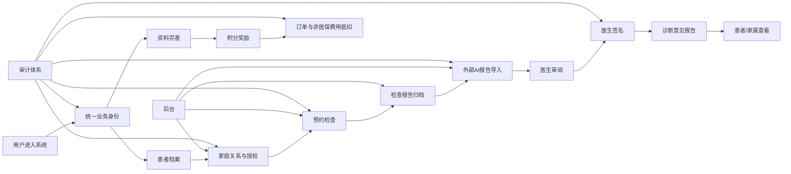

项目设计文档明确把“预约检查、报告归档、AI 报告导入、医生签名形成诊断意见报告、家庭协同与代办授权、账户/积分/非医保费用抵扣”作为首版重点闭环。也就是说，真正理解这个项目，必须把**身份、授权、业务对象状态、文件、审计**一起看，而不能只看某一个 Controller。

---

# 2. 先建立全局认知：它不是普通医疗 CRUD

如果你刚开始接触这个项目，第一感觉很容易是：

> `controller -> service -> repository -> database`，不就是标准 Spring Boot CRUD 吗？

这个理解只对了一半。

从代码组织上，它确实采用了典型的企业后端分层；但从业务建模上，它已经明显进入了“**流程型业务系统**”的范畴。

## 2.1 CRUD 只是最外层的皮

比如“预约”表面上只有：

```text
创建预约
查询预约
修改状态
查看详情
```

但实际业务是：

```text
谁提交？
↓
为哪个患者提交？
↓
这个人是否有代办权限？
↓
选的检查项目是否启用？
↓
时间是否合法？
↓
是否重复提交？
↓
后台是否已经处理？
↓
当前状态是否允许继续操作？
↓
谁处理的？
↓
什么时候处理的？
↓
是否要产生审计记录？
```

所以它不是简单的“写一条 appointment_record”。

## 2.2 项目真正复杂的地方

这个项目最值得你学习的复杂点，可以概括成六个：

### 第一类：身份复杂

不是只有一个用户表。

系统同时存在：

- 患者/家属业务用户；
- 医生用户；
- 后台管理员；
- 微信渠道身份；
- 宿主小程序身份；
- SSO ticket；
- JWT token。

### 第二类：关系复杂

“谁能替谁看数据”和“谁是哪个患者”并不是同一个问题。

因此它把：

- 用户账户；
- 患者档案；
- 家属绑定关系；
- 量表授权；
- 报告授权；
- 管理服务上下文

分开建模。

### 第三类：状态复杂

预约、家庭关系、AI 报告、诊断报告、订单、积分奖励，都存在状态流转。

### 第四类：数据敏感

手机号、身份证号、医疗信息、报告正文、医生诊断意见等都涉及敏感信息，因此系统有独立的加密、脱敏和审计规则。

### 第五类：外部依赖多

从 `pom.xml` 可以直接看到：

- 腾讯云人脸核身；
- 腾讯云 OCR；
- 腾讯云短信；
- JWT；
- Redis；
- MySQL；
- Flyway；
- PDFBox；
- Apache POI。

这意味着很多业务不是“本地方法调用”这么简单，而是要考虑依赖故障、网关抽象、Mock Gateway、超时、重试以及测试环境替身。

### 第六类：长期演进

数据库中存在从 `V1` 一直到 `V78` 的大量 Flyway 迁移，说明这个项目已经不是一次性 Demo，而是明显在持续演进。

因此你作为后端开发者，最应该学会的并不是“怎么写一个新的 `save()`”，而是：

> **如何在一个已经有大量业务约束、数据演进和历史兼容的系统里，安全地增加功能。**

---

# 3. 项目边界与仓库组织

## 3.1 当前采用单 Git 仓库、双工程目录

项目文档明确规定当前仓库不是把前端、后端拆成多个 Git repo，而是：

```text
一个 Git 仓库
    ├── projects/ikunming-main
    └── projects/ikunming-chuncheng-health
```

其中：

- `ikunming-main`：主小程序 `i昆明`；
- `ikunming-chuncheng-health`：春城健康业务模块。

这是一种**产品边界优先，而不是技术栈边界优先**的仓库组织方式。

## 3.2 为什么不是 frontend/backend 两个仓库？

因为这个项目在研发协作上更强调：

```text
一个业务需求
      ↓
患者端页面
医生端页面
后台页面
后端接口
数据库迁移
测试脚本
设计文档
      ↓
共同演进
```

例如一个“家属绑定流程”需求，不应该只改后端。

它通常同时涉及：

- 患者端 Family 页面；
- 家属邀请页面；
- 后端 `family` 模块；
- 数据库 migration；
- 权限/授权逻辑；
- smoke test；
- 需求文档与交接文档。

所以按产品工程打包是有现实意义的。

---

# 4. 当前工程结构

根据仓库当前结构，可以把春城健康工程理解成下面几层：

```text
projects/
└── ikunming-chuncheng-health/
    ├── apps/
    │   ├── ikunming-medical-backend/       # 统一后端
    │   ├── ikunming-medical-admin-web/     # 管理后台
    │   └── ../ikunming-chuncheng-doctor/   # 独立医生端（实际位于同仓库相关目录）
    ├── archive/
    │   └── ikunming-medical-wechat-patient-reference/
    ├── db/
    │   ├── migration/                      # Flyway
    │   └── manual/                          # 手工维护 SQL
    ├── dev/
    │   ├── cleanup/
    │   ├── release/
    │   └── run/                             # 回归/Smoke 脚本
    ├── doc/
    │   └── 微信小程序架构方案/
    ├── docs/
    │   └── 运行与阶段设计文档
    ├── compose.yaml
    └── README.md
```

## 4.1 后端目录结构

后端 package 主要包括：

```text
com.ikunming.medical
├── admin
├── agreement
├── audit
├── auth
├── basedata
├── common
├── config
├── coupon
├── doctor
├── faceverify
├── family
├── file
├── managementservice
├── patient
├── points
├── questionnaire
├── report
├── user
└── withdrawal
```

这个结构非常值得注意。

它不是：

```text
controller/
service/
repository/
entity/
```

这样的“按技术层分包”。

而是：

```text
业务域/
   controller/
   service/
   repository/
   entity/
```

即：**按领域组织代码，再在领域内部做分层。**

这就是典型的“模块化单体”风格。

---

# 5. 三端一后端整体架构

项目架构文档给出的系统上下文是：

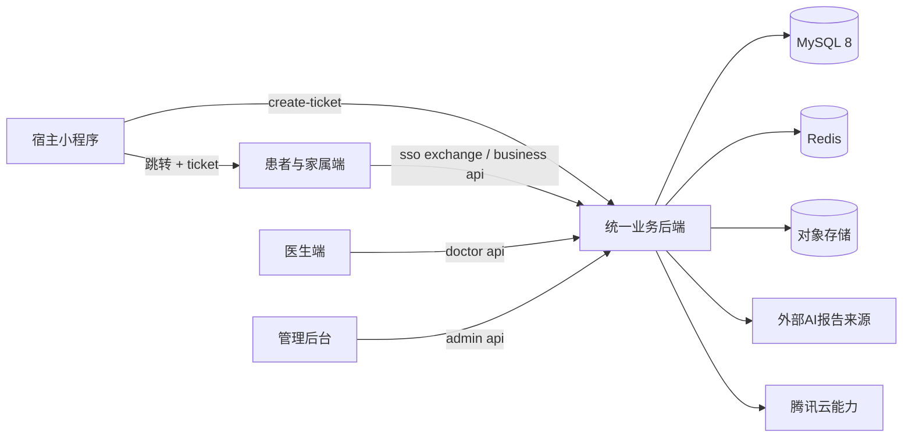

## 5.1 四个入口

### 入口 A：宿主小程序

负责把已有用户导流到患者业务模块。

关键机制是：

```text
宿主用户
  ↓
create-ticket
  ↓
短期 SSO Ticket
  ↓
navigateToMiniProgram
  ↓
患者端
  ↓
微信 code
  ↓
SSO exchange
  ↓
患者端 token
```

### 入口 B：患者与家属端

这是面向用户的核心业务端，主要承载：

- 首页；
- 家庭关系；
- 预约；
- 报告；
- AI 报告；
- 诊断意见；
- 积分；
- 订单；
- 个人资料；
- 实名与身份相关能力。

当前仓库里同时可以看到 `ikunming-chuncheng-health-h5`，说明患者侧还存在 H5 化演进/迁移方向。

### 入口 C：医生端

医生端的核心职责很明确：

```text
登录
↓
查看待处理 AI 报告
↓
查看详情
↓
编辑诊断意见
↓
签名
↓
发布
```

所以医生端不是一个“后台管理系统”，而是一个面向医生业务任务的工作台。

### 入口 D：管理后台

后台负责的不是“医生诊断”，而是运营与业务流转：

- 检查项目维护；
- 预约处理；
- 报告上传；
- AI 报告导入；
- 患者与家庭关系；
- 积分/订单；
- 权限；
- 审计日志；
- 管理服务配置；
- 基础数据。

---

# 6. 技术栈总览

## 6.1 后端实际依赖

后端 `pom.xml` 明确包含：

| 技术 | 用途 | 理解重点 |
|---|---|---|
| Java 17 | JVM 语言 | 当前项目运行基础 |
| Spring Boot 3.3.2 | 应用框架 | Controller、DI、配置、Web |
| Spring MVC | HTTP API | REST 接口入口 |
| Spring Validation | 参数校验 | DTO 校验 |
| Spring Security | 安全框架 | 认证/过滤器/权限 |
| Spring Data JPA | ORM / Repository | 部分实体与持久化 |
| Redis | 缓存/状态/短期数据 | token、挑战、短期会话等场景 |
| Flyway | DB 迁移 | Schema 持续演进 |
| MySQL Connector/J | MySQL 驱动 | 数据库连接 |
| JJWT | JWT | 多端业务 token |
| 腾讯云 FaceID | 人脸核身 | 实名/家属/医生安全场景 |
| 腾讯云 OCR | OCR | 实名身份证等识别 |
| 腾讯云 SMS | 短信 | 登录/验证 |
| PDFBox | PDF | 报告文件处理 |
| POI OOXML | Office 文档 | 报告模板/文档生成 |
| Lombok | Java 样板代码减少 | Getter/Builder 等 |
| Actuator | 运行监控 | 健康检查、运维 |

## 6.2 一个值得注意的点：MyBatis 与 JPA

项目文档里专门存在 `MyBatis与JPA实体清单.md`，而当前实际 `pom.xml` 中可以明确看到 `spring-boot-starter-data-jpa`。

这说明项目至少在设计阶段考虑过 **MyBatis + JPA 共存** 或实体统一规范。

理解这点时不要简单得出“项目就是纯 JPA”。

更准确的说法应该是：

> 当前代码基于模块化单体和 JPA 持久化能力组织，项目资料同时保留了 MyBatis/JPA 实体与 Mapper/Repository 的统一设计讨论，因此新增代码应该先看目标模块的现有实现习惯，再决定采用哪种持久化方式。

**不要因为你以前习惯 MyBatis，就在项目里新开一套 DAO 风格；也不要因为项目用了 JPA，就把所有查询都硬塞给 Repository 方法名。**

## 6.3 前端技术栈

### 医生端

实际 `package.json`：

- Vue 3；
- Vue Router；
- Pinia；
- TypeScript；
- Vite；
- Sass；
- vue-tsc。

### 管理后台

实际 `package.json` 当前非常轻量，核心是：

- TypeScript；
- Vite。

项目文档在架构建议上使用 `Vue 3 + TypeScript + Element Plus`，但具体代码版本要以当前仓库实际文件为准。

### 患者 H5

当前 H5 工程实际依赖包括：

- Vue 3；
- Vue Router；
- Pinia；
- TypeScript；
- Vite；
- Sass；
- PDF.js；
- QRCode。

这说明患者侧已经具备比较完整的 Web 应用能力，而不仅仅是一个静态 H5。

---

# 7. 后端代码分层与模块职责

后端每个业务域内部通常遵循：

```text
controller
   ↓
dto
   ↓
service
   ↓
repository
   ↓
entity
   ↓
MySQL
```

同时还有：

```text
service
   ↘ 外部 Gateway / Tencent Cloud / 文件存储 / 其他模块
```

## 7.1 Controller 层

职责：

- 接收 HTTP 请求；
- 参数绑定；
- 权限上下文获取；
- 调用应用服务；
- 返回统一响应。

Controller 不应该承担完整业务规则。

比如医生签名：

错误做法：

```java
@PostMapping("/{id}/sign")
public Result sign(...) {
    // 查 ai report
    // 判断医生
    // 生成 diagnosis
    // 校验状态
    // 写审计
    // 修改状态
    // return
}
```

合理的方向是：

```text
Controller
   ↓
DoctorSignatureService
   ↓
状态校验 / 数据装配 / 签名 / 落库 / 审计
```

## 7.2 DTO

DTO 在当前项目中非常多，尤其认证、家庭绑定、报告、管理服务等领域。

理解方式：

```text
Request DTO = 外部输入契约
Response DTO / VO = 外部输出契约
Entity = 数据库持久化对象
```

这三者不要混用。

## 7.3 Service 层

这里是项目最核心的学习区域。

例如：

- `FamilyBindingFlowService`
- `SpecialtyManagementService`
- `ManagementServiceAppService`
- `QuestionnaireService`
- `ReportViewAuthorizationService`
- `DoctorSignatureProfileService`
- `DoctorTodoBoardService`
- `WithdrawalService`

这些 Service 的存在说明业务真正的复杂度都沉淀在“应用服务/领域服务”里。

## 7.4 Repository

Repository 负责持久化访问，但不应该成为业务规则的垃圾桶。

你应该看到：

```text
Repository = 查数据 / 存数据
Service = 为什么查 / 什么情况下能查 / 查了之后怎么处理
```

## 7.5 Gateway

这是项目另一个很值得学习的地方。

例如：

- `TencentCloudSmsAdminVerificationCodeGateway`
- `MockAdminVerificationCodeGateway`
- `TencentCloudFamilyFaceVerificationGateway`
- `MockFamilyFaceVerificationGateway`
- `HttpFamilyFaceVerificationGateway`
- `UserRealNameOcrGateway`

这是典型的“外部依赖抽象”。

业务代码不要直接：

```java
new TencentClient(...)
```

而是：

```text
Service
  ↓
Gateway Interface
  ↓
 ┌───────────────┬───────────────────┐
 │ Mock Gateway  │ Tencent/HTTP真实网关 │
 └───────────────┴───────────────────┘
```

这样测试就容易很多。

---

# 8. 前端与后端如何对应

如果你以后接到一个需求，第一件事不是打开某个 Java 文件，而是做“端到端映射”。

例如“查看 AI 报告”：

```mermaid
flowchart LR
    A[患者页面 AiReportDetail] --> B[services/ai-report 或 report 服务封装]
    B --> C[GET /ai-reports/{id}]
    C --> D[AI Report Controller]
    D --> E[AI Report Service]
    E --> F[AiReportRepository]
    F --> G[(ai_report)]
    E --> H[权限/授权判断]
    H --> I[family relation / authorization]
    E --> J[风险提示组装]
    J --> A
```

同理，“医生签名”：

```mermaid
flowchart LR
    A[DoctorSignatureView] --> B[signature-service.ts]
    B --> C[POST /doctor/diagnoses/{id}/sign]
    C --> D[DoctorSignatureController]
    D --> E[DoctorSignatureProfileService / 相关 Service]
    E --> F[状态校验]
    E --> G[医生身份校验]
    E --> H[签名留痕]
    E --> I[DiagnosisReportRepository]
    I --> J[(diagnosis_report)]
    E --> K[AuditLogService]
```

因此项目学习时最有效的单位不是“一个 Java 类”，而是：

> **一个功能 = 页面 + service API + controller + service + repository + entity + migration + test。**

---

# 9. 统一身份体系：整个项目最重要的基础设施之一

这是整个系统最值得优先理解的地方。

## 9.1 为什么不能拿 openid 当业务主键

因为：

- 一个用户可能从不同 AppID 进入；
- 宿主小程序与患者端小程序的身份渠道不同；
- 医生和后台根本不是患者侧微信身份；
- 后续可能扩展 Web、H5、其他渠道。

所以项目用：

```text
internal_user_id
```

作为业务主键。

渠道身份只是映射：

```text
internal_user_id
    │
    ├── 微信 AppID A / openid A
    ├── 微信 AppID B / openid B
    ├── unionid
    └── external_user_id
```

## 9.2 SSO Ticket 是怎么工作的

最关键的不是“跳转”，而是：

> **跳转不能直接共享长期 token。**

流程：

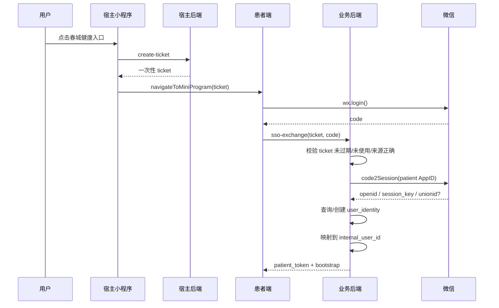

## 9.3 Ticket 为什么必须短期、一次性

防止：

- 重放；
- 被复制后长时间使用；
- 错 AppID 使用；
- 把敏感患者信息塞在 URL/参数里。

因此文档建议 ticket 的有效期为几十到几百秒级，并在使用后立即失效。

## 9.4 三套 Token

当前设计明确倾向：

```text
patient_token
    ≠
doctor_token
    ≠
admin_token
```

这是非常正确的边界。

否则就容易出现：

```text
患者 token → 调用医生接口
患者 token → 调后台接口
医生 token → 访问患者全部敏感信息
```

这种权限泄漏。

---

# 10. 用户、患者、家属三个概念到底有什么区别

这是新人最容易搞混的地方。

## 10.1 User = 登录身份

`user_account` 表达的是：

> “这个人是谁，系统怎么识别他。”

它是登录和账户层的主体。

## 10.2 Patient = 被服务对象

`patient_profile` 表达的是：

> “医疗服务最终服务谁。”

所以：

```text
一个 user
    └── 可以是患者本人

一个 user
    └── 也可以作为家属代办人
```

而不能简单理解成：

```text
user = patient
```

## 10.3 Family = 关系，不是用户类型

“家属”不是单独一个登录身份，而是：

```text
User A
   ↕ relation
User B
```

其中双方在某个关系里扮演：

- sponsor；
- subject；
- 代办人；
- 被代办人。

这就是为什么 `family_binding_relation` 使用：

- `sponsor_user_id`
- `subject_user_id`

来表达关系。

## 10.4 为什么要这么建模

因为现实业务里：

```text
妈妈 = 用户 A
爸爸 = 用户 B
孩子 = 用户 C
```

可能出现：

```text
A 为 B 代办
B 为 A 代办
A 为 C 代办
```

如果直接在 user 上写 `family_user_id`，很快就崩了。

关系应该单独建模。

---

# 11. 家庭绑定与授权模型

## 11.1 绑定不是授权

这是整个项目的关键业务概念。

```text
建立关系
   ↓
关系成立
   ↓
获得某种授权
   ↓
授权某个业务能力
```

也就是说：

> “我和你是家人” ≠ “我自动能看你所有医疗数据”。

## 11.2 为什么不建一个巨大 family_authorization 表

现有架构文档明确将旧的统一授权表拆成业务域授权：

- 问卷查看授权；
- 报告查看授权；
- 管理服务上下文。

这是一个非常重要的领域建模思路。

因为不同业务的权限天然不同：

```text
关系成立
  │
  ├── 可以看报告？
  ├── 可以看量表？
  ├── 可以代预约？
  ├── 可以确认服务？
  └── 可以管理订单？
```

如果做成一个万能授权表，最终会出现：

```text
permission_type = REPORT_VIEW
permission_type = QUESTIONNAIRE_VIEW
permission_type = APPOINTMENT_CREATE
permission_type = ORDER_CONFIRM
...
```

字段会不断膨胀，业务规则会变得非常难维护。

## 11.3 正确理解

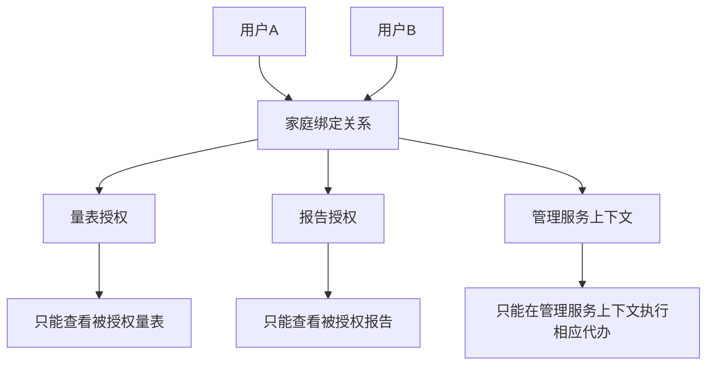

## 11.4 取消关系之后发生什么

重点不是简单把关系删掉。

更合理的企业业务逻辑是：

```text
旧关系
  ↓
status = UNBOUND / REVOKED
  ↓
未来新操作拒绝
  ↓
历史记录保留
  ↓
历史审计仍可追踪
```

所以“删除关系”其实常常是“业务状态失效”，而不是数据库 `DELETE`。

---

# 12. 预约业务流程

预约是最适合新人拿来练习端到端开发的模块之一。

## 12.1 核心对象

至少有：

- `appointment_item`：检查项目配置；
- `appointment_request`：用户提交的预约申请。

## 12.2 业务流程

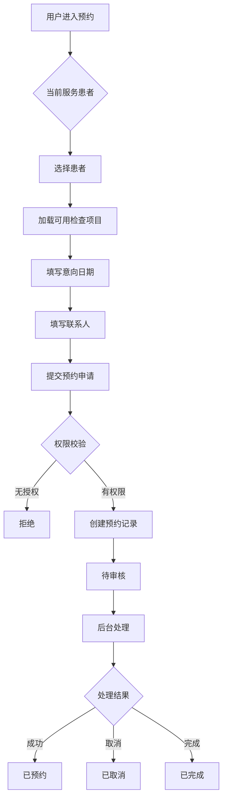

## 12.3 状态

设计文档给出的建议状态包括：

```text
待提交
↓
待审核
↓
处理中
↓
已预约
↓
已完成
```

也存在：

```text
待审核 -> 已取消
处理中 -> 已取消
```

注意：这些状态是业务语义，不应该直接和“页面按钮”绑死。

## 12.4 为什么 submitter_user_id 和 patient_id 都要存

这是非常企业级的建模细节。

假设：

```text
爸爸（patient_id = 1001）

妈妈（submitter_user_id = 2001）
```

那么数据库必须同时记录：

```text
patient_id = 1001
submitter_user_id = 2001
```

否则以后你无法知道：

- 谁被服务；
- 谁提交了申请；
- 谁对这次操作负责。

这对于审计非常重要。

---

# 13. 检查报告、AI 报告、诊断意见报告的关系

这是整个项目业务理解的第二个核心。

最简单的理解方式：

```text
检查报告
   ↓
外部 AI 分析
   ↓
AI 报告
   ↓
医生审阅
   ↓
诊断意见报告
```

## 13.1 三种报告不是同一个东西

### 检查报告

真实医疗检查结果的归档。

### AI 报告

外部平台产生的分析结果。

项目明确说明：

> 本系统不自己生成 AI 报告，而是负责导入外部 AI 结果。

### 诊断意见报告

医生审阅后形成的、对患者正式展示的诊断意见。

它才是最终的业务出口。

## 13.2 为什么 AI 报告不能直接当诊断报告

因为 AI 报告只是辅助信息。

系统必须区分：

```text
AI 报告
状态：未签名
提示：不是最终医生意见
```

和：

```text
诊断意见报告
状态：已签名/已发布
医生：XXX
签名时间：XXX
```

## 13.3 数据关系图

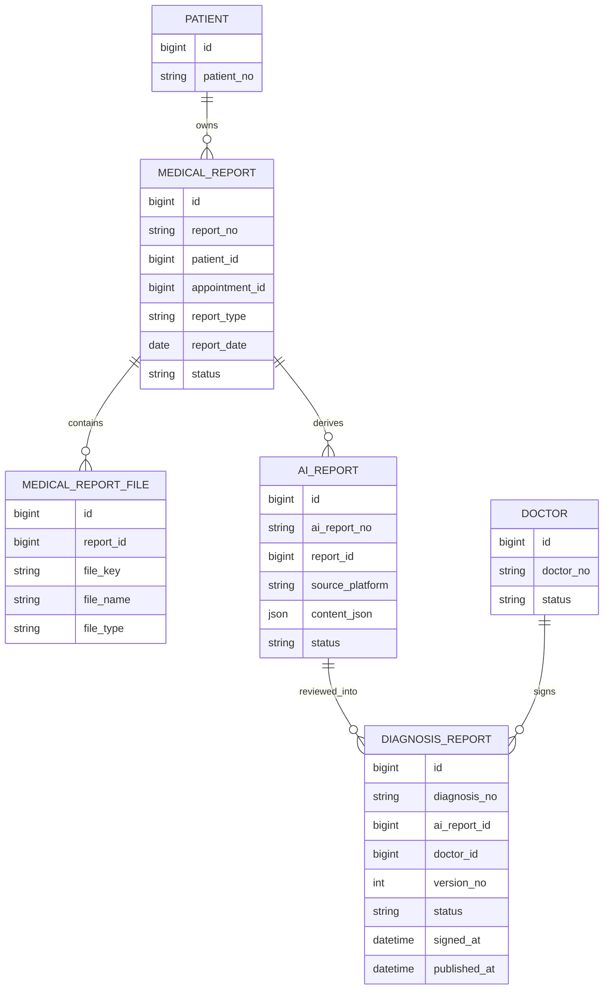

---

# 14. 医生端业务闭环与签名

医生端是整个项目“人工最终确认”的业务节点。

## 14.1 流程

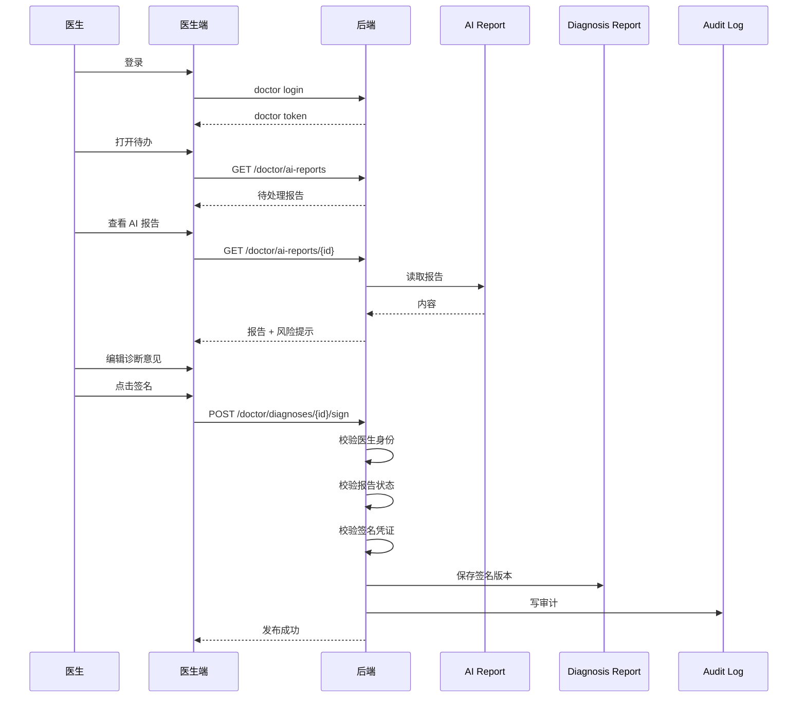

## 14.2 为什么要有 version_no

诊断意见是非常敏感的业务数据。

假设医生第一次填写：

```text
version = 1
```

后续因为重新复核修改：

```text
version = 2
```

这样才能保留：

```text
谁改了
什么时候改的
改的是哪个版本
哪一版对外发布
```

## 14.3 已发布后为什么不能再编辑

项目错误码中明确有：

- `DIAGNOSIS_STATUS_INVALID`
- `DIAGNOSIS_ALREADY_PUBLISHED`
- `DIAGNOSIS_SIGN_REQUIRED`
- `DOCTOR_SIGN_VERIFY_FAILED`

这些错误码反映出一个非常重要的状态原则：

> **发布后的诊断报告不是普通文章，而是具有业务效力的版本。**

因此不能把它当作“一个 content_text 字段，随便 update”。

---

# 15. 积分、订单与费用拆分

这个模块看起来最像电商，但实际上它被医疗费用规则强约束。

## 15.1 核心表

- `points_account`
- `points_reward_claim`
- `points_ledger`
- `order_record`

## 15.2 积分不是余额字段就完事

正确的数据模型是：

```text
points_account
    ↓
当前余额

points_ledger
    ↓
每次变化记录
```

例如：

```text
初始：0
填写资料：+100
抵扣订单：-60
退款回退：+60
```

如果只存：

```text
balance = 40
```

后续你无法知道为什么是 40。

所以必须有流水。

## 15.3 为什么还有 points_reward_claim

因为“奖励是否领取”是另一个业务事实。

例如：

```text
reward_code = PROFILE_COMPLETION
status = CLAIMED
reward_points = 100
```

这可以防止：

```text
用户重复点按钮
↓
重复发放 100 积分
```

正确校验：

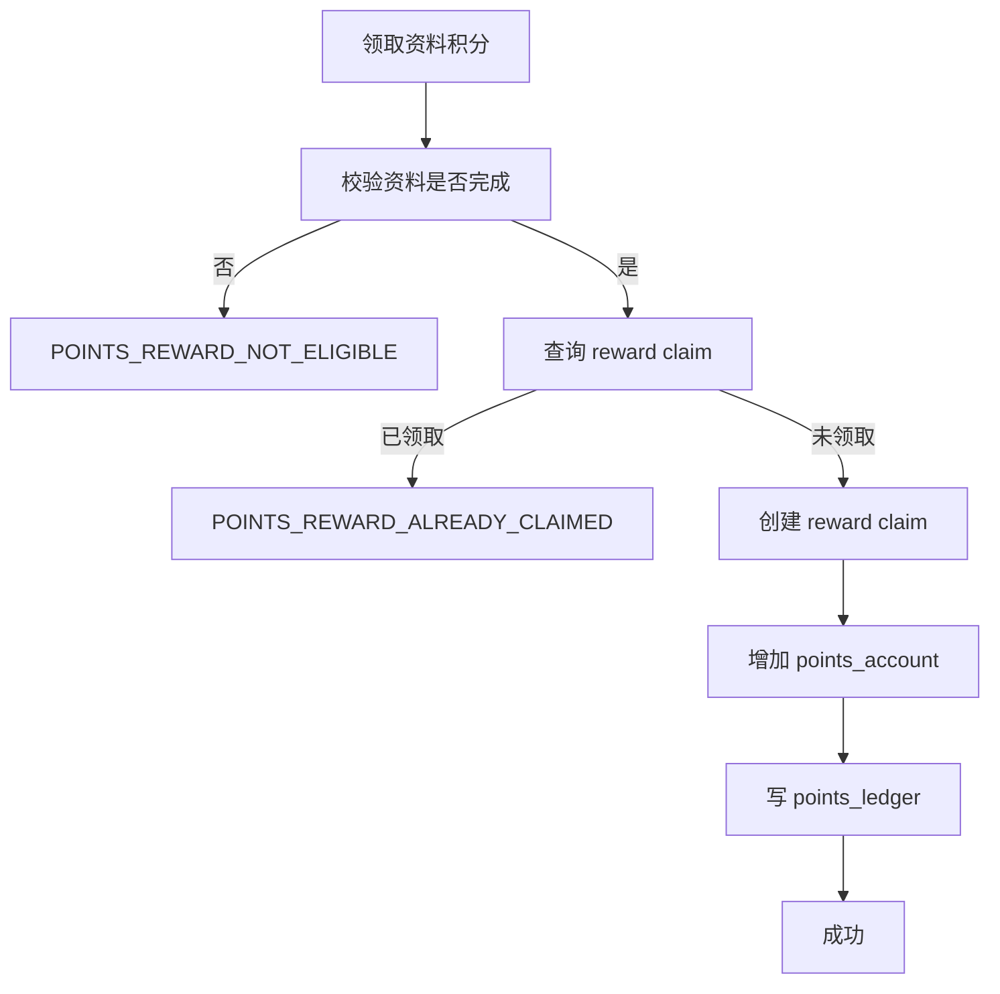

## 15.4 为什么医保金额不能用积分抵扣

这是明确的业务规则：

```text
医保金额
    ❌ 积分抵扣

非医保医疗费用
    ✅ 可能抵扣

平台服务费
    ✅ 可能抵扣
```

订单里因此要拆分：

- `insurance_amount`
- `self_pay_medical_amount`
- `platform_service_amount`
- `points_deduct_amount`
- `actual_pay_amount`
- `points_used`

这里体现出一个非常标准的企业系统原则：

> **不要把金额压成一个 total_amount，再靠代码猜这个金额由什么组成。**

### 费用拆分图

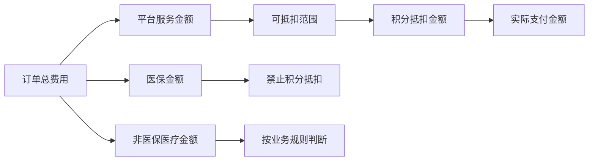

---

# 16. 管理服务与专科管理能力

这个项目后期已经不只是“预约 + 报告”，还出现了比较复杂的 `managementservice` 域。

当前后端可以看到：

- `ManagementServiceEntity`
- `ManagementServiceVersionEntity`
- `ManagementServicePlanEntity`
- `ManagementServiceAppointmentEntity`
- `ManagementServiceConfirmationEntity`
- `ManagementServiceAgreementAcceptanceEntity`
- `ManagementServiceStatementAcceptanceEntity`
- `SpecialtyInsurancePolicyEntity`
- `SpecialtyUserBlacklistEntity`

这说明业务已经进入“**服务产品 + 规则 + 计划 + 确认 + 协议 + 预约**”的阶段。

## 16.1 管理服务是什么

可以粗略理解为：

```text
一个可运营的服务产品
    ↓
配置服务名称
配置前置条件
配置风险等级
配置医院/分诊医院
配置 AI 项目
配置协议
配置优惠券/保险相关规则
    ↓
用户满足条件
    ↓
进入服务确认流程
    ↓
形成计划
    ↓
预约 / 执行 / 待办
```

## 16.2 为什么要做 Version

管理服务是后台可配置对象。

如果管理员修改了：

```text
服务名称
前置问卷
医院列表
规则
协议
```

那么旧用户已经接受的内容不能被“无痕修改”。

因此项目采用：

```text
service
   ↓
service_version
   ↓
当次用户确认快照
```

这就是企业业务系统常见的“配置版本化”。

---

# 17. 问卷 / 量表与风险准入

项目存在：

- `questionnaire_template`
- `questionnaire_question`
- `questionnaire_answer_sheet`
- `questionnaire_answer_item`
- `questionnaire_result_profile`
- `questionnaire_risk_rule`
- `questionnaire_view_authorization`
- `questionnaire_access_log`

这说明问卷不是一个简单的“动态表单”。

## 17.1 逻辑结构

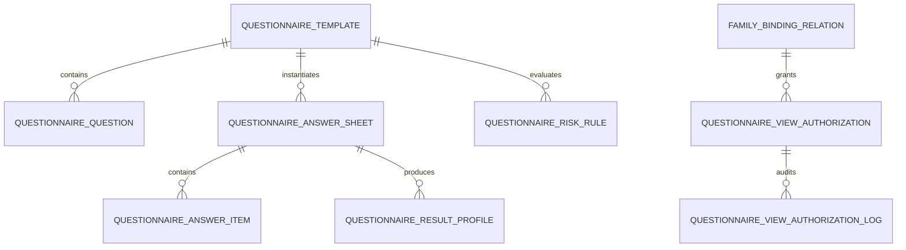

## 17.2 为什么需要风险规则

因为问卷回答不只是“存起来展示”，还可能用于：

```text
用户填写
↓
答案计算
↓
风险等级
↓
判断服务是否可进入
↓
决定是否能领取某些服务/优惠
```

所以问卷域和管理服务域之间存在业务耦合。

但代码层面不能简单写成：

```text
service -> questionnaireRepository
```

更合理的是通过明确的应用服务/规则对象把依赖收敛起来。

---

# 18. 文件与对象存储

医疗项目里文件是核心业务对象，不是简单附件。

## 18.1 文件相关模块

后端有：

- `FileAssetEntity`
- `FileAssetRepository`
- `FileAssetService`
- `FileAssetStorageService`
- `FileAssetCleanupScheduler`

同时在 `medical_report_file` 等业务对象中记录文件引用。

## 18.2 为什么要“业务表 + 文件资产表”

因为：

```text
业务对象
  ↓
业务关系
  ↓
文件
```

并不等于：

```text
业务表直接存一串 URL
```

比如：

```text
medical_report
    ↓
medical_report_file
    ↓
file_asset
    ↓
object storage
```

这样更容易实现：

- 生命周期管理；
- 清理无效文件；
- 权限校验；
- 短链接；
- 文件元数据管理。

## 18.3 为什么 file_key 不能直接给前端

如果对象存储直接公开：

```text
bucket/report/abc.pdf
```

任何知道 URL 的人都可能访问。

因此合理方式是：

```text
前端请求查看
   ↓
后端鉴权
   ↓
生成短时 URL
   ↓
前端临时访问
```

项目安全设计文档明确强调报告文件查看、上传、下载都要鉴权并记录审计。

---

# 19. 认证与安全模型

## 19.1 统一错误响应

项目有明确的响应结构：

```json
{
  "code": "AUTHORIZATION_SCOPE_DENIED",
  "message": "当前授权不包含代预约权限",
  "requestId": "req_xxx",
  "details": {}
}
```

注意最重要的是：

```text
code
requestId
```

### 为什么需要稳定 code

因为前端不能靠中文 `message` 判断逻辑。

例如：

```text
AUTHORIZATION_SCOPE_DENIED
```

前端可以：

```text
显示权限不足
```

而不能去判断：

```java
if (message.contains("授权不包含"))
```

## 19.2 为什么 requestId 很重要

因为这个项目存在很多外部依赖：

```text
用户请求
  ↓
Backend
  ↓
Redis
  ↓
MySQL
  ↓
Tencent Cloud
  ↓
Object Storage
```

出问题时，只有 `requestId` 才能把一条完整请求串起来。

## 19.3 敏感字段策略

安全设计明确提出：

```text
传输 -> HTTPS
落库 -> 加密
精确查询 -> hash 索引
日志 -> 不记明文
接口 -> 脱敏
文件 -> 私有对象存储
```

典型模式：

```text
手机号
   ↓
标准化
   ├──> SHA-256 -> mobile_hash
   └──> AES-256-GCM -> mobile_encrypted
```

这样既能：

```sql
WHERE mobile_hash = ?
```

又不会把明文手机号直接存进数据库。

## 19.4 密码不能加密，只能哈希

这是必须区分的：

```text
业务字段：可逆加密
密码：不可逆哈希
```

例如：

```text
AES-GCM
```

适合手机号、身份证等需要恢复原文的字段。

而：

```text
bcrypt / Argon2id
```

适合密码。

---

# 20. 数据模型总览

从现有设计文档可以抽象出下面这张“大图”：

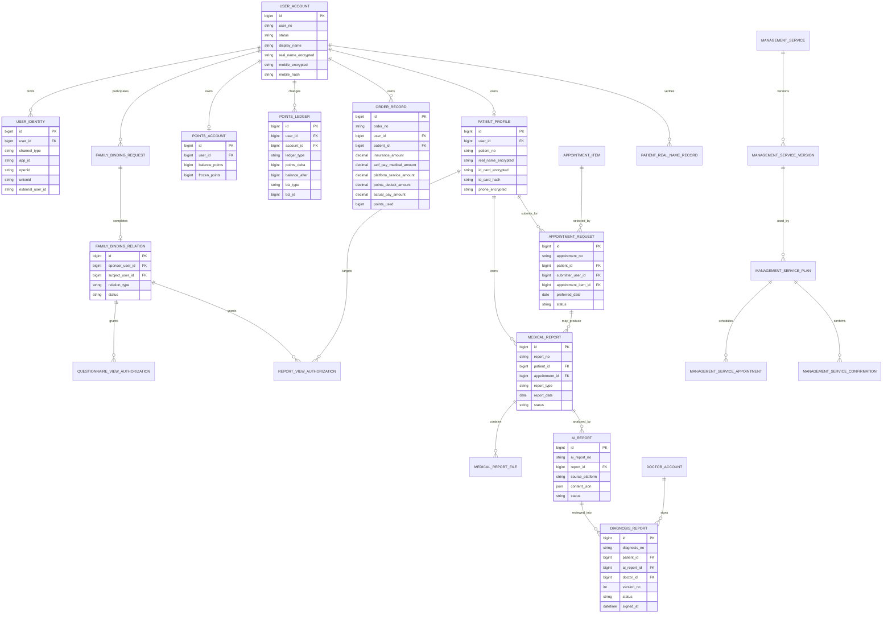

---

# 21. 核心数据表逐个理解

下面不要把它当“字段背诵表”，而应该当“业务语义表”。

## 21.1 user_account

**回答的问题：谁登录了系统？**

关键点：

- 业务主用户；
- 不等于微信身份；
- 不等于患者；
- 不等于医生或管理员。

## 21.2 user_identity

**回答的问题：这个业务用户从哪个渠道来的？**

例如：

```text
user_id = 10001
channel_type = WECHAT_MINI_PROGRAM
app_id = xxx
openid = xxx
```

## 21.3 sso_ticket

**回答的问题：宿主小程序怎么安全地把用户导入患者端？**

## 21.4 patient_profile

**回答的问题：这个账户对应哪个医疗服务对象？**

## 21.5 family_binding_request

**回答的问题：某次绑定申请是怎么发起的？**

注意：申请不是正式关系。

## 21.6 family_binding_relation

**回答的问题：现在双方是否存在正式家庭关系？**

## 21.7 questionnaire_answer_sheet

**回答的问题：用户某次具体填写结果是什么？**

它和模板不是一个东西：

```text
template = 题目模板
answer_sheet = 用户一次实际填写
```

## 21.8 appointment_item

**回答的问题：系统当前提供哪些检查项目？**

## 21.9 appointment_request

**回答的问题：用户为哪个患者申请什么检查？**

## 21.10 medical_report

**回答的问题：某个患者有什么正式检查报告？**

## 21.11 medical_report_file

**回答的问题：这个报告由哪些文件组成？**

## 21.12 ai_report

**回答的问题：外部 AI 平台给这个检查/患者产生了什么结果？**

## 21.13 diagnosis_report

**回答的问题：医生最终给患者发布了什么诊断意见？**

## 21.14 points_account

**回答的问题：现在这个人还有多少积分？**

## 21.15 points_ledger

**回答的问题：积分为什么会变成这个数？**

## 21.16 order_record

**回答的问题：某一次服务费用是怎么组成的？**

## 21.17 audit_log

**回答的问题：谁在什么时候做了什么重要动作？**

---

# 22. 领域关系 ER 图

如果你只允许自己记住一张 ER 图，我建议记下面这张：

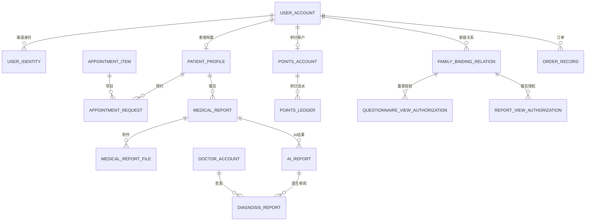

这张图实际上表达了五条核心主线：

```text
身份线
关系线
服务线
报告线
结算线
```

---

# 23. 核心业务时序图合集

## 23.1 用户进入系统

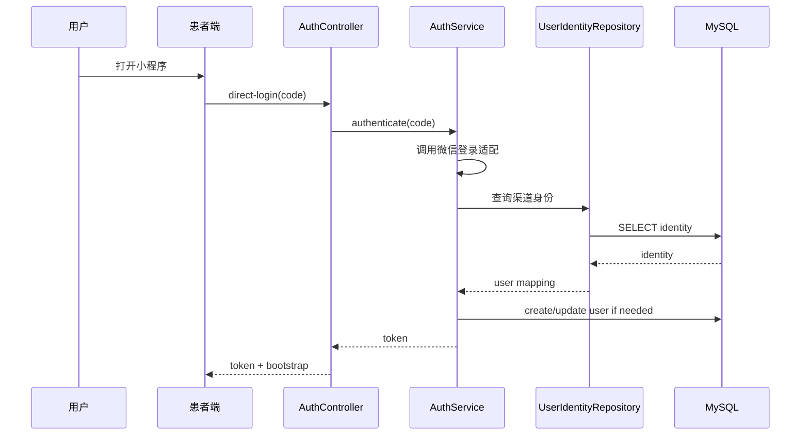

## 23.2 代办预约

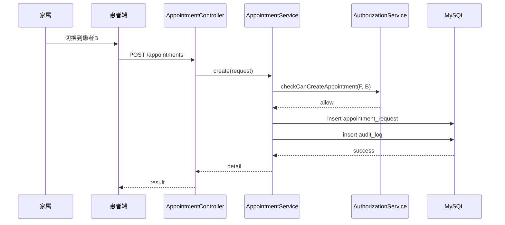

## 23.3 AI 报告导入到医生签名

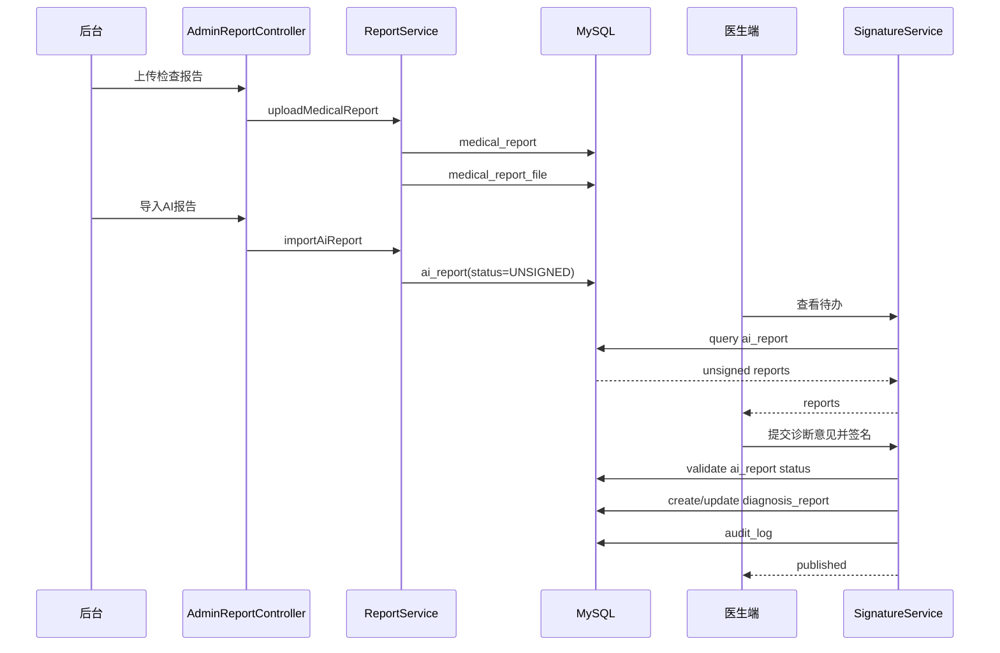

## 23.4 积分奖励

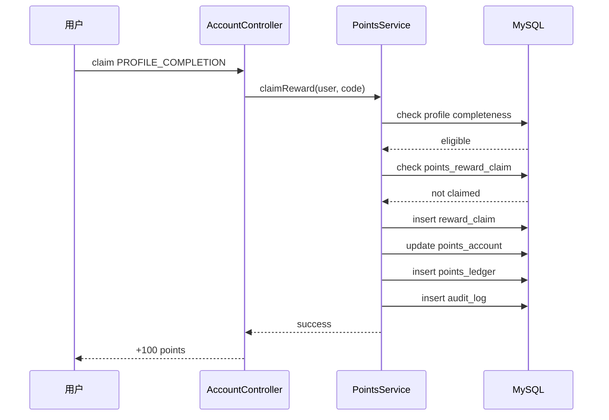

---

# 24. 状态机：为什么这个项目大量使用 status

新人看到很多：

```java
status
```

容易觉得“状态字段就是一个字符串”。

其实在企业系统里，`status` 往往是一个**业务状态机节点**。

## 24.1 预约状态机

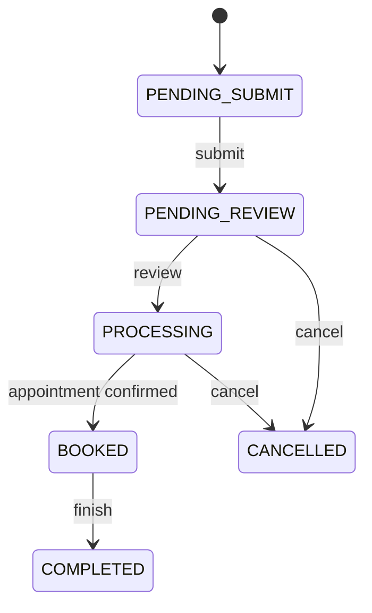

## 24.2 AI 报告

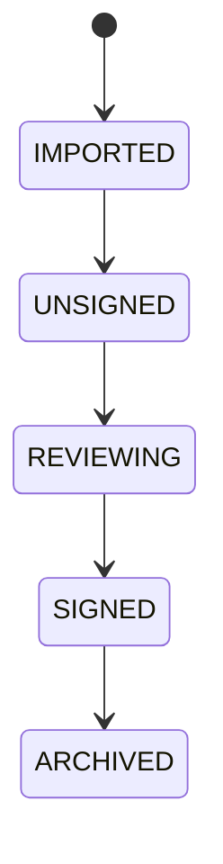

这里的具体状态名以当前代码枚举/常量为准，图主要用于帮助理解“状态节点 + 迁移”的思想。

## 24.3 诊断意见报告

```mermaid
stateDiagram-v2
    [*] --> DRAFT
    DRAFT --> SIGN_PENDING
    SIGN_PENDING --> PUBLISHED: signature passed
    SIGN_PENDING --> DRAFT: signature failed / edit again
    PUBLISHED --> ARCHIVED
```

## 24.4 状态迁移必须带角色

比如：

```text
预约：
用户 -> PENDING_REVIEW
后台 -> PROCESSING
后台 -> BOOKED
```

而不是：

```text
任何人都可以 appointment.status = BOOKED
```

这就是业务安全边界。

---

# 25. 接口设计与错误码体系

接口草案中当前至少覆盖：

### 患者端

```text
POST /auth/host/create-ticket
POST /auth/patient/sso-exchange
POST /auth/patient/direct-login
GET  /user/bootstrap
GET  /dashboard/home
GET  /account/profile
PUT  /account/profile
GET  /appointments
POST /appointments
GET  /appointments/{id}
GET  /reports
GET  /reports/{id}
GET  /ai-reports
GET  /diagnoses
GET  /family/binding-relations
POST /family/binding-requests
GET  /family/pending-requests
POST /family/authorizations
GET  /account/points
GET  /account/orders
POST /account/profile-reward/claim
```

### 医生端

```text
GET  /doctor/ai-reports
GET  /doctor/ai-reports/{id}
POST /doctor/diagnoses/{id}/sign
```

### 管理后台

```text
GET  /admin/patients
GET  /admin/patients/{id}
GET  /admin/family/relations
POST /admin/family/relations
GET  /admin/appointments/items
POST /admin/appointments/items
PUT  /admin/appointments/items/{id}
GET  /admin/appointments
POST /admin/appointments/{id}/handle
POST /admin/reports/upload
GET  /admin/reports
POST /admin/ai-reports/import
GET  /admin/ai-reports/imports
GET  /admin/orders
POST /admin/orders/{id}/confirm
GET  /admin/points/rewards
POST /admin/points/rewards/{id}/approve
GET  /admin/audit-logs
```

## 25.1 HTTP 状态码要记住什么

```text
200 成功
400 请求本身不正确
401 没登录 / token 无效
403 有身份但没权限
404 资源不存在
409 状态冲突 / 重复提交
422 业务校验不通过
500 系统内部异常
502/503 外部依赖异常
```

## 25.2 为什么 409 特别重要

企业系统里经常发生：

```text
用户A 打开页面
后台把对象改了
用户A 再点击提交
```

这不是 400，也不是 500。

而是：

```text
业务状态冲突
```

所以出现：

- `APPOINTMENT_STATUS_INVALID`
- `DIAGNOSIS_ALREADY_PUBLISHED`
- `POINTS_REWARD_ALREADY_CLAIMED`
- `POINTS_FREEZE_FAILED`
- `ORDER_STATUS_INVALID`

都是很典型的 409 场景。

---

# 26. 数据库版本演进：Flyway

当前 `db/migration` 存在从：

```text
B78__baseline.sql
V1__init_account_and_identity.sql
V2__init_patient_and_family.sql
V3__init_appointment_and_report.sql
V4__init_doctor_and_diagnosis.sql
V5__init_points_order_audit_and_admin.sql
...
V78__remove_fixed_specialty_ui_messages.sql
```

这是一条非常清晰的历史脉络。

## 26.1 如何阅读这些 migration

建议不要一个个死看，而是按阶段：

### 阶段一：账户

```text
V1
V9
```

核心：用户、渠道身份、唯一约束。

### 阶段二：患者与家庭

```text
V2
V6
V49
V50...
```

核心：患者档案、家庭绑定、旧 schema 清理、字段补充。

### 阶段三：报告与医生

```text
V3
V4
V28
V31
V75
V76
```

核心：报告、诊断、授权、文件、实名/人脸/安全动作。

### 阶段四：积分与订单

```text
V5
V13
V36
V40
V57
```

核心：积分、优惠券、提现、费用拆分、冻结。

### 阶段五：管理服务

```text
V24
V29
V30
V45
V46
V52
V55
V62
V63
```

核心：管理服务、计划、预约、版本化配置、字段演进。

## 26.2 为什么不能修改旧 migration

项目文档明确采用：

```text
已执行 migration 不回改
↓
后续结构变化新增 Vxx
```

因为生产环境可能已经执行旧版本。

如果你把：

```text
V30.sql
```

改掉，而生产已经执行过 V30，那么：

```text
开发数据库 ≠ 生产数据库
```

最终会出现最难排查的一类问题：

> “代码看起来对，数据库却不一样。”

---

# 27. 测试体系

这个项目有一个很明显的优点：它不仅有单元/Service 测试，还有 smoke 和 regression 脚本。

## 27.1 测试类型

### 单元/服务测试

例如：

- `DoctorAuthenticationServiceTest`
- `FamilyBindingFlowServiceTest`
- `PointsServiceTest`
- `QuestionnaireServiceTest`
- `ReportViewAuthorizationServiceTest`

这些测试适合验证业务规则。

### Controller 测试

例如：

- `DoctorAuthControllerTest`
- `DoctorPatientControllerTest`
- `AdminQuestionnaireControllerTest`

用于验证 HTTP 层契约。

### Regression

例如：

```text
admin-auth-regression.sh
doctor-auth-regression.sh
family-flow-regression.sh
patient-regression.sh
report-smoke.sh
questionnaire-smoke.sh
management-service-smoke.sh
```

这说明项目已经开始使用：

```text
代码测试 + 运行态验证
```

## 27.2 为什么 smoke test 很重要

例如后台登录流程可能涉及：

```text
密码
+ SMS challenge
+ token
+ token invalidation
```

单测可以证明 Service 某个条件成立。

但 smoke test 才能证明：

```text
真实 HTTP
↓
真实数据库
↓
真实 token
↓
整个流程
```

真的跑通。

## 27.3 必须关注的错误链路

项目测试资料特别强调：

- 无 token；
- token 过期；
- 已撤销授权继续操作；
- 积分抵扣医保金额；
- 医生重复签名/发布；
- 无权限访问审计日志。

这告诉你一个很重要的企业开发原则：

> **业务系统测试的价值不只是测试“能成功”，而是测试“不能乱成功”。**

---

# 28. 源码阅读路线：推荐从哪里开始

千万不要上来就：

```text
从第一个 Java 文件开始，一个个看。
```

这会非常痛苦。

## 第一阶段：先看 5 份设计文档

推荐顺序：

```text
整体技术架构总览
↓
登录时序与认证设计
↓
核心数据模型设计
↓
业务需求清单
↓
核心流程状态机
```

先知道“为什么这样设计”。

## 第二阶段：只看 8 个后端领域

第一批：

```text
auth
user
patient
family
appointment/managementservice
report
doctor
points
```

这些是最核心的业务链。

## 第三阶段：每个领域只抓四类文件

例如 `family`：

```text
controller
service
repository
entity
```

然后再看：

```text
dto
constants
gateway
test
```

## 第四阶段：沿一个接口穿透

例如：

```text
POST /family/binding-requests
```

从：

```text
Controller
↓
DTO
↓
Service
↓
Repository
↓
Entity
↓
Migration
↓
Test
```

一路看。

这样你的脑中会形成“代码图”。

---

# 29. 需求接入时如何定位代码

这部分对日常实习工作最有用。

当产品说：

> “家属现在要支持查看新的报告类型。”

你不要直接全局搜索 `report`。

先问四个问题：

```text
1. 谁看？
2. 看什么？
3. 什么情况下能看？
4. 当前模型有没有这个对象？
```

## 29.1 例：增加一个新的报告访问范围

先找：

```text
report/
family/
authorization/
```

然后：

```text
Controller
↓
ReportViewAuthorizationService
↓
ReportViewAuthorizationEntity
↓
Repository
↓
Vxx migration
↓
Test
```

如果是前端：

```text
report.vue
↓
report.ts service
↓
API
```

## 29.2 例：新增“预约备注必填”

这个需求看起来只有一行代码，但实际可能涉及：

```text
前端表单校验
↓
Request DTO @NotBlank
↓
Service 业务校验
↓
数据库是否允许 null
↓
Migration
↓
接口测试
↓
回归脚本
```

所以企业开发不是“改一个地方”，而是：

> **修改一个业务契约，同时保证上下游契约不被破坏。**

---

# 30. 一个真实需求的完整落地模板

下面用“新增一个需要家属授权才能使用的业务动作”做示范。

## Step 1：明确业务对象

例如：

```text
动作：家属帮患者提交预约
对象：appointment_request
角色：sponsor_user
被服务对象：patient
授权：family relation + appointment scope
```

## Step 2：画业务流程

```mermaid
flowchart TD
    A[家属点击代办预约] --> B[切换患者]
    B --> C[加载家庭关系]
    C --> D{关系是否有效}
    D -->|否| E[拒绝]
    D -->|是| F{授权是否包含预约}
    F -->|否| G[拒绝]
    F -->|是| H[校验预约参数]
    H --> I[创建预约]
    I --> J[写审计日志]
    J --> K[返回预约详情]
```

## Step 3：确认代码位置

后端：

```text
family/
appointment/
audit/
```

前端：

```text
appointment view
family service
request service
```

## Step 4：确认数据库

如果已有：

```text
family_binding_relation
appointment_request
```

就优先复用，不要重复设计一张：

```text
family_appointment
```

## Step 5：确认错误码

需要考虑：

```text
FAMILY_RELATION_NOT_FOUND
FAMILY_AUTHORIZATION_REVOKED
AUTHORIZATION_SCOPE_DENIED
APPOINTMENT_STATUS_INVALID
```

## Step 6：写测试

至少覆盖：

```text
本人预约成功
有效家属预约成功
无授权失败
关系已撤销失败
关系已过期失败
重复提交失败
```

## Step 7：写 migration 还是不写？

判断原则：

```text
如果数据库结构不变 -> 不需要 migration
如果新增字段/索引/约束 -> 新增 Vxx
```

这就是企业级开发正确的“改需求”方式。

---

# 31. 这个项目里最值得学习的后端设计点

## 31.1 模块化单体

这是最值得学习的一点。

它不是：

```text
一个超级 Service
```

也不是：

```text
一上来拆 20 个微服务
```

而是：

```text
一个部署单元
+ 明确领域边界
+ 每个领域内部独立
```

这在企业项目中非常实用。

## 31.2 外部依赖 Gateway 化

例如短信、OCR、人脸核身，都通过 Gateway 抽象。

结果是：

```text
生产
  ↓
腾讯云 Gateway

测试
  ↓
Mock Gateway
```

这是非常典型的可测试架构。

## 31.3 Audit Log 一等公民

医疗场景非常重要。

关键操作包括：

- 登录；
- 授权；
- 预约；
- 上传；
- 导入；
- 签名；
- 发布；
- 积分抵扣；
- 后台配置。

因此 `audit_log` 不是一个“以后再补”的日志表，而是业务闭环的一部分。

## 31.4 业务状态与数据删除解耦

例如：

```text
关系解除
```

应该更倾向：

```text
status -> REVOKED
```

而不是：

```sql
DELETE FROM family_binding_relation
```

因为历史事实不能丢。

## 31.5 输入 / 持久化 / 输出分离

DTO / Entity / VO 分离是值得学习的。

否则你很容易写成：

```java
return repository.save(requestEntity);
```

这种代码在复杂业务里非常容易把数据库字段泄漏给前端。

## 31.6 版本化思维

这个项目至少有：

- DB migration version；
- 管理服务 version；
- 诊断报告 version；
- 授权/状态历史。

这体现出：

> **业务数据不是“当前值”，而是“在时间维度上演进的事实”。**

---

# 32. 容易踩坑的地方

## 32.1 把 user 当 patient

这是最大坑之一。

错误：

```java
long patientId = currentUser.getId();
```

正确思考：

```text
current user
   ↓
当前操作患者
   ↓
权限校验
```

## 32.2 直接信任前端 patientId

前端传：

```json
{"patientId": 10002}
```

不代表这个用户就可以操作 10002。

后端必须重新验证：

```text
user -> family relation -> authorization -> patient
```

## 32.3 直接把 status 修改为目标状态

比如：

```java
order.setStatus(PAID);
```

企业项目里不能这样干。

应该先：

```text
校验当前状态
校验操作者
校验前置条件
执行迁移
写审计
```

## 32.4 直接暴露文件 URL

医疗文件一定要考虑：

```text
谁可以看？
多久有效？
是否需要审计？
```

## 32.5 重复发积分

典型并发问题：

```text
请求A：查未领取
请求B：查未领取
请求A：发100
请求B：再发100
```

因此 `points_reward_claim`、唯一约束、事务/锁策略都可能参与。

## 32.6 认为“409 就是异常”

其实 409 是业务并发和状态机设计的重要工具。

例如：

```text
“报告已经被别人签了”
```

这完全是正常业务竞争，不代表服务器坏了。

---

# 33. 当前项目的明确冲突与待确认项

这是非常重要的一节，因为真实企业项目不会永远“设计完美”。

当前项目文档已经明确存在以下口径冲突：

## 33.1 一患者到底能绑定几个家属？

一个文档写：

```text
一个患者可绑定多个家属
```

另一个文档写：

```text
一个患者当前只绑定一个家属
```

而当前清单暂时按多对多关系整理。

**结论：不能自行脑补最终产品规则。**

开发时必须找产品/负责人确认。

## 33.2 待办摘要到底属于 bootstrap 还是首页

存在两种设计倾向：

```text
/user/bootstrap 返回待办
```

或者：

```text
/dashboard/home 返回首页待办
```

这关系到：

- 登录接口大小；
- 首页接口职责；
- 缓存策略；
- 前端初始化流程。

## 33.3 授权事项是否要做细粒度

当前首版部分权限只保留扩展位，尚未彻底冻结。

所以不要在没有产品确认的情况下直接设计一个庞大的：

```text
family_permission
```

表。

## 33.4 当前工程正处于持续演进

从大量 Flyway migration、H5 migration 文档、管理服务 refactor handoff 等资料可以看到，这个工程的模型还在变化。

因此阅读源码时要区分：

```text
当前生产代码
设计草案
历史兼容代码
归档参考代码
```

不要把 `archive/` 当成当前正式实现。

---

# 34. 从实习生视角理解“我到底在维护什么”

如果你现在是刚进入团队的 Java 后端开发者，可以把自己的工作理解成下面这张图：

```mermaid
flowchart TD
    A[产品需求] --> B[业务对象]
    B --> C[状态机]
    C --> D[接口契约]
    D --> E[Controller]
    E --> F[Service]
    F --> G[Repository]
    G --> H[(MySQL)]
    F --> I[Redis / Gateway / OSS]
    H --> J[Flyway]
    F --> K[Audit Log]
    E --> L[Controller Test]
    F --> M[Service Test]
    L --> N[Regression / Smoke]
    M --> N
```

你不是只负责：

```text
写 Java
```

而是在负责：

```text
一个业务事实如何进入系统
↓
如何被校验
↓
如何落库
↓
如何被其他角色继续操作
↓
如何被审计
↓
如何被测试证明不会出错
```

这才是企业后端开发的核心。

---

# 35. 面向开发工作的项目知识地图

下面这张图建议你以后直接放在自己的笔记首页：

```mermaid
mindmap
  root((春城健康后端))
    身份
      user_account
      user_identity
      SSO ticket
      patient token
      doctor token
      admin token
    患者
      patient_profile
      实名
      资料
    家庭
      binding request
      binding relation
      authorization
      family share
    预约
      appointment_item
      appointment_request
      后台流转
    报告
      medical_report
      medical_report_file
      ai_report
      diagnosis_report
      医生签名
    问卷
      template
      question
      answer sheet
      risk rule
      result
      access authorization
    管理服务
      service
      version
      plan
      appointment
      confirmation
      agreement
      statement
      insurance
      blacklist
    结算
      points_account
      reward_claim
      points_ledger
      order_record
      coupon
      withdrawal
    支撑
      Redis
      File Storage
      Tencent Cloud
      Audit
      Flyway
      RequestId
      Security
    测试
      Unit
      Controller
      Regression
      Smoke
```

---

# 36. 最终总结：用五条主线记住整个项目

如果信息量太大，最后只记住下面五条。

## 主线一：身份

```text
微信/宿主渠道
    ↓
user_identity
    ↓
internal_user_id
    ↓
patient / doctor / admin 不同身份体系
```

**核心思想：渠道身份 != 业务身份。**

## 主线二：关系

```text
用户
 ↓
家庭绑定关系
 ↓
具体业务授权
 ↓
能看什么、能操作什么
```

**核心思想：关系成立 != 全量数据权限。**

## 主线三：医疗业务

```text
患者
 ↓
预约
 ↓
检查报告
 ↓
AI 报告
 ↓
医生审阅
 ↓
签名诊断意见
 ↓
患者查看
```

**核心思想：AI 是辅助输入，医生签名后的报告才是正式业务输出。**

## 主线四：结算

```text
资料完善
 ↓
积分
 ↓
积分流水
 ↓
服务订单
 ↓
费用拆分
 ↓
非医保部分抵扣
```

**核心思想：积分不是简单余额，订单也不是简单 total_amount。**

## 主线五：治理

```text
每一个敏感业务动作
       ↓
权限校验
       ↓
状态校验
       ↓
数据落库
       ↓
审计日志
       ↓
测试验证
```

**核心思想：企业系统最重要的是“不允许错误发生”，而不仅是“成功时能跑”。**

---

# 附录 A：当前后端模块速查表

| 模块 | 核心职责 | 典型对象/类 | 学习优先级 |
|---|---|---|---|
| `auth` | 登录、token、微信/H5/医生认证 | `AuthApplicationService`、`JwtTokenService` | ★★★★★ |
| `user` | 用户账户、资料、实名 | `UserRealNameService`、`UserPreferenceService` | ★★★★★ |
| `patient` | 患者主档 | `PatientProfileEntity` | ★★★★★ |
| `family` | 家庭关系、邀请、实名、人脸、短信 | `FamilyBindingFlowService` | ★★★★★ |
| `doctor` | 医生患者主流程、待办、签名 | `DoctorPatientMainlineService`、`DoctorSignatureProfileService` | ★★★★★ |
| `report` | 报告访问、授权、诊断报告 | `ReportViewAuthorizationService` | ★★★★★ |
| `managementservice` | 管理服务、计划、预约、配置 | `ManagementServiceAppService` | ★★★★☆ |
| `questionnaire` | 问卷、答卷、风险、授权 | `QuestionnaireService` | ★★★★☆ |
| `points` | 积分账户、流水、奖励 | `PointsService` | ★★★★☆ |
| `coupon` | 优惠券定义、发放、用户券 | `CouponService` | ★★★☆☆ |
| `file` | 文件资产、上传、存储 | `FileAssetService` | ★★★★☆ |
| `basedata` | 医院、医生、机构、保险等基础数据 | `BaseDataService` | ★★★☆☆ |
| `agreement` | 协议模板/版本/预览 | `AgreementCatalogService` | ★★★☆☆ |
| `audit` | 审计 | `AuditLogService` | ★★★★★ |
| `faceverify` | 人脸核身 | `FaceVerifyService` | ★★★☆☆ |
| `withdrawal` | 提现 | `WithdrawalService` | ★★☆☆☆ |
| `admin` | 后台登录、角色、权限 | `AdminAuthenticationService` | ★★★★☆ |
| `common` | 统一响应、异常、请求 ID、工具 | `GlobalExceptionHandler`、`RequestIdFilter` | ★★★★★ |

---

# 附录 B：当前实际目录中值得优先打开的文件

## 后端入口

```text
projects/ikunming-chuncheng-health/apps/ikunming-medical-backend/
├── pom.xml
└── src/main/java/com/ikunming/medical/IkunmingMedicalBackendApplication.java
```

## 通用基础设施

```text
common/api/ApiResponse.java
common/api/ApiResponses.java
common/entity/BaseEntity.java
common/exception/BusinessException.java
common/exception/GlobalExceptionHandler.java
common/web/RequestIdFilter.java
common/web/RequestMetadata.java
```

## 认证

```text
auth/controller/AuthController.java
auth/controller/DoctorAuthController.java
auth/controller/PatientH5AuthController.java
auth/service/AuthApplicationService.java
auth/service/JwtTokenService.java
auth/service/HostTicketService.java
auth/service/DoctorAuthenticationService.java
auth/service/PatientH5AuthService.java
auth/web/JwtAuthenticationFilter.java
```

## 家属

```text
family/controller/FamilyBindingFlowController.java
family/service/FamilyBindingFlowService.java
family/service/FamilyBindingRelationResolver.java
family/service/FamilyInviteConfigService.java
family/service/FamilyFaceVerificationGateway.java
```

## 医生

```text
doctor/controller/DoctorPatientController.java
doctor/controller/DoctorSignatureController.java
doctor/controller/DoctorTodoController.java
doctor/service/DoctorPatientMainlineService.java
doctor/service/DoctorSecureActionSessionService.java
doctor/service/DoctorSignatureProfileService.java
doctor/service/DoctorTodoBoardService.java
```

## 报告

```text
report/controller/UserReportViewAuthorizationController.java
report/controller/UserSpecialtyReportController.java
report/service/ReportViewAuthorizationService.java
report/service/DiagnosisReportDocumentService.java
report/service/SpecialtyReportService.java
```

## 管理服务

```text
managementservice/controller/ManagementServiceAppService.java
managementservice/service/ManagementServiceAppService.java
managementservice/service/SpecialtyManagementService.java
managementservice/service/UserManagementPlanService.java
managementservice/service/PlanTodoStatusResolver.java
```

## 测试

优先看与 Service 同名的测试，例如：

```text
FamilyBindingFlowServiceTest.java
DoctorSignatureProfileServiceTest.java
QuestionnaireServiceTest.java
ReportViewAuthorizationServiceTest.java
PointsServiceTest.java
ManagementServiceAppServiceTest.java
```

这样你能快速建立：

```text
“业务规则在代码里到底是怎么落地的”
```

---

# 附录 C：学习时推荐的“单链路穿透法”

建议你第一次真正读源码，不要一口气读整个项目。

选择下面三个功能，逐个完整穿透：

## 链路一：登录

```text
前端 LoginView
→ auth.ts
→ /auth/patient/*
→ AuthController
→ AuthApplicationService / PatientH5AuthService
→ UserIdentityRepository
→ UserAccountRepository
→ JwtTokenService
→ bootstrap
```

目的：理解认证架构。

## 链路二：预约

```text
AppointmentView
→ appointment.ts
→ POST /appointments
→ Controller
→ Appointment Service
→ Family Authorization
→ Appointment Repository
→ appointment_request
→ Audit Log
```

目的：理解业务权限和状态机。

## 链路三：AI 报告 → 医生签名

```text
Admin report import
→ AI report
→ Doctor todo
→ Doctor detail
→ Diagnosis draft
→ Signature
→ Diagnosis published
→ Patient report
```

目的：理解“数据生命周期 + 角色协作 + 审计”。

当这三条链完全看懂之后，你再去看：

- points；
- coupon；
- withdrawal；
- managementservice；
- questionnaire；
- faceverify；

会轻松很多。

---

# 附录 D：如果你要给自己做项目笔记，建议固定用这个模板

```text
【功能名】

一、业务目标
- 谁使用？
- 解决什么问题？

二、入口
- 页面：
- API：

三、核心对象
- user
- patient
- relation
- xxx

四、业务前置条件
- 登录？
- 实名？
- 授权？
- 状态？

五、代码入口
- Controller：
- DTO：
- Service：
- Repository：
- Entity：

六、数据库
- 主表：
- 从表：
- migration：

七、状态机
- 当前状态：
- 可迁移状态：

八、外部依赖
- Redis：
- OSS：
- 腾讯云：

九、错误码
- 401：
- 403：
- 409：
- 422：

十、审计
- 谁操作？
- 操作什么？
- requestId？

十一、测试
- 单测：
- Controller：
- Smoke：
- Regression：

十二、待确认
- 产品口径：
- 历史兼容：
- 数据模型：
```

---

# 最后的理解结论

这个项目最值得你学的，不是某一个框架 API，而是**一个真实企业医疗后端如何把“身份、关系、权限、状态、文件、外部依赖、数据库演进、审计、测试”组合成一个能持续开发的系统**。

如果你只把它理解成：

```text
Spring Boot + MySQL + Redis
```

你只理解了技术栈。

如果你能继续理解：

```text
user
  ↓
patient
  ↓
family relation
  ↓
authorization
  ↓
appointment
  ↓
medical report
  ↓
ai report
  ↓
doctor diagnosis
  ↓
points/order
  ↓
audit
```

你才真正理解了这个项目。

而真正进入企业后端开发之后，你每天做的工作，大概率就是围绕这条链发生局部修改：

```text
加字段
加状态
加接口
改权限
改业务规则
加一张表
补 migration
补 Service
补测试
修回归问题
处理历史数据
```

所以后面你再看源码，建议始终带着三个问题：

1. **这个类代表哪个业务事实？**
2. **这个字段是在表达当前状态，还是历史事实？**
3. **这个操作为什么被允许，又为什么不允许别人做？**

只要你持续用这三个问题去读，这个项目会从“几百个 Java 类”逐渐变成一张非常清晰的业务地图。

---

## 资料依据（仓库内）

- `projects/ikunming-chuncheng-health/README.md`
- `projects/ikunming-chuncheng-health/doc/微信小程序架构方案/02-架构设计/整体技术架构总览.md`
- `projects/ikunming-chuncheng-health/doc/微信小程序架构方案/02-架构设计/登录时序与认证设计.md`
- `projects/ikunming-chuncheng-health/doc/微信小程序架构方案/02-架构设计/核心数据模型设计.md`
- `projects/ikunming-chuncheng-health/doc/微信小程序架构方案/03-需求设计/最小可行版本需求文档.md`
- `projects/ikunming-chuncheng-health/doc/微信小程序架构方案/03-需求设计/业务需求清单.md`
- `projects/ikunming-chuncheng-health/doc/微信小程序架构方案/03-需求设计/核心流程状态机.md`
- `projects/ikunming-chuncheng-health/doc/微信小程序架构方案/03-需求设计/字段级数据字典.md`
- `projects/ikunming-chuncheng-health/doc/微信小程序架构方案/04-实现准备/后端接口草案.md`
- `projects/ikunming-chuncheng-health/doc/微信小程序架构方案/04-实现准备/错误码清单与权限矩阵.md`
- `projects/ikunming-chuncheng-health/doc/微信小程序架构方案/04-实现准备/敏感字段加密实现约定.md`
- `projects/ikunming-chuncheng-health/doc/微信小程序架构方案/04-实现准备/MyBatis与JPA实体清单.md`
- `projects/ikunming-chuncheng-health/db/migration/*.sql`
- `projects/ikunming-chuncheng-health/apps/ikunming-medical-backend/pom.xml`
- `projects/ikunming-chuncheng-health/apps/ikunming-medical-backend/src/main/java/com/ikunming/medical/**`
- `projects/ikunming-chuncheng-health/apps/ikunming-medical-backend/src/test/java/com/ikunming/medical/**`
- `projects/ikunming-chuncheng-health/dev/run/*.sh`

