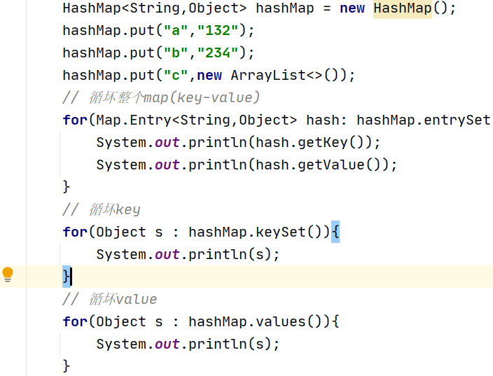
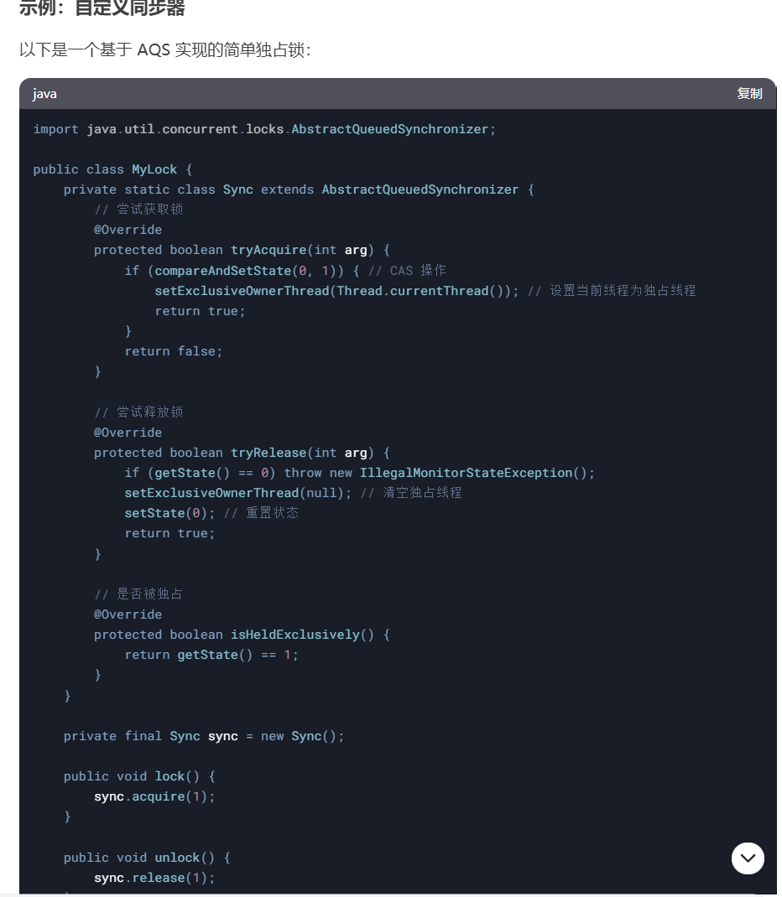
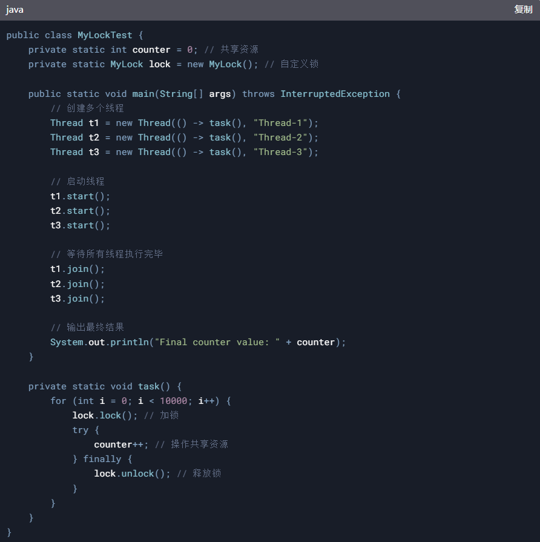
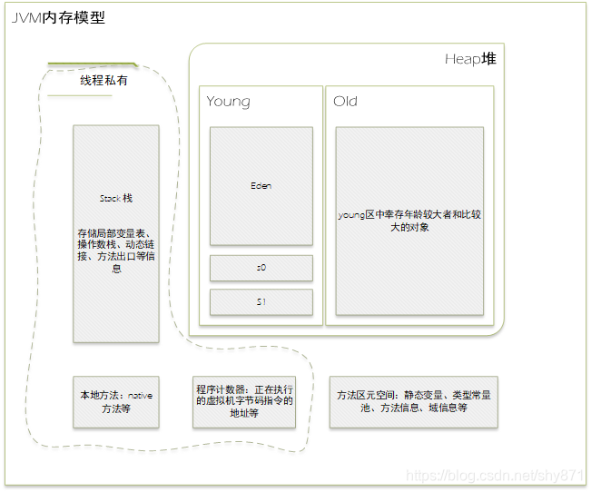

# Java 基础相关知识：

## 1.String 是不是基本数据类型？请说出String 的几个方法？

答：不是，String 是 final 修饰。 不能被继承和重写。

Indexof(c) ---c 的 索引位置

CharAt(5) --- 查找的索引对应的字

Substring(0,5)—截取字符串

2. **StringBuilder 和 StringBuffer 有什么区别？**

答：StringBuilder 线程不安全，但效率高

  StringBuffer  线程安全，但效率低

## 3.请说出java 的集合分类？

答：

## 4.ArrayList 和 LinkedList 的区别？

答：ArrayList 是查询快，增删慢（初始容量是10，超过10，扩容到1.5倍）

LinkedList  是增删快，查询慢

## 5.HashMap, HashSet 和 HashTable 的区别？

HashMap与HashTable都是key-value 结构 ，put()添加
HashMap 可以为null  ,HashTable 不能为 null， 

HashSet  是 不能 有重复元素,add()添加

## 6.HashMap, ConcurrentHashMap 和HashTable 的区别？（线程安全性考虑）

HashMap 不是安全，效率高

HashTable 是安全的，效率不高

ConcurrentHashMap 既安全，效率也高（分段锁）----→为什么安全？

## 7.HashMap 的底层结构？

HashMap 底层数组，数据会放在bucket 桶里，结构是Entry

执行put(“a”,”123”),key.hashcode 算出hash 值 存储位置。

Hash 冲突 时会放入链表中，链表的长度是 8.  Jdk 1.8 之前是链表

，1.8 之后变成红黑树。

（HashMap 默认容量是16,负载因子是0.75，动态扩容为2的幂）

链表长度超过 **8** 且数组长度达到 **64** 时，链表会转换为**红黑树。**

   备注：防止hash 冲突，重写hashcode 和 equals 方法

## 9.Map 能不能循坏？



## 12.什么是双亲委派机制？

答：启动类加载器-→平台类加载器--→应用加载器

优先从子类去找父类，父类没有再找子类（从下往上，再从上往下）

## 13.JDK 8 有哪些新特性？

答：
lambda 表达式----（a,b）->{} 或User::getName

stream流     ----foreach  map

新的日期API -------timeZone 包含时区

函数式编程出现  -------@FunctionInterface 消费型（参数只进不出）和供给型（参数只出不进） ，接口作为参数传入

## 14.创建线程的几种方式？

答：
继承 Thread

实现 runnable 接口 ----无返回值

实现 callable 接口  ----有返回值 （构造线程实例时，需先使用实现了Runnable接口的FutureTask封装）（通过futureTask实例调用.get()方法获取返回值）

## 15.实现线程池有几种方式？使用最多哪种？哪七个参数？

答：
Executors.newFixedThreadPool：创建一个固定大小的线程池
Executors.newCachedThreadPool：创建一个可缓存的线程池，
Executors.newSingleThreadExecutor：创建单个线程数的线程池
Executors.newScheduledThreadPool：创建一个可以执行延迟任务的线程池；

Executors.newSingleThreadScheduledExecutor：创建一个单线程的可以执行延迟任务的线程池；

Executors.newWorkStealingPool：创建一个工作窃取线程池

ThreadPoolExecutor：最原始也最推荐的创建线程池的方式，它包含了 7 个参数可供设置

（1：核心线程数 2: 最大线程数 3: 线程存活时间 4: 时间单位 5: 阻塞队列 6: 线程工厂 7: 拒绝策略)

拒绝策略 :

	1. AbortPolicy（拒绝，直接抛异常）

    2. DiscardPolicy（拒绝，没有异常和通知）

    3. DiscardOldestPolicy（丢弃等待时间长的）

    4. CallerRunsPolicy(谁提交线程谁管理)

执行流程是什么？

答：6---→1—→5--→2---→7

## 16.线程执行的步骤或状态？

答：创建状态----就绪状态---运行状态----阻塞状态-----死亡状态；

## 17.线程状态Sleep 和 wait 有什么区别？

答：
Sleep 是Thead 类 ，必须传参指定延迟时间，延迟期间不释放锁。

Wait 是 Object 类 （由锁对象调用，锁对象被synchronized 同步锁定），调用就立即释放锁。指定时间自动唤醒，不传参，需使用notify唤醒。

## 18.请说说synchronized 这个关键字的作用？

答：synchronized 是同步锁

原子性 ----访问的线程都互相隔离

Synchronized 修饰 方法    ----给该方法的实例对象 进行加锁

Synchronized 修饰 静态方法----给该方法的类 进行加锁

Synchronized（this）代码块 ----对源头访问的对象或类进行加锁

## 19.单例模式怎么运用的？

答：spring java 所有对象bean 都是单例（默认都是懒加载）

```java

//饿汉式单例类.在类初始化时，已经自行实例化

public class Singleton1 {

    private Singleton1() {}

    private static final Singleton1 single = new Singleton1();

    //静态工厂方法

    public static Singleton1 getInstance() {

        return single;

    }

}
```

- 懒汉式：

```java

//懒汉式单例类.在第一次调用的时候实例化自己

public class Singleton {

    private Singleton() {}

    private static Singleton single=null;

    //静态工厂方法

    public static Singleton getInstance() {

         if (single == null) {

             single = new Singleton();

         }

        return single;

    }

}
```

- 饿汉式就是类一旦加载，就把单例初始化完成，保证getInstance()的时候，单例就已经存在。
- 懒汉式比较懒，只有当调用getInstance的时候，才会去初始化这个单例

## 20.常见的设计模式？

答：23 种设计模式，常用的有单例模式；代理模式；工厂模式；适配器模式；策略模式；

装饰模式

（找到自己熟悉的设计模式集合业务使用场景叙述）

## 21.CAS 和 AQS ?

CAS（Compare-And-Swap）是Java中的一种原子操作，用于实现**无锁并发控制。它通过比较并交换的方式确保线程安全**，常用于多线程环境下的变量更新。

CAS 操作步骤

1. **比较**：检查当前值是否与预期值一致。
2. **交换**：如果一致，则更新为新值；否则，不进行操作。

Java 中的 CAS

在Java中，CAS主要通过**java.util.concurrent.atomic包中的类（如AtomicInteger、AtomicLong等）实现。这些类提供了compareAndSet方法**，用于执行CAS操作。


CAS 的优缺点

优点：

无锁：减少线程阻塞，提升并发性能。

轻量：相比锁机制，开销较小。

缺点：

ABA问题：值从A变为B再变回A，CAS会误认为未变化。可通过版本号或AtomicStampedReference解决。

自旋开销：在高竞争下，CAS可能多次重试，增加CPU负担。

总结：

CAS是一种高效的无锁并发控制机制，适用于低竞争场景。在高竞争环境下，可能需要结合其他同步机制

AQS（AbstractQueuedSynchronizer）是Java并发包（java.util.concurrent.locks）中的一个核心框架，用于构建锁和其他同步器（如ReentrantLock、Semaphore、CountDownLatch等）。AQS 提供了一个基于 FIFO（先进先出） 等待队列的同步机制，开发者可以通过继承 AQS 并实现其抽象方法来创建自定义的同步器。

**AQS 的核心思想**

AQS 的核心思想是通过一个 volatile 的整型状态变量（state） 和一个 FIFO 线程等待队列 来实现同步机制。AQS 的主要功能包括：

1. 状态管理：通过 state 变量表示同步状态（如锁的持有次数、信号量的许可数等）。
2. 线程排队：通过一个双向链表实现的等待队列，管理竞争资源的线程。
3. 模板方法：AQS 提供了一些模板方法（如 tryAcquire、tryRelease 等），需要子类实现这些方法来定义具体的同步逻辑。

**AQS 的核心方法**

AQS 的核心方法可以分为两类：

**独占模式（Exclusive Mode）**：

一次只有一个线程可以获取资源。

核心方法：

**acquire**(int arg)：获取资源，如果失败则进入等待队列。

**release**(int arg)：释放资源，唤醒等待队列中的线程。

**tryAcquire**(int arg)：尝试获取资源（需要子类实现）。

**tryRelease**(int arg)：尝试释放资源（需要子类实现）。

**共享模式（Shared Mode）：**

多个线程可以同时获取资源。

核心方法：

**acquireShared**(int arg)：获取共享资源。

**releaseShared**(int arg)：释放共享资源。

**tryAcquireShared**(int arg)：尝试获取共享资源（需要子类实现）。

**tryReleaseShared**(int arg)：尝试释放共享资源（需要子类实现）。

**AQS 的实现原理**

**1.状态变量（state）**：

通过 volatile int state 表示同步状态。

子类可以通过 getState()、setState() 和 compareAndSetState() 方法来操作状态。

**2.等待队列：**

使用一个双向链表实现的 FIFO 队列来管理等待线程。

每个节点（Node）代表一个等待线程，包含线程引用、等待状态等信息。

**3.模板方法：**

AQS 提供了模板方法（如 acquire、release），这些方法会调用子类实现的 tryAcquire、tryRelease 等方法。

**AQS 的应用**

AQS 是 Java 并发包中许多同步工具的基础，例如：

**ReentrantLock：**

基于 AQS 实现的可重入锁。

使用独占模式：

**Semaphore：**

基于 AQS 实现的信号量。

使用共享模式。

**CountDownLatch：**

基于 AQS 实现的倒计时门闩。

使用共享模式。

**ReentrantReadWriteLock：**

基于 AQS 实现的读写锁。

读锁使用共享模式，写锁使用独占模式。





**AQS 的优点**

灵活性：开发者可以通过继承 AQS 实现自定义的同步器。

高性能：基于 CAS 和 volatile 实现，避免了传统锁的开销。

可扩展性：支持独占模式和共享模式，适用于多种同步场景。

**总结**

AQS 是 Java 并发编程的核心框架之一，它为构建锁和其他同步器提供了强大的基础。通过理解 AQS 的工作原理，可以更好地掌握 Java 并发工具的实现机制，并能够根据需求实现自定义的同步器。

## 22.JVM 的结构？JVM 如何调优？



栈 Stack  ; 堆 Heap ; 方法区(永久代----元空间)；本地方法栈；程序计数器

GC垃圾回收算法：标记-清理 ； 标记-整理 ； 标记-复制

Jvm 优化调优参数


Jvm 命令工具：

Jps(JVM process status) 可以查看虚拟机启动的所有进程 ，jps -v 可查看启动参数

Jstat(JVM statiscs monitoring tool) 监视虚拟机信息

Jmap(memory map for java) 查看堆内存信息

  Jmap -histo pid  可以打印出当前堆中所有每个类的实例数量和内存占用

  Jmap -dump     可以转储堆内存快照到指定文件。比如执行jmap -dump:format=b，file=/data/dump/dumpfile_jmap.hprof 14620

Jvm 优化步骤流程：

第一步：分析GC日志及dump 文件，判断是否需要优化，确定瓶颈问题点：

使用命令：

```

jps -v 查看虚拟机所有进程

Jstat 查看虚拟机信息

jmap -dump:format=b，file=/data/dump/dumpfile_jmap.hprof
```

第二步：确定jvm调优量化目标---确定是调整堆还是栈，或者GC

第三步：确定jvm调优参数

第四步：调优一台服务器，对比观察调优前后的差异

第五步：不断的分析和调整，直到找到合适的jvm参数配置

第六步：找到合适的参数，将这些参数应用到所有服务器，并进行后续追踪

## 23.项目中高并发产生了OOM(内存溢出)，如何排查？

 上面22 JVM 调优的答案

---
