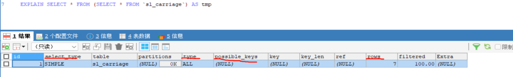
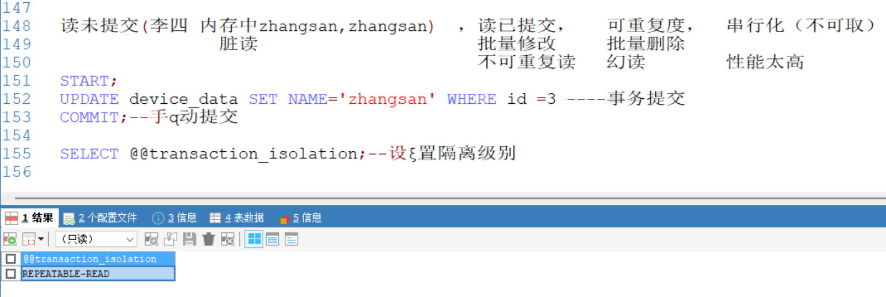

# Mysql 相关知识：

## 二叉树，红黑树，B树，B\+树？

1. 二叉树：只有二个叉，大数据量情况下，层架较深，查找次数过多。可能出现单叉的坏情况
2. 红黑树（平衡二叉树）：在算法上比二叉快一点。依然只有二个叉，大数据量情况下，层架较深，查找次数过多
3. B-Tree(多阶多路平衡多叉树): 每个节点最多有5阶的叉，存储数据更多，层级更短。查询次数少效率就高。叶子节点和非叶子  节点上都存储了索引和数据，在查找最终数据的过程中需要加载大量数据，影响效率
4. B+Tree：在b-tree 的基础上改进，数据放在叶子节点。中间只加载索引和指针。效率大大提高
5. ·
## 1.MySQL数据库索引的类型有哪些？

主键索引, 唯一索引, 普通索引，复合索引(联合索引)

## 2.主建索引，唯一索引区别?

唯一性索引列允许空值,而主键列不允许为空值

## 3.mysql索引是不是越多越好？

CREATE INDEX idx_iotId_functionId_time ON device_data (iot_id,function_id,alarm_time)---创建索引

MySQL索引不是越多越好。索引可以提高查询性能，但它们也会占用更多的存储空间，并且在插入、删除和更新数据时会增加额外的开销，因为索引也需要被更新。过多的索引可能导致性能问题，因为数据库需要更多的时间来维护这些索引

## 4.索引失效场景？

1. like 通配符% 错误使用---左模糊会失效

2. 索引列使用MySQL函数，索引失效

3. 索引列存在计算，使用（+、-、* 、/），索引失效

4. 使用（！= 或者 < >，not in），导致索引失效

5. 使用了select * ，导致索引效率低

6. 联合索引不满足最左匹配原则

## 5.数据库事物特性?

数据库事务的特性通常被称为[ACID特性](https://www.baidu.com/s?wd=ACID%E7%89%B9%E6%80%A7&rsv_idx=2&tn=baiduhome_pg&usm=2&ie=utf-8&rsv_pq=b21cccad0397ab2f&oq=%E6%95%B0%E6%8D%AE%E5%BA%93%E4%BA%8B%E7%89%A9%E7%89%B9%E6%80%A7&rsv_t=77b68deXsOSiNB7s5RhgzumlFmM0wVqY%2BHeQP%2FNbzPASzcu%2BJHW6grUj%2FCRtKGjQDSVS&sa=re_dqa_zy&icon=1" \t "_self)，这四个特性分别是：

    ‌原子性‌：事务里的操作要么全成功，要么全失败，不会只做一半，靠回滚日志保证 。
    ‌一致性‌：数据始终符合业务规则，如转账前后总金额保持不变，是最终目标 。
    ‌隔离性‌：多个事务同时进行互不干扰，防止数据读取错乱，通过隔离级别控制 。
    ‌持久性‌：一旦提交，数据永久保存，即使断电也不会丢失，靠重做日志保证 。‌‌

1. 原子性（Atomicity）：事务是一个不可分割的工作单位，事务中的所有操作要么全部执行，要么全部不执行。这意味着事务的操作序列要么完全应用到数据库，要么完全不影响数据库。
2. 一致性（Consistency）：事务的执行必须使数据库从一个一致性状态变换到另一个一致性状态。这意味着事务的执行必须满足所有数据的完整性约束条件，例如，在转账的例子中，无论转账如何进行，参与转账的账户总金额应保持不变。
3. 隔离性（Isolation）：在并发环境中，多个事务的执行应相互隔离。这意味着一个事务的内部操作及其使用的数据对其他并发事务是隔离的，并发执行的事务之间不能互相干扰。数据库系统提供了多种隔离级别来确保事务的隔离性。
4. 持久性（Durability）：一旦事务被提交，它对数据库中数据的改变就是永久性的，即使系统或介质发生故障，已提交事务的更新不会被丢失。这意味着事务日志等机制被用来确保即使在故障发生后，已提交事务的更改仍然可以被恢复、

## 6.SQL语句如何调优? 100%

SQL调优通常涉及以下方面：

1.  对表的设计方面

    创建表结构字段尽量不要太多

    Sql 语句的where 条件使用频繁可以创建索引

2.  Sql 语句上进行优化

    like 通配符% 不能加左边
    
    索引列不能使用MySQL函数，索引失效
    
    索引列不能，使用（+、-、* 、/），索引失效
    
    不使用（！= 或者 < >，not in），导致索引失效
    
    不使用了select * ，导致索引效率低
    
    联合索引满足最左匹配原则

3.  使用explain 慢sql计划 分析

possible_key 当前sql可能会使用到的索引

key 当前sql实际命中的索引

key_len 本次查询实际使用了索引中多少个字节的长度

## 7.mysql的外连接和内连接有什么区别
外连接：
  左外连接（left outer join）：以左边的表为主表
  
  右外连接（right outer join）：以右边的表为主表
  
  以某一个表为主表，进行关联查询，不管能不能关联的上，主表的数据都会保留，关联不上的以NULL显示

内连接：取两张表数据的交集

## 8.回表知道吗，怎么避免回表查询？

使用覆盖索引；避免使用select * 查询 ；使用缓存数据库；聚簇索引查询

聚簇索引（聚集索引）：数据与索引放到一块，B\+树的叶子节点保存了整行数据，有且只有一个

非聚簇索引（二级索引）：数据与索引分开存储，B\+树的叶子节点保存对应的主键，可以有多个

覆盖索引是指查询使用了索引，并且需要返回的列，在该索引中已经全部能够找到 。

（条件创建三个索引字段，返回列是2个条件索引列。满足覆盖索引）

回表----通过列字段查询，找到id,再通过主键索引找整行数据。

    二级索引叶子节点的 ID 列表虽然按逻辑排序，但映射到聚簇索引后，这些 ID 所在的物理数据页在磁盘上往往相隔甚远（跨 Extent）。这导致回表操作无法利用 B+ 树叶子节点的‘物理相邻预读’特性，每一次读取都退化为独立的、需要完整磁盘寻道的单页随机 I/O，从而严重拖慢性能。

1. 数据库的隔离级别？

读未提交；读已提交；可重复读；串行化

## 9.数据库的引擎？

InnoDB（默认）：支持事务管理，行级锁

MyISAM：不支持事务管理，表级锁

BDB

Memory

Merge

## 10.mysql的快照读和当前读？

快照读=无锁历史版本，当前读=加锁最新版本

    MySQL中的快照读和当前读是事务隔离级别的概念，不是指具体的代码实现或功能。

快照读（Snapshot Read）: 快照读是一种不加锁的读操作，它可以读取已经提交的数据。快照读在MySQL的REPEATABLE READ隔离级别以及更低级别的隔离级别下都可以使用。

当前读（Current Read）: 当前读是一种加锁的读操作，它读取记录的最新版本，并且会对读取的记录加锁，保证其他事务不会并发修改这些记录。一般在SERIALIZABLE隔离级下使用
（SERIALIZABLE隔离级会强制把所有读变成当前读）。

在实际操作中，快照读通常是隐式的，而当前读则可以通过显式锁定语句来实现，如SELECT ... FOR UPDATE或者SELECT ... LOCK IN SHARE MODE

    **当前读是一种操作指令（我要改/我要锁），快照读是一种读取策略（我看历史照片）。它们由 SQL 类型决定，不由隔离级别决定。隔离级别只是决定了快照读拍照片的‘频率’（RR拍一次，RC拍多次），而 SERIALIZABLE 级别是强行把‘看照片’的动作直接变成‘现场查封**

## 11.mysql的MVCC？

自己去看

## 12.Mysql 乐观锁和悲观锁？（数据库层面）(高并发) === redis 分布式锁 （业务层进行高并发控制）

   乐观锁：认为在多线程下，数据不会被多个同时修改 set version = version\+1  where version = 0

悲观锁：认为在多线程的情况下，数据会被多个同时修改

    在修改之前就要加索， 查询时加一个select * from user for update。

## 13.mysql大数据量的优化题？

现在我有一张表 这张表 有 6000万 数据量，我怎么在这张中查询或者分页 我想要的数据 1 s ?  id --→嵌套sql

