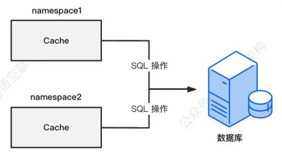

# Mybatis 相关知识：

## 1.什么是Mybatis/简单说说Mybatis？

MyBatis 是一个开源、轻量级的数据持久化框架，是 JDBC 和 Hibernate 的替代方案。MyBatis 内部封装了 JDBC，简化了加载驱动、创建连接、创建 statement 等繁杂的过程，开发者只需要关注 SQL 语句本身。

## 2.Mybatis中\#{}和${}的区别是什么？

\#传入的参数在sql中显示为字符串--占位符，\#方式能够很大程度防止sql注入；

\$传入的参数在sql中直接显示为传入的值--赋值符，$方式无法防止sql注入。

## 3.Mybatis中当实体类中的属性名和表中的字段名不一样，怎么办 ？如何封装数据？请列举几种方式？

可以通过在映射文件中使用resultMap来解决这个问题。resultMap允许你将查询结果中的列名映射到实体类的属性上。

下面是一个简单的例子：

实体类（Java）：
```java

public class User {

    private int id;

    private String username; // 对应数据库中的user_name

    // getters and setters

}

```

映射文件（XML）：
```xml

<resultMap id="userResultMap" type="User">

    <result property="id" column="id"/>

    <result property="username" column="user_name"/>

</resultMap>

<select id="selectUser" resultMap="userResultMap">

  SELECT id, user_name

  FROM users

  WHERE id = \#{id}

</select>
```

在上面的resultMap中，property属性指的是实体类中的属性名，column属性指的是数据库表中的字段名。在 < select > 查询中，通过resultMap属性引用这个resultMap，MyBatis会自动处理映射。

第二种方式：可以 使用select user_name as name 这种别名的方式

## 4.Mybatis中模糊查询like语句该怎么写？

SELECT * FROM your_table WHERE your_column LIKE CONCAT('%', \#{name}, '%')

## 5.Mybatis如何执行批量插入数据？

MyBatis可以通过<foreach>标签来实现批量插入数据

在对应的Mapper XML文件中，使用<foreach>标签来遍历实体列表并构建批量插入的SQL语句：
```xml

<mapper namespace="your.package.YourMapper">

    <insert id="insertBatch">

        INSERT INTO your_table (column1, column2, ...)

    VALUES

    <foreach collection="list" item="item" index="index" separator=",">

    (\#{item.field1}, \#{item.field2}, ...)

        </foreach>

    </insert>

</mapper>
```

## 6.Mybatis中如何获取Mysql自动增长的主键值【主键返回/生成】?

在MyBatis中，要获取MySQL数据库自增主键值，可以使用useGeneratedKeys属性和keyProperty属性。在<insert>标签中设置这两个属性，useGeneratedKeys设置为true表明要获取数据库自动生成的键，keyProperty设置为Java对象中对应主键属性的名

```xml

<insert id="insertUser" useGeneratedKeys="true" keyProperty="id">

  INSERT INTO users (username, email) VALUES (\#{username}, \#{email})

</insert>

```

## 7.Mybatis中在mapper接口方法中如何传递多个参数，需要用到什么注解?

@Param注解

## 8.你在实际开发中用到了哪些Mybatis的动态sql标签？

If , where , trim, choose , when , otherwise , foreach

## 9.Mybatis的Xml映射文件中，不同的Xml映射文件，id是否可以重复？同一个Xml映射文件，能重复吗？

MyBatis的XML映射文件中，不同的映射文件可以有相同的id值，因为MyBatis在加载映射文件时会将它们视作不同的映射定义。但是，在同一个XML映射文件中，所有的id值必须是唯一的，因为MyBatis会使用这个id来引用特定的映射语句。

如果你有两个不同的XML映射文件，它们中的映射语句可以有相同的id值

<\!-- file1.xml -->
```xml

<mapper namespace="com.example.mapper.File1Mapper">

  <select id="selectSomething" resultType="com.example.SomeType">

    SELECT * FROM some_table WHERE id = \#{id}

  </select>

</mapper>
```

<\!-- file2.xml -->
```xml

<mapper namespace="com.example.mapper.File2Mapper">

  <select id="selectSomething" resultType="com.example.SomeType">

    SELECT * FROM another_table WHERE id = \#{id}

  </select>

</mapper>

```

## 10.说说Mybatis的大概执行流程？

MyBatis 的执行流程大致可以分为以下几个步骤：

1. 加载配置 ：首先，MyBatis 会加载配置文件（通常是 mybatis-config.xml），这个配置文件包含了数据库连接信息、事务管理器信息、数据源信息等内容。

2. 创建SqlSessionFactory ：然后，MyBatis 会根据加载的配置信息创建 SqlSessionFactory 对象。SqlSessionFactory 是 MyBatis 的核心对象，它负责创建 SqlSession 对象。

3. 创建 SqlSession ：SqlSession 是 MyBatis 中用于执行 SQL 语句、获取映射器（Mapper）对象的重要对象。你可以通过 SqlSessionFactory 的 openSession() 方法来获取 SqlSession。

4. 获取映射器（Mapper）对象 ：通过 SqlSession，你可以获取映射器对象，这个对象包含了数据库表对应的 Java 对象和 SQL 语句的映射关系。你可以通过两种方式获取映射器对象：一是使用 SqlSession 的 getMapper() 方法，二是使用 MyBatis 提供的注解 @Mapper 或 @MapperScan。

5. 执行 SQL 语句 ：一旦你获取了映射器对象，你就可以通过它来执行 SQL 语句了。你可以通过映射器对象直接调用 SQL 语句对应的 Java 方法，MyBatis 会自动将你的方法参数映射到 SQL 语句的参数，并将 SQL 语句的执行结果映射到 Java 对象。

6. 关闭 SqlSession ：执行完 SQL 语句后，你需要关闭 SqlSession，以释放数据库连接和其他资源。

## 11.你们项目中Mybatis分页是如何实现的？使用原生limit 如何实现？

使用第三方pagehelper 插件。

使用原始limit (pageNum-1)*pageSize , pageSize

## 12.Mybatis的一级、二级缓存有了解吗，具体说说？

答：

一级缓存原理：Sqlsession

在一次 SqlSession 中（数据库会话），程序执行多次查询，且查询条件完全相同，多次查询之间程序没有其他增删改操作，则第二次及后面的查询可以从缓存中获取数据，避免走数据库。


每个SqlSession中持有了Executor，每个Executor中有一个LocalCache。当用户发起查询时，MyBatis根据当前执行的语句生成MappedStatement，在Local Cache进行查询，如果缓存命中的话，直接返回结果给用户，如果缓存没有命中的话，查询数据库，结果写入Local Cache，最后返回结果给用户。

Local Cache 其实是一个 hashmap 的结构：

private Map<Object, Object> cache = new HashMap<Object, Object>();

如下图所示，有两个 SqlSession，分别为 SqlSession1 和 SqlSession2，每个 SqlSession 中都有自己的缓存，缓存是 hashmap 结构，存放的键值对。

键是 SQL 语句组成的 Key ：

Statement Id \+ Offset \+ Limmit \+ Sql \+ Params

值是 SQL 查询的结果：


一级缓存配置

在 mybatis-config.xml 文件配置，name=localCacheScope，value有两种值：SESSION 和 STATEMENT
```xml

<configuration>

<settings>

<setting name="localCacheScope" value="SESSION"/>

</settings>

<configuration>
```

SESSION：开启一级缓存功能

STATEMENT：缓存只对当前执行的这一个 SQL 语句有效，也就是没有用到一级缓存功能。

MyBatis 一级缓存失效的场景：

不同的SqlSession对应不同的一级缓存

同一个SqlSession但是查询条件不同

同一个SqlSession两次查询期间执行了任何一次增删改操作

同一个SqlSession两次查询期间手动清空了缓存

### 二级缓存原理：SqlsessionFactory

 MyBatis的二级缓存相对于一级缓存来说，实现了SqlSession之间缓存数据的共享，同时粒度更加的细，能够到namespace级别，通过Cache接口实现类不同的组合，对Cache的可控性也更强。MyBatis在多表查询时，极大可能会出现脏数据，有设计上的缺陷，安全使用二级缓存的条件比较苛刻

一级缓存最大的共享范围就是一个 SqlSession 内部，如果多个 SqlSession 之间需要共享缓存，则需要使用到二级缓存。

开启二级缓存后，会使用 CachingExecutor 装饰 Executor，进入一级缓存的查询流程前，先在CachingExecutor 进行二级缓存的查询。

二级缓存开启后，同一个 namespace下的所有操作语句，都影响着同一个Cache



每个 Mapper 文件只能配置一个 namespace，用来做 Mapper 文件级别的缓存共享。

<mapper namespace="mapper.StudentMapper"></mapper>

二级缓存被同一个 namespace 下的多个 SqlSession 共享，是一个全局的变量。MyBatis 的二级缓存不适应用于映射文件中存在多表查询的情况。

通常我们会为每个单表创建单独的映射文件，由于MyBatis的二级缓存是基于namespace的，多表查询语句所在的namspace无法感应到其他namespace中的语句对多表查询中涉及的表进行的修改，引发脏数据问题


先查询二级缓存，因为二级缓存中可能会有其他程序已经查出来的数据，可以拿来直接使用

如果二级缓存没有命中，再查询一级缓存

如果一级缓存也没有命中，则查询数据库

SqlSession关闭之后，一级缓存中的数据会写入二级缓存。

二级缓存配置

开启二级缓存需要在 mybatis-config.xml 中配置：

<settingname="cacheEnabled"value="true"/>
