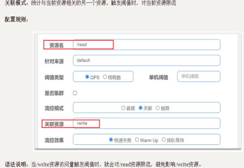
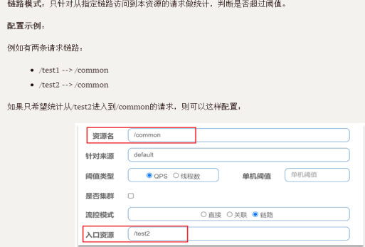
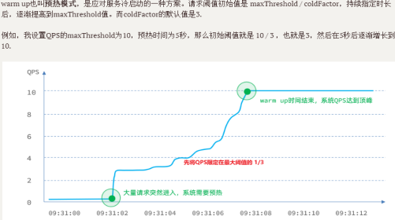
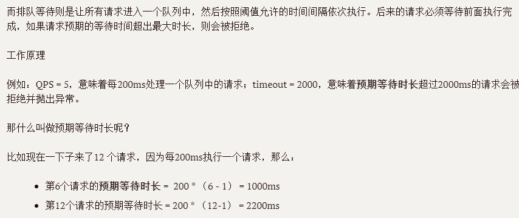
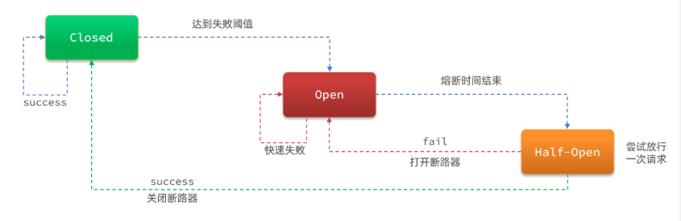
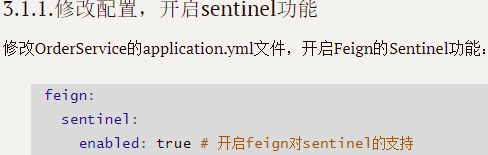
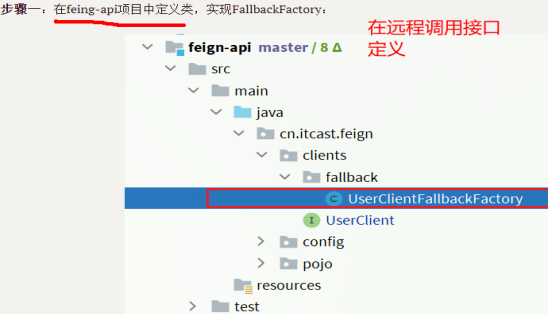
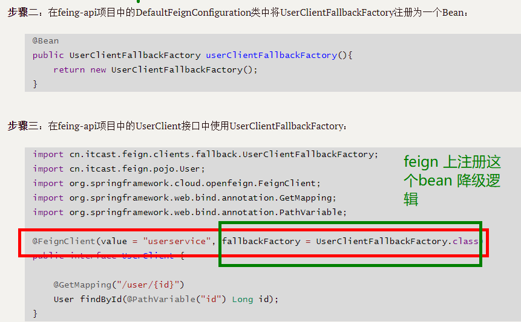

# Sentinel相关：

## Sentinel 如何进行微服务保护？

源头控制：

流量控制：直接限流；关联模式，链路模式

         

流控效果：直接失败；warmup; 排队等待

     

熔断降级：

熔断：断路器默认是close关闭,设置触发的熔断规则（自己设置：慢调用，异常比例，异常数）时则open 打开，到达熔断时长时则会half-open放开一个链接去进行访问，如果成功则断路器close,如果失败则断路器open.持续上面的过程

降级：业务失败后，不能直接报错，而应该返回用户一个友好提示或者默认结果，这个就是失败降级逻辑。给FeignClient编写失败后的降级逻辑
      
      
