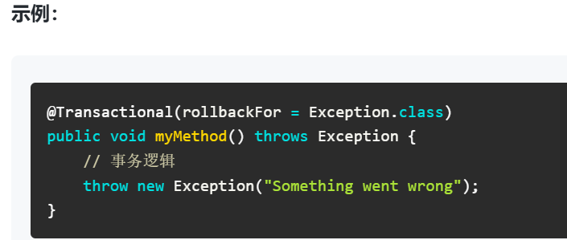
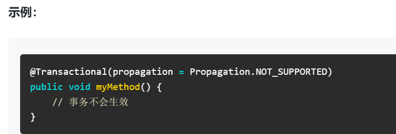
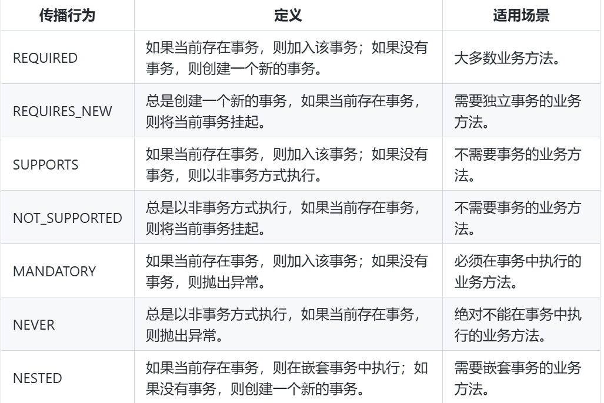
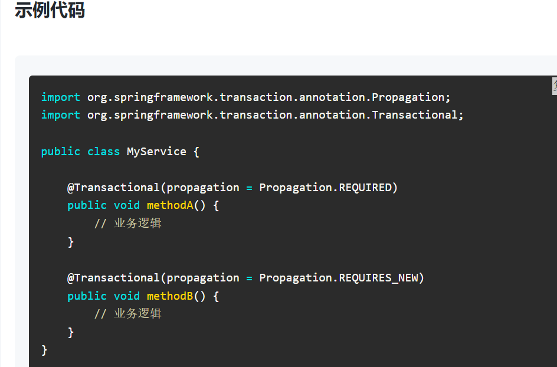
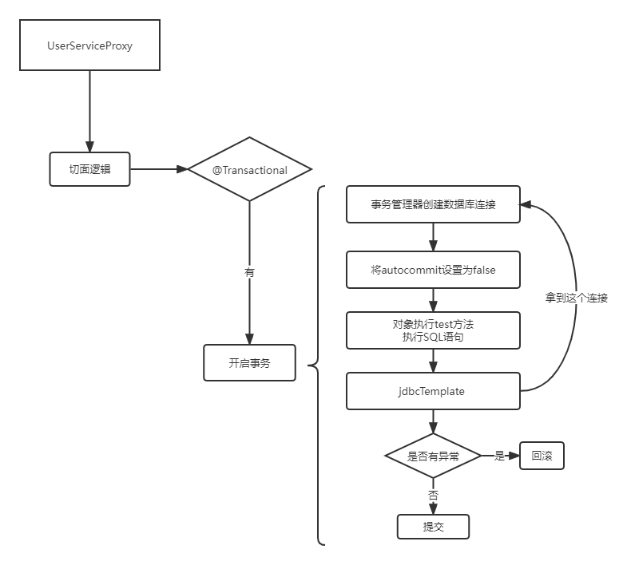
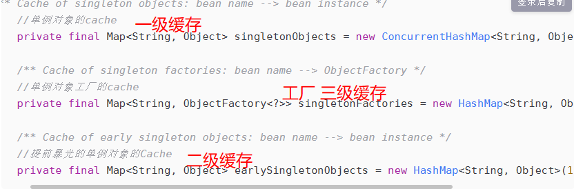
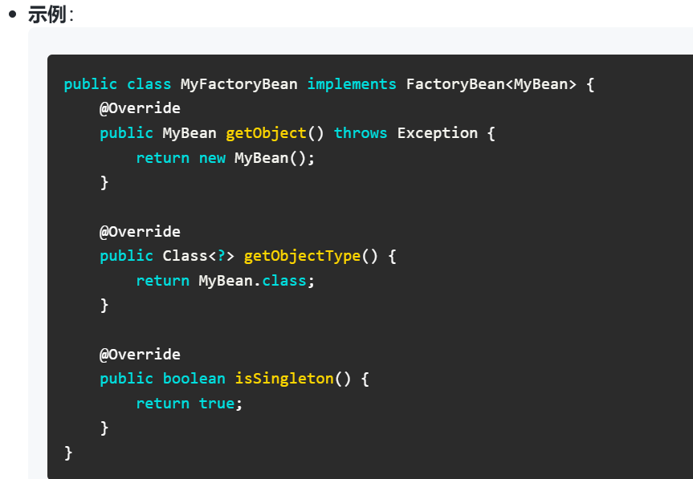

# Spring 框架 知识：

## 什么是Spring IOC ？

答：控制反转：原来需要我们主动去new 一个对象，现在通过将对象的创建和管理交给一个spring的容器.然后对容器里的对象进行依赖注入

## 什么是AOP？

答：面向切面编程，在不改变原代码的基础上对代码功能进行增强。它包括三部分：切面(@Aspect)，切入点（@PointCut）,通知类型(@Before @After @Around…)

## 简单说说AOP的底层是基于什么实现的？动态代理的方式有哪些？

答：aop 底层实现是动态代理（Proxy）。

分为 jdk 动态代理：针对实现接口的动态代理（默认代理方式）

cglib 动态代理：针对接口的实现类的代理

   底层主要是通过Proxy.newProxyInstance(ClassLoader loader, class<?> interfaces,new InvocationHandler) 这个方法实现。

这三个参数分别是：指定当前目标对象的类加载器

    目标对象实现接口的类型

    s事件处理，执行目标对象方法时，会触发

## Aop 的常用注解有哪些？通知类型有哪些？

@Aspect、@Pointcut

@Before、@After、@AfterReturning、@AfterThrowing和@Around

## 说说AOP一般能用来干什么？在你的项目中有用到吗，如何使用的？

Aop 用来在不改变原代码的基础上对代码功能进行增强。我项目中有使用到，主要用在了后台管理系统，获取用户操作后台页面的前后记录插入到数据库操作。


## spring依赖注入实现方式有几种？

答：构造器注入 ; Setter注入(@Autowried) ; 字段注入(@Value)

## 说说什么是Spring Bean？

答：Spring Bean是由Spring IoC容器管理的对象，它们通过依赖注入的方式获取其他Bean的引用，并且由Spring容器负责生命周期的管理

## 简单说说Spring Bean的生命周期？

实例化：Spring容器根据配置创建Bean的实例。

属性赋值：Spring容器为Bean的属性赋值。

初始化：Spring容器调用Bean的初始化方法（如@PostConstruct注解的方法）。

使用：Bean被应用程序使用。

销毁：Spring容器在Bean销毁前调用销毁方法（如@PreDestroy注解的方法）

## 说说Spring常用的注解有哪些？

@Component  @Controller  @Service @Repository  @Bean  @Configuration  @Autowired   @RequestMapping

## Spring框架中的单例bean是线程安全的吗？如果不是如何解决？

答：不是，默认情况下Spring创建bean对象是单例的。也就是说这个JVM虚拟机中就一个bean对象，并且里面的全局变量属性也就独此一份。

如果此时多用户并发请求调用bean对象的一个方法，对全局变量进行增删改操作。因为一个请求服务器会创建一个线程进行处理，就会发生多线程并发操作同一个共享变量，如果此时全局变量本身也是线程不安全的【举例变量类型是ArrayList，是线程不安全的】，那么就会产生线程安全问题。

如何解决呢？

1、将bean的作用域改成 Prototype非单例，这样每次用户请求，Spring都会创建新的UserService对象，不同对象的data属性是隔离的，所以不存在线程安全问题。但是每次创建UserSerivce对象，会操作内存空间的浪费，很不推荐使用。

2、使用线程同步，比如对方法加synchronized 或者使用Lock锁，避免并发操作的问题。

3、将成员变量声明为方法中的局部变量，局部变量只在方法内有效。而每个线程执行方法是在线程的独立内存空间中进行的。也就是局部变量，不同线程间是相互隔离的，也就不存在线程安全问题。

4、使用线程安全的类：AtomicInteger, ConcurrentHashMap,vector 等

## 你们项目中的事务是如何处理的？一般事务在三层架构中的哪层进行处理？

@Transactional    ;  业务层添加处理

## 说说哪些情况下会导致spring事务失效？

## 1. 默认只能作用于public方法。如果将事务注解放在非public方法上（如private、protected方法），事务将不会生效

## 2. 在同一个类中，如果一个方法调用了另一个带有事务注解的方法，事务将不会生效。这是因为Spring的事务管理是通过代理模式实现的，内部方法调用不会经过代理对象


Spring事务默认情况下只会回滚RuntimeException和Error，如果抛出的是受检异常（Checked Exception），事务不会回滚。可以通过@Transactional的rollbackFor属性指定需要回滚的异常类型。



Spring事务的传播行为（Propagation Behavior）决定了事务在不同方法调用之间如何传播。如果传播行为设置不当，可能会导致事务失效

s

## Spring事务的隔离级别有哪些？

## 1.读取未提交的数据（脏读）。可能导致脏读、不可重复读和幻读。

## 2.读取已提交的数据。可以防止脏读，但可能导致不可重复读和幻读

## 3.可重复读数据。保证在同一个事务中多次读取同一数据时，结果是一致的。可以防止脏读和不可重复读，但可能导致幻读。

## 4.串行化。通过强制事务串行执行，防止脏读、不可重复读和幻读。性能最低

## 备注：脏读和幻读的区别？


## 说说什么是Spring事务传播行为？Spring事务的传播行为有哪些？

定义了事务方法调用时，事务如何传播和处理。Spring提供了多种传播行为，用于控制事务的边界和行为





## 15..简单说说Spring事务的底层实现原理？

答：Spring 框架提供了两种事务实现方式：

编程式事务：DataSourceTransactionManager 对象，手动Commit 提交事务或回滚

声明式事务：@Transactional 注解

当使用声明式事务@Transactional 注解后事务的自动提交功能会关闭，由改由spring 进行控制事务，spring 事务管理是通过aop 代理实现的，对被代理对象的每个方法进行拦截，在方法执行前启动事务，在方法执行完成后根据是否由异常及异常的类型进行提交或回滚。由DataSourceTransactionManager 对象，进行提交或回滚

举例说明详细解释：
```java

@Component

public class UserService {

    @Autowired

    private JdbcTemplate jdbcTemplate;

    @Transactional

    public void test(){

        jdbcTemplate.execute("insert into student values (1, 'lyd', 18, '20183033210')");

       throw new NullPointerException();

    }

}
```

过程：

首先spring会调用代理对象，对于事务，代理对象会通过执行事务的aop切面逻辑。在这个切面逻辑，Spring会去判断是否含有@Transactional事务注解，如果有才会去开启事务。spring的事务管理器DataSourceTransactionManager会新建一个数据库连接conn，紧接着会把conn.autocommit 设置为 false ，autocommit(自动提交)，每次执行完SQL后就会立马提交，因此这里需要设置为false。(因为spring默认是开启了自动提交，当SQL执行结束之后就会提交，当遇到异常的时候，由于前面的事务都已经提升，因此就没法回滚了，所以需要把自动提交给关闭了) 最后在通过第一次创建的对象去执行test方法。接着会去执行SQL语句，在此SQL执行完之后是不会进行提交的，在执行SQL语句之前，jdbcTemplate会去拿到事务管理器创建的这个数据库连接conn。当执行完test方法后，Spring事务会去判断是否有异常，没有异常就会提交事务（conn.commit()），否者就会事务回滚（conn.rollback()）;



## 16. Spring 框架中都用到了哪些设计模式，简单说说？

单例模式

应用场景：Spring中的Bean默认是单例的

工厂模式

应用场景：Spring中的BeanFactory和ApplicationContext就是工厂模式的实现，用于创建和管理Bean实例

代理模式

应用场景：Spring AOP（面向切面编程）使用代理模式来实现横切关注点的织入，如事务管理、日志记录等

模板方法模式

应用场景：Spring中的JdbcTemplate、RestTemplate等模板类使用了模板方法模式，简化了数据库操作和REST API调用

## 19.知道Spring是如何解决Bean的循环依赖的吗 ？

思考：

什么是循环依赖？

Spring怎么解决循环依赖？

Spring对于循环依赖无法解决的场景？

循环依赖：是循环引用，也就是两个或两个以上的bean 对象互相持有对方，形成闭环。比如A 依赖B，B依赖C, C又依赖于A.

Spring 中循环依赖的场景有：

1. 构造器的循环依赖
```java

@Service

    public class A{

        private B b;

        public A(B b){

            this.b = b;

        }

    }

    @Service

    public class B{

        private A a;

        public B(A a){

            this.a = a;

        }

}
```

    上述代码运行，会抛如下异常：BeanCurrentlylnCreationException异常。

Spring 框架无法解决

1. Field 属性的循环依赖
```java

@Service

    public class A{

        @Autowired

        private B b;

    }

    @Service

    public class B{

        @Autowired

        private A a;

    }
```

    上述代码运行，不会报错。这说明Bean A,Bean 都被成功注入。Spring 框架解决了这种循环依赖的问题。具体怎么解决的呢？

原理：

Spring 对象产生需要这几步：creatBeanInstance 实例化，populateBean 属性赋值，InitializeBean 初始化。

循环依赖主要发生在实例化和属性赋值中间。Spring 采用了三级缓存



步骤:

1.Spring首先从一级缓存singletonObjects中获取。

2.如果获取不到，并且对象正在创建中，就再从二级缓存earlySingletonObiects中获取

3.如果还是获取不到且允许singletonFactories通过getObject()获取，就从三级缓存 singletonFactory.getObject()(三级缓存)获取.

4.如果从三级缓存中获取到就从singletonFactories中移除，并放入earlySingletonObjects中。其实也就是从三级缓存移动到了二级缓存。

那怎么样的循环依赖无法处理呢?

1. 因为加入singletonFactories三级缓存的前提是执行了构造器来创建半成品的对象，所以构造器的循环依赖没法解决。因此.Spring不能解决“A的构造方法中依赖了B的实例对象，同时B的构造方法中依赖了A的实例对象”这类问题了\!（即上面的构造器循环依赖场景）
2. spring不支持原型(prototype)bean属性注入循环依赖，不同于构造器注入循环依赖会在创建spring容器 context时报错，它会在用户执行代码如context.getBean()时抛出异常。因为对于原型bean，spring容器只有在需要时才会实例化，初始化它。

## 20.FactoryBean   和 BeanFactory的区别？

## 1. BeanFactory

定义：BeanFactory 是 Spring 框架的核心接口之一，负责管理和配置 Spring 容器中的 Bean。它是 Spring IoC 容器的实际实现，提供了基本的 Bean 管理功能。

功能：

Bean 的创建和管理：BeanFactory 负责创建、配置和管理 Bean 实例。

依赖注入：通过 BeanFactory，可以实现 Bean 之间的依赖注入。

延迟初始化：默认情况下，BeanFactory 中的 Bean 是延迟初始化的，即只有在第一次请求时才会创建 Bean 实例。

## 2. FactoryBean

定义：FactoryBean 是一个特殊的 Bean，它本身是一个bean 对象，用于创建其他 Bean 实例。FactoryBean 接口允许你自定义 Bean 的创建逻辑。

功能：

自定义 Bean 创建逻辑：通过实现 FactoryBean 接口，你可以定义如何创建和管理 Bean 实例。

复杂对象的创建：FactoryBean 常用于创建复杂的对象，例如代理对象、数据库连接池等。

延迟初始化：FactoryBean 可以控制 Bean 的初始化时机，例如在第一次请求时才创建 Bean 实例。

s

## 21.说说spring和springboot的关系？

Springboot 框架是基于spring 框架为基础 进行简化开发。主要解决spring 框架的几个问题：

- 解决spring框架的需要引入大量pom 依赖问题-------springboot起步依赖
- 解决spring框架的大量xml 配置文件问题------------springboot自动配置
- 解决spring框架项目需要安装tomcat 服务器问题------springboot内置tomcat
