# Java 基础相关知识：
## 1.String 是不是基本数据类型？请说出String 的几个方法？

答：不是，String 是 final 修饰。 不能被继承和重写。

Indexof(c) ---c 的 索引位置

CharAt(5) --- 查找的索引对应的字

Substring(0,5)—截取字符串

2. **StringBuilder 和 StringBuffer 有什么区别？**

答：StringBuilder 线程不安全，但效率高

  StringBuffer  线程安全，但效率低

## 3.请说出java 的集合分类？

答：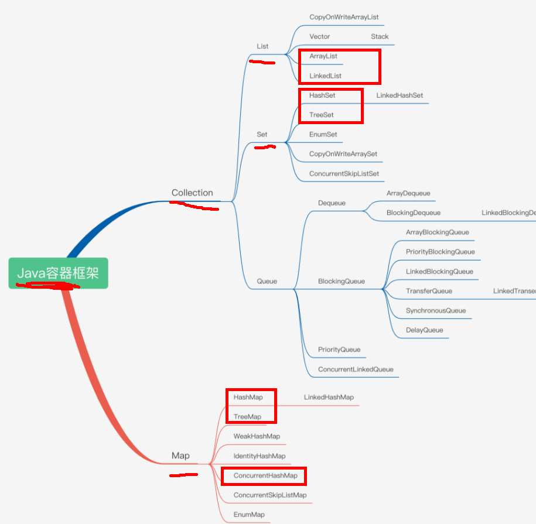

## 4.ArrayList 和 LinkedList 的区别？

答：ArrayList 是查询快，增删慢（初始容量是10，超过10，扩容到1.5倍）

LinkedList  是增删快，查询慢

## 5.HashMap,  HashTable 和  HashSet的区别？

HashMap与HashTable都是key-value 结构 ，put()添加
HashMap 可以为null  ,HashTable 不能为 null，

HashSet  是不能有重复元素,add()添加

## 6.HashMap, ConcurrentHashMap 和HashTable 的区别？（线程安全性考虑）

HashMap 不是安全，效率高

HashTable 是安全的，效率不高

ConcurrentHashMap 既安全，效率也高（分段锁）----→为什么安全？

## 7.HashMap 的底层结构？

HashMap 底层数组，数据会放在bucket 桶里，结构是Entry

执行put("a","123"),key.hashcode 算出hash 值 存储位置。

Hash 冲突 时会放入链表中，链表的长度是 8.  Jdk 1.8 之前是链表

，1.8 之后变成红黑树。

（HashMap 默认容量是16,负载因子是0.75，动态扩容为2的幂）

链表长度超过 **8** 且数组长度达到 **64** 时，链表会转换为**红黑树。**

   备注：防止hash 冲突，重写hashcode 和 equals 方法

## 9.Map 能不能循坏？


## 12.什么是双亲委派机制？

答：启动类加载器-→平台类加载器--→应用加载器

优先从子类去找父类，父类没有再找子类（从下往上，再从上往下）

## 13.JDK 8 有哪些新特性？

答：
lambda 表达式----（a,b）->{} 或User::getName

stream流     ----foreach  map

新的日期API -------timeZone 包含时区

函数式编程出现  -------@FunctionInterface 消费型（参数只进不出）和供给型（参数只出不进） ，接口作为参数传入

## 14.创建线程的几种方式？

答：
继承 Thread

实现 runnable 接口 ----无返回值

实现 callable 接口  ----有返回值 （构造线程实例时，需先使用实现了Runnable接口的FutureTask封装）（通过futureTask实例调用.get()方法获取返回值）

## 15.实现线程池有几种方式？使用最多哪种？哪七个参数？

答：

Executors.newFixedThreadPool：创建一个固定大小的线程池
Executors.newCachedThreadPool：创建一个可缓存的线程池，
Executors.newSingleThreadExecutor：创建单个线程数的线程池

Executors.newScheduledThreadPool：创建一个可以执行延迟任务的线程池；

Executors.newSingleThreadScheduledExecutor：创建一个单线程的可以执行延迟任务的线程池；

Executors.newWorkStealingPool：创建一个工作窃取线程池

ThreadPoolExecutor：最原始也最推荐的创建线程池的方式，它包含了 7 个参数可供设置

（1：核心线程数 2: 最大线程数 3: 线程存活时间 4: 时间单位 5: 阻塞队列 6: 线程工厂 7: 拒绝策略)

拒绝策略 :

	1. AbortPolicy（拒绝，直接抛异常）

    2. DiscardPolicy（拒绝，没有异常和通知）

    3. DiscardOldestPolicy（丢弃等待时间长的）

    4. CallerRunsPolicy(谁提交线程谁管理)

执行流程是什么？

答：6---→1—→5--→2---→7

## 16.线程执行的步骤或状态？

答：创建状态----就绪状态---运行状态----阻塞状态-----死亡状态；

## 17.线程状态Sleep 和 wait 有什么区别？

答：
Sleep 是Thead 类 ，必须传参指定延迟时间，延迟期间不释放锁。

Wait 是 Object 类 （由锁对象调用，锁对象被synchronized 同步锁定），调用就立即释放锁。指定时间自动唤醒，不传参，需使用notify唤醒。

## 18.请说说synchronized 这个关键字的作用？

答：synchronized 是同步锁

原子性 ----访问的线程都互相隔离

Synchronized 修饰 方法    ----给该方法的实例对象 进行加锁

Synchronized 修饰 静态方法----给该方法的类 进行加锁

Synchronized（this）代码块 ----对源头访问的对象或类进行加锁

## 19.单例模式怎么运用的？

答：spring java 所有对象bean 都是单例（默认都是懒加载）

```java

//饿汉式单例类.在类初始化时，已经自行实例化

public class Singleton1 {

    private Singleton1() {}

    private static final Singleton1 single = new Singleton1();

    //静态工厂方法

    public static Singleton1 getInstance() {

        return single;

    }

}
```

- 懒汉式(双重检查锁DCL，高并发推荐)：

```java

//懒汉式单例类.在第一次调用的时候实例化自己

public class Singleton {

    private Singleton() {}

    private static Singleton single=null;
    //静态工厂方法
    public static Singleton getInstance() {

         if (single == null) {

             single = new Singleton();
         }
        return single;
    }
}
```

- 饿汉式就是类一旦加载，就把单例初始化完成，保证getInstance()的时候，单例就已经存在。
- 懒汉式比较懒，只有当调用getInstance的时候，才会去初始化这个单例

## 20.常见的设计模式？

答：23 种设计模式，常用的有单例模式；代理模式；工厂模式；适配器模式；策略模式；

装饰模式

（找到自己熟悉的设计模式集合业务使用场景叙述）

源码了。

---

### 第一类：创建型模式（教你如何“优雅地 new 对象”）

|模式名称|一句话核心|实战中的经典场景|
|---|---|---|
|**单例模式 (Singleton)**|全局只有一个实例。|**你刚学的**。Spring中的Bean（默认单例）、数据库连接池、日志管理器。|
|**工厂模式 (Factory)**|把 `new` 的过程封装起来，调用者不用关心具体实现类。|Spring的 `BeanFactory`、`ApplicationContext`。比如你要生成不同的支付渠道（微信/支付宝），传个类型就返回对应的实现类。|
|**建造者模式 (Builder)**|解决**多参数**对象创建，尤其是可选参数很多时，支持链式调用。|你之前看到的静态内部类例子。Lombok的 `@Builder` 注解、`OkHttpClient` 的构建、`StringBuilder`。|


### 第二类：结构型模式（教你如何“组合类和对象”）

| 模式名称                  | 一句话核心                            | 实战中的经典场景                                                                                             |
| --------------------- | -------------------------------- | ---------------------------------------------------------------------------------------------------- |
| **代理模式 (Proxy)**      | 不直接操作目标对象，而是通过一个“中间人”来间接控制或增强功能。 | **Spring AOP（面向切面编程）** 的底层核心！比如你在方法前后加日志、加事务、做权限校验，都是通过动态代理帮你插进去的。                                   |
| **适配器模式 (Adapter)**   | 让两个原本不兼容的接口能一起工作，像个“转换插头”。       | Spring MVC中的 `HandlerAdapter`（把五花八门的Controller统一适配成标准执行流程）、`java.io.InputStreamReader`（字节流转字符流）。     |
| **装饰器模式 (Decorator)** | 动态地给一个对象添加额外的职责，比继承更灵活。          | Java I/O流，如 `new BufferedReader(new FileReader(...))`。`BufferedReader` 就是在装饰 `FileReader`，给它加上了缓存功能。 |

### 第三类：行为型模式（教你“对象之间如何高效通信”）

|模式名称|一句话核心|实战中的经典场景|
|---|---|---|
|**策略模式 (Strategy)**|定义一系列算法，把每个算法封装起来，让它们可以互相替换。|支付方式的选择（微信/支付宝/银行卡）、活动的优惠计算（满减/打折/秒杀）。若有一大堆 `if...else`，就是重构为策略模式的最佳时机。|
|**观察者模式 (Observer)**|对象间一对多的依赖，当一个对象状态改变，所有依赖它的对象都会自动收到通知。|**Spring 事件监听（ApplicationEvent）**、消息队列的发布-订阅模型、WebSocket 推送。你写个 `@EventListener` 注解，底层就是这玩意儿。|
|**模板方法模式 (Template Method)**|父类定义好执行流程的骨架，具体步骤交给子类实现。|Spring中的 `JdbcTemplate`、`RedisTemplate`。它把“获取连接-执行SQL-释放连接”的流程固定死，你只需传入具体的SQL逻辑即可。|

## 21.CAS 和 AQS ?

CAS（Compare-And-Swap）是Java中的一种原子操作，用于实现**无锁并发控制。它通过比较并交换的方式确保线程安全**，常用于多线程环境下的变量更新。

CAS 操作步骤

1. **比较**：检查当前值是否与预期值一致。
2. **交换**：如果一致，则更新为新值；否则，不进行操作。

Java 中的 CAS

在Java中，CAS主要通过**java.util.concurrent.atomic包中的类（如AtomicInteger、AtomicLong等）实现。这些类提供了compareAndSet方法**，用于执行CAS操作。

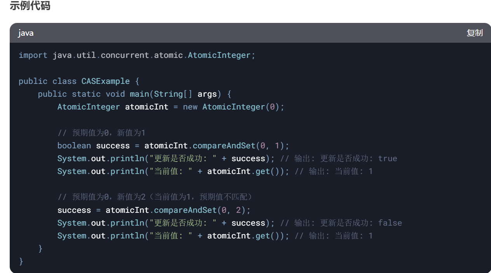

CAS 的优缺点

优点：

无锁：减少线程阻塞，提升并发性能。

轻量：相比锁机制，开销较小。

缺点：
ABA问题：值从A变为B再变回A，CAS会误认为未变化。可通过版本号或AtomicStampedReference解决。

自旋开销：在高竞争下，CAS可能多次重试，增加CPU负担。

总结：

CAS是一种高效的无锁并发控制机制，适用于低竞争场景。在高竞争环境下，可能需要结合其他同步机制

AQS（AbstractQueuedSynchronizer）是Java并发包（java.util.concurrent.locks）中的一个核心框架，用于构建锁和其他同步器（如ReentrantLock、Semaphore、CountDownLatch等）。AQS 提供了一个基于 FIFO（先进先出） 等待队列的同步机制，开发者可以通过继承 AQS 并实现其抽象方法来创建自定义的同步器。

**AQS 的核心思想**

AQS 的核心思想是通过一个 volatile 的整型状态变量（state） 和一个 FIFO 线程等待队列 来实现同步机制。AQS 的主要功能包括：

1. 状态管理：通过 state 变量表示同步状态（如锁的持有次数、信号量的许可数等）。
2. 线程排队：通过一个双向链表实现的等待队列，管理竞争资源的线程。
3. 模板方法：AQS 提供了一些模板方法（如 tryAcquire、tryRelease 等），需要子类实现这些方法来定义具体的同步逻辑。

**AQS 的核心方法**

AQS 的核心方法可以分为两类：

**独占模式（Exclusive Mode）**：

一次只有一个线程可以获取资源。

核心方法：

**acquire**(int arg)：获取资源，如果失败则进入等待队列。

**release**(int arg)：释放资源，唤醒等待队列中的线程。

**tryAcquire**(int arg)：尝试获取资源（需要子类实现）。

**tryRelease**(int arg)：尝试释放资源（需要子类实现）。

**共享模式（Shared Mode）：**

多个线程可以同时获取资源。

核心方法：

**acquireShared**(int arg)：获取共享资源。

**releaseShared**(int arg)：释放共享资源。

**tryAcquireShared**(int arg)：尝试获取共享资源（需要子类实现）。

**tryReleaseShared**(int arg)：尝试释放共享资源（需要子类实现）。

**AQS 的实现原理**

**1.状态变量（state）**：

通过 volatile int state 表示同步状态。

子类可以通过 getState()、setState() 和 compareAndSetState() 方法来操作状态。

**2.等待队列：**

使用一个双向链表实现的 FIFO 队列来管理等待线程。

每个节点（Node）代表一个等待线程，包含线程引用、等待状态等信息。

**3.模板方法：**

AQS 提供了模板方法（如 acquire、release），这些方法会调用子类实现的 tryAcquire、tryRelease 等方法。

**AQS 的应用**

AQS 是 Java 并发包中许多同步工具的基础，例如：

**ReentrantLock：**

基于 AQS 实现的可重入锁。

使用独占模式：

**Semaphore：**

基于 AQS 实现的信号量。

使用共享模式。

**CountDownLatch：**

基于 AQS 实现的倒计时门闩。

使用共享模式。

**ReentrantReadWriteLock：**

基于 AQS 实现的读写锁。

读锁使用共享模式，写锁使用独占模式。


**AQS 的优点**

灵活性：开发者可以通过继承 AQS 实现自定义的同步器。

高性能：基于 CAS 和 volatile 实现，避免了传统锁的开销。

可扩展性：支持独占模式和共享模式，适用于多种同步场景。

**总结**

AQS 是 Java 并发编程的核心框架之一，它为构建锁和其他同步器提供了强大的基础。通过理解 AQS 的工作原理，可以更好地掌握 Java 并发工具的实现机制，并能够根据需求实现自定义的同步器。

## 22.JVM 的结构？JVM 如何调优？


栈 Stack  ; 堆 Heap ; 方法区(永久代----元空间)；本地方法栈；程序计数器

GC垃圾回收算法：标记-清理 ； 标记-整理 ； 标记-复制

Jvm 优化调优参数

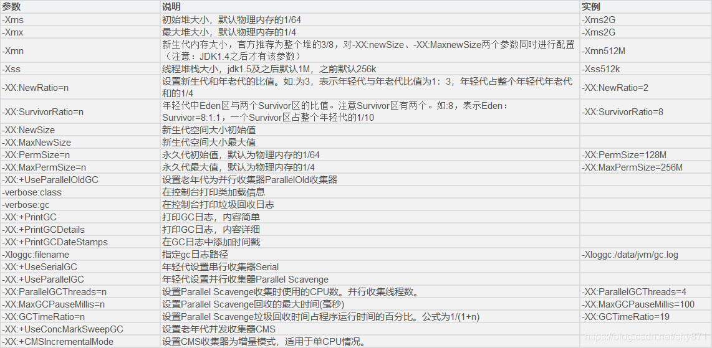

Jvm 命令工具：

Jps(JVM process status) 可以查看虚拟机启动的所有进程 ，jps -v 可查看启动参数

Jstat(JVM statiscs monitoring tool) 监视虚拟机信息

Jmap(memory map for java) 查看堆内存信息

  Jmap -histo pid  可以打印出当前堆中所有每个类的实例数量和内存占用

  Jmap -dump     可以转储堆内存快照到指定文件。比如执行jmap -dump:format=b，file=/data/dump/dumpfile_jmap.hprof 14620

Jvm 优化步骤流程：

第一步：分析GC日志及dump 文件，判断是否需要优化，确定瓶颈问题点：

使用命令：

```

jps -v 查看虚拟机所有进程

Jstat 查看虚拟机信息

jmap -dump:format=b，file=/data/dump/dumpfile_jmap.hprof

```

第二步：确定jvm调优量化目标---确定是调整堆还是栈，或者GC

第三步：确定jvm调优参数

第四步：调优一台服务器，对比观察调优前后的差异

第五步：不断的分析和调整，直到找到合适的jvm参数配置

第六步：找到合适的参数，将这些参数应用到所有服务器，并进行后续追踪

## 23.项目中高并发产生了OOM(内存溢出)，如何排查？

  上面22 JVM 调优的答案

---

# Spring 框架 知识：

## 什么是Spring IOC ？

答：控制反转：原来需要我们主动去new 一个对象，现在通过将对象的创建和管理交给一个spring的容器.然后对容器里的对象进行依赖注入

## 什么是AOP？

答：面向切面编程，在不改变原代码的基础上对代码功能进行增强。它包括三部分：切面(@Aspect)，切入点（@PointCut）,通知类型(@Before @After @Around…)

## 简单说说AOP的底层是基于什么实现的？动态代理的方式有哪些？

答：aop 底层实现是动态代理（Proxy）。

 jdk 动态代理：针对实现接口的动态代理（默认代理方式）

cglib 动态代理：针对接口的实现类的代理

JDK 代理靠接口，CGLIB 代理靠继承

   底层主要是通过
   ```java
Proxy.newProxyInstance(
ClassLoader loader, class<?> interfaces,new InvocationHandler) 
   ```
   这个方法实现。

这三个参数分别是：

    指定当前目标对象的类加载器
    目标对象实现接口的类型
    事件处理，执行目标对象方法时，会触发

## Aop 的常用注解有哪些？通知类型有哪些？

@Aspect、@Pointcut

@Before、@After、@Around、@AfterReturning和@AfterThrowing

## 说说AOP一般能用来干什么？在你的项目中有用到吗，如何使用的？

Aop 用来在不改变原代码的基础上对代码功能进行增强。我项目中有使用到，主要用在了后台管理系统，获取用户操作后台页面的前后记录插入到数据库操作。

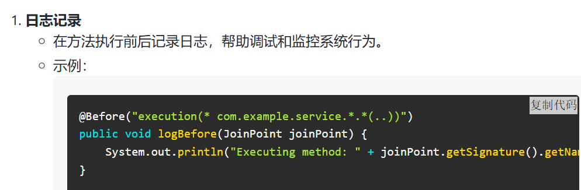

## spring依赖注入实现方式有几种？

答：构造器注入 ; Setter注入(@Autowried) ; 字段注入(@Value)

## 说说什么是Spring Bean？

答：Spring Bean是由Spring IoC容器管理的对象，它们通过依赖注入的方式获取其他Bean的引用，并且由Spring容器负责生命周期的管理

## 简单说说Spring Bean的生命周期？

实例化：Spring容器根据配置创建Bean的实例。

属性赋值：Spring容器为Bean的属性赋值。

初始化：Spring容器调用Bean的初始化方法（如@PostConstruct注解的方法）。

使用：Bean被应用程序使用。

销毁：Spring容器在Bean销毁前调用销毁方法（如@PreDestroy注解的方法）

## 说说Spring常用的注解有哪些？

@Component  @Controller  @Service @Repository  @Bean  @Configuration  @Autowired   @RequestMapping

## Spring框架中的单例bean是线程安全的吗？如果不是如何解决？

答：
不是，默认情况下Spring创建bean对象是单例的。也就是说这个JVM虚拟机中就一个bean对象，并且里面的全局变量属性也就独此一份。

    如果此时多用户并发请求调用bean对象的一个方法，对全局变量进行增删改操作。因为一个请求服务器会创建一个线程进行处理，就会发生多线程并发操作同一个共享变量，如果此时全局变量本身也是线程不安全的【举例变量类型是ArrayList，是线程不安全的】，那么就会产生线程安全问题。

如何解决呢？

1、将bean的作用域改成 Prototype非单例，这样每次用户请求，Spring都会创建新的UserService对象，不同对象的data属性是隔离的，所以不存在线程安全问题。但是每次创建UserSerivce对象，会操作内存空间的浪费，很不推荐使用。

2、使用线程同步，比如对方法加synchronized 或者使用Lock锁，避免并发操作的问题。

3、将成员变量声明为方法中的局部变量，局部变量只在方法内有效。而每个线程执行方法是在线程的独立内存空间中进行的。也就是局部变量，在不同线程间是相互隔离的，也就不存在线程安全问题。

4、使用线程安全的类：AtomicInteger, ConcurrentHashMap,vector 等

## 你们项目中的事务是如何处理的？一般事务在三层架构中的哪层进行处理？

@Transactional    ;  业务层添加处理

## 说说哪些情况下会导致spring事务失效？

 1. spring事务默认只能作用于public方法。事务注解放在非public方法上（如private、protected方法），事务不生效。

2. 同一个类中，一个方法调用了另一个带有事务注解的方法，事务不会生效。因为Spring的事务管理是通过代理模式实现的，内部方法调用不会经过代理对象。

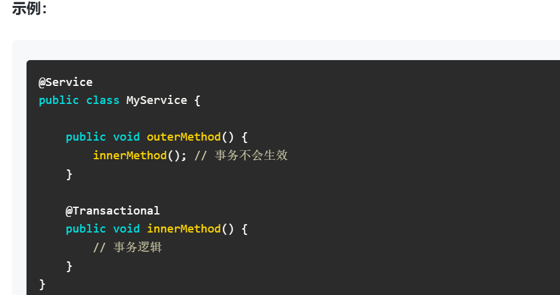

1. Spring事务默认情况下只会回滚RuntimeException和Error，如果抛出的是受检异常（Checked Exception），事务不会回滚。
   但可以通过@Transactional注解的rollbackFor属性指定需要回滚的异常类型。


4. Spring事务的传播行为（Propagation Behavior）决定了事务在不同方法调用间如何传播。如果传播行为设置不当，可能导致事务失效

s

## Spring事务的隔离级别有哪些？

1.读未提交：可能导致脏读、不可重复读和幻读。

2.读已提交：可以防止脏读，但可能导致不可重复读和幻读

3.可重复读：保证在同一个事务中多次读取同一数据时，结果是一致的。可以防止脏读和不可重复读，但可能导致幻读。

4.串行化：通过强制事务串行执行，防止脏读、不可重复读和幻读。性能最低

备注：
不可重复读与幻读的区别：
    不可重复读是值发生改变，关注updata和delete；
    幻读是行数反生改变，关注Insert和delete。
    脏读是读取未提交的数据，数据可能回滚。

脏读和幻读的区别？

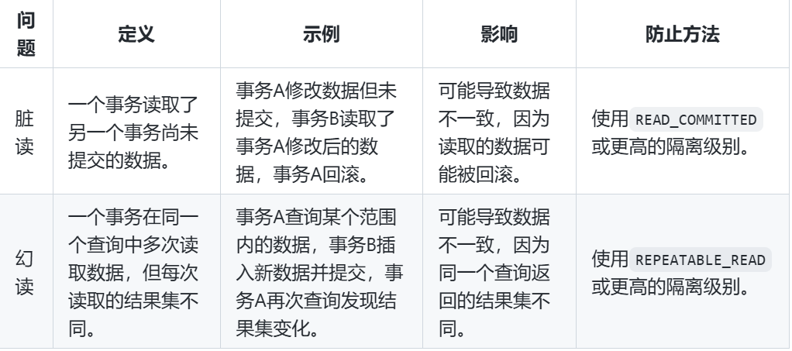

## 说说什么是Spring事务传播行为？Spring事务的传播行为有哪些？

定义了事务方法调用时，事务如何传播和处理。
Spring提供了多种传播行为，用于控制事务的边界和行为


| 小写单词 (背诵用)        | 中文翻译 (字面义) | 简短助记 (方便背)                   |
| :---------------- | :--------- | :--------------------------- |
| **required**      | 必需的        | 默认选项。**必需**要有事务，有就加入，没有就新建。  |
| **requires_new**  | 需要新的       | 独立存在。总是**需要新的**事务，把旧的先挂起。    |
| **supports**      | 支持         | 随缘。**支持**事务，有就加入，没有就非事务运行。   |
| **not_supported** | 不支持        | 拒接。**不支持**事务，有事务就挂起，强行非事务运行。 |
| **mandatory**     | 强制的        | 必须存在。**强制**要求在现有事务里跑，没有就报错。  |
| **never**         | 从不         | 排斥。**从不**在事务里跑，有事务就报错。       |
| **nested**        | 嵌套的        | 内嵌。在现有事务里**嵌套**一个子事务。        |


## 15..简单说说Spring事务的底层实现原理？

答：Spring 框架提供了两种事务实现方式：

编程式事务：DataSourceTransactionManager 对象，手动Commit 提交事务或回滚

声明式事务：@Transactional 注解

当使用声明式事务@Transactional 注解后事务的自动提交功能会关闭，由改由spring 进行控制事务，spring 事务管理是通过aop 代理实现的，对被代理对象的每个方法进行拦截，在方法执行前启动事务，在方法执行完成后根据是否由异常及异常的类型进行提交或回滚。由DataSourceTransactionManager 对象，进行提交或回滚

举例说明详细解释：
```java

@Component

public class UserService {

    @Autowired

    private JdbcTemplate jdbcTemplate;

    @Transactional

    public void test(){

        jdbcTemplate.execute("insert into student values (1, 'lyd', 18, '20183033210')");

       throw new NullPointerException();

    }

}

```

过程：

首先spring会调用代理对象，对于事务，代理对象会通过执行事务的aop切面逻辑。在这个切面逻辑，Spring会去判断是否含有@Transactional事务注解，如果有才会去开启事务。spring的事务管理器DataSourceTransactionManager会新建一个数据库连接conn，紧接着会把conn.autocommit 设置为 false ，autocommit(自动提交)，每次执行完SQL后就会立马提交，因此这里需要设置为false。(因为spring默认是开启了自动提交，当SQL执行结束之后就会提交，当遇到异常的时候，由于前面的事务都已经提升，因此就没法回滚了，所以需要把自动提交给关闭了) 最后在通过第一次创建的对象去执行test方法。接着会去执行SQL语句，在此SQL执行完之后是不会进行提交的，在执行SQL语句之前，jdbcTemplate会去拿到事务管理器创建的这个数据库连接conn。当执行完test方法后，Spring事务会去判断是否有异常，没有异常就会提交事务（conn.commit()），否者就会事务回滚（conn.rollback()）;


## 16. Spring 框架中都用到了哪些设计模式，简单说说？

单例模式

应用场景：Spring中的Bean默认是单例的

工厂模式

应用场景：Spring中的BeanFactory和ApplicationContext就是工厂模式的实现，用于创建和管理Bean实例

代理模式

应用场景：Spring AOP（面向切面编程）使用代理模式来实现横切关注点的织入，如事务管理、日志记录等

模板方法模式

应用场景：Spring中的JdbcTemplate、RestTemplate等模板类使用了模板方法模式，简化了数据库操作和REST API调用


## 19.知道Spring是如何解决Bean的循环依赖的吗 ？

思考：

什么是循环依赖？

Spring怎么解决循环依赖？

Spring对于循环依赖无法解决的场景？

循环依赖：是循环引用，也就是两个或两个以上的bean 对象互相持有对方，形成闭环。比如A 依赖B，B依赖C, C又依赖于A.

Spring 中循环依赖的场景有：

1. 构造器的循环依赖
```java

@Service

    public class A{

        private B b;

        public A(B b){

            this.b = b;

        }

    }

    @Service

    public class B{

        private A a;

        public B(A a){

            this.a = a;

        }

}
```

    上述代码运行，会抛如下异常：BeanCurrentlylnCreationException异常。

Spring 框架无法解决

1. Field 属性的循环依赖
```java

@Service

    public class A{

        @Autowired

        private B b;

    }

    @Service

    public class B{

        @Autowired

        private A a;

    }

```

    上述代码运行，不会报错。这说明Bean A,Bean 都被成功注入。Spring 框架解决了这种循环依赖的问题。具体怎么解决的呢？

原理：

Spring 对象产生需要这几步：creatBeanInstance 实例化，populateBean 属性赋值，InitializeBean 初始化。

循环依赖主要发生在实例化和属性赋值中间。Spring 采用了三级缓存


步骤:

1.Spring首先从一级缓存singletonObjects中获取。

2.如果获取不到，并且对象正在创建中，就再从二级缓存earlySingletonObiects中获取

3.如果还是获取不到且允许singletonFactories通过getObject()获取，就从三级缓存 singletonFactory.getObject()(三级缓存)获取.

4.如果从三级缓存中获取到就从singletonFactories中移除，并放入earlySingletonObjects中。其实也就是从三级缓存移动到了二级缓存。

那怎么样的循环依赖无法处理呢?

1. 因为加入singletonFactories三级缓存的前提是执行了构造器来创建半成品的对象，所以构造器的循环依赖没法解决。因此.Spring不能解决"A的构造方法中依赖了B的实例对象，同时B的构造方法中依赖了A的实例对象"这类问题了！（即上面的构造器循环依赖场景）
2. spring不支持原型(prototype)bean属性注入循环依赖，不同于构造器注入循环依赖会在创建spring容器 context时报错，它会在用户执行代码如context.getBean()时抛出异常。因为对于原型bean，spring容器只有在需要时才会实例化，初始化它。

## 20.FactoryBean   和 BeanFactory的区别？

1. BeanFactory

定义：BeanFactory 是 Spring 框架的核心接口之一，负责管理和配置 Spring 容器中的 Bean。它是 Spring IoC 容器的实际实现，提供了基本的 Bean 管理功能。
功能：
Bean 的创建和管理：BeanFactory 负责创建、配置和管理 Bean 实例。
依赖注入：通过 BeanFactory，可以实现 Bean 之间的依赖注入。
延迟初始化：默认情况下，BeanFactory 中的 Bean 是延迟初始化的，即只有在第一次请求时才会创建 Bean 实例。

 2. FactoryBean
定义：FactoryBean 是一个特殊的 Bean，它本身是一个bean 对象，用于创建其他 Bean 实例。FactoryBean 接口允许你自定义 Bean 的创建逻辑。
功能：
自定义 Bean 创建逻辑：通过实现 FactoryBean 接口，你可以定义如何创建和管理 Bean 实例。
复杂对象的创建：FactoryBean 常用于创建复杂的对象，例如代理对象、数据库连接池等。
延迟初始化：FactoryBean 可以控制 Bean 的初始化时机，例如在第一次请求时才创建 Bean 实例。


## 21.说说spring和springboot的关系？

Springboot 框架是基于spring 框架为基础 进行简化开发。主要解决spring 框架的几个问题：

- 解决spring框架的需要引入大量pom 依赖问题-------springboot起步依赖
- 解决spring框架的大量xml 配置文件问题------------springboot自动配置
- 解决spring框架项目需要安装tomcat 服务器问题------springboot内置tomcat

---

# SpringBoot相关知识：

## 1.Spring Boot的两大特征是什么？如何实现自动配置？

答：

1. 起步依赖

Springboot 工程 pom -----<parent> spring-boot-starter-parent ---→父工程定义了大量的依赖坐标,依赖坐标里包含了 我们项目中使用的 依赖。并且定义版本号，不会造成冲突

2. 自动配置

启动类@SpringBootApplication--→ @EnableAutoConfiguration--→ @Import--→bean对象选择器---→ META-INF/spring/*.imports结尾文件(定义了大量的配置类，配置类包含所有的bean对象)

## 2.SpringBoot的常用注解有哪些？

@SpringBootApplication
@EnableAutoConfiguration
@Import
@Component
@Configuration
@Controller
@service

## 3.SpringBoot读取配置文件的方式有哪些？

第一种：@Value

第二种：@ConfigurationProperties

## 4.Spring Boot与Spring Cloud的关系是什么？

Springboot 是快速启动spring 框架的技术。Springcloud 是微服务框架。

两个没有任何关系。但是springcloud 微服务组件必须要结合springboot 的自动装配功能更合适

---

# Springmvc 相关知识：

## 1.什么是Spring MVC ？简单介绍下你对springMVC的理解

Spring MVC 是 Spring Framework 提供的一个基于 Java 的实现 MVC（Model-View-Controller）设计模式的请求驱动类型的轻量级 Web 框架

## 2.说说SpringMVC的执行流程？

2.1用户发送请求到前端控制器（DispatcherServlet）

2.2请求映射到处理器映射（HandlerMapping）

2.3调用处理器适配器(HandlerAdapter)

2.4调用处理器 (Handler) 处理业务

2.5调用视图解析器（ViewResolver）

## 3.说说你们项目中springmvc异常是如何处理的？
-
	1. 定义异常的类型（业务异常，系统异常，其它异常）
	2. 创建一个异常类使用@RestControllerAdvice注解
	3. @ExceptionHandler注解放在多个方法上去匹配各种异常类型

备注：springmvc 的异常处理本质是aop

## 4.Spring MVC如何接受和响应json格式数据？

@RequestBody 接参

@ResponseBody 响应

## 5.项目中用过到过拦截器【handlerInterceptor】吗？哪里用到过？如何实现的？

用户登录验证：

当用户请求一个需要登录后才能访问的页面或资源时，拦截器会首先检查用户是否已经登录。

如果用户未登录，拦截器会重定向用户到登录页面；
如果用户已登录，则放行请求到对应的Controller

具体：在用户登录访问后端服务时携带token ,拦截器会拦截token 判断token 是否失效或者并解析

## 8.说说SpringMVC中接受前端传递的请求参数的方式有哪些？

普通类型传参---→http:127.0.0.1:8080/user?name = zhangsan ---------(String name)

Json 传参 -----→post 方式提交表单---------（@RequestBody User user）

Rest风格路径传参---→http:127.0.0.1:8080/user/{id}/{name} ---------（@Pathvariable Long id）

## 9.Springmvc 有哪些常用注解？

@Controller  @RestController  @RequestMapping  @RequestParam

@PathVariable @RequestBody

---

# Mybatis 相关知识：

## 1.什么是Mybatis/简单说说Mybatis？

MyBatis 是一个开源、轻量级的数据持久化框架，是 JDBC 和 Hibernate 的替代方案。MyBatis 内部封装了 JDBC，简化了加载驱动、创建连接、创建 statement 等繁杂的过程，开发者只需要关注 SQL 语句本身。

## 2.Mybatis中\#{}和${}的区别是什么？

\#传入的参数在sql中显示为字符串--占位符，\#方式能够很大程度防止sql注入；

$传入的参数在sql中直接显示为传入的值--赋值符，$方式无法防止sql注入。

## 3.Mybatis中当实体类中的属性名和表中的字段名不一样，怎么办 ？如何封装数据？请列举几种方式？

可以通过在映射文件中使用resultMap来解决这个问题。resultMap允许将查询结果中的列名映射到实体类的属性上。

下面是一个简单的例子：

实体类（Java）：
```java

public class User {

    private int id;

    private String username; // 对应数据库中的user_name

    // getters and setters

}

```

映射文件（XML）：
```xml

<resultMap id="userResultMap" type="User">

    <result property="id" column="id"/>

    <result property="username" column="user_name"/>

</resultMap>

<select id="selectUser" resultMap="userResultMap">

  SELECT id, user_name

  FROM users

  WHERE id = \#{id}

</select>

```

在上面的resultMap中，property属性指的是实体类中的属性名，column属性指的是数据库表中的字段名。在 < select > 查询中，通过resultMap属性引用这个resultMap，MyBatis会自动处理映射。

第二种方式：可以 使用select user_name as name 这种别名的方式

## 4.Mybatis中模糊查询like语句该怎么写？

SELECT * FROM your_table WHERE your_column LIKE CONCAT('%', \#{name}, '%')

## 5.Mybatis如何执行批量插入数据？

MyBatis可以通过<foreach>标签来实现批量插入数据

在对应的Mapper XML文件中，使用<foreach>标签来遍历实体列表并构建批量插入的SQL语句：
```xml

<mapper namespace="your.package.YourMapper">

    <insert id="insertBatch">

        INSERT INTO your_table (column1, column2, ...)

    VALUES

    <foreach collection="list" item="item" index="index" separator=",">

    (\#{item.field1}, \#{item.field2}, ...)

        </foreach>

    </insert>

</mapper>

```

## 6.Mybatis中如何获取Mysql自动增长的主键值【主键返回/生成】?

    设置useGeneratedKeys属性为true，指定keyProperty属性为java对象中对应的主键属性名
在MyBatis中，要获取MySQL数据库自增主键值，可以使用useGeneratedKeys属性和keyProperty属性。在<insert>标签中设置这两个属性，useGeneratedKeys设置为true表明要获取数据库自动生成的键，keyProperty设置为Java对象中对应主键属性的名

```xml

<insert id="insertUser" useGeneratedKeys="true" keyProperty="id">

  INSERT INTO users (username, email) VALUES (\#{username}, \#{email})

</insert>

```

## 7.Mybatis中在mapper接口方法中如何传递多个参数，需要用到什么注解?

@Param注解

## 8.你在实际开发中用到了哪些Mybatis的动态sql标签？

If , where , trim, choose , when , otherwise , foreach

## 9.Mybatis的Xml映射文件中，不同的Xml映射文件，id是否可以重复？同一个Xml映射文件，能重复吗？

MyBatis的XML映射文件中，不同的映射文件可以有相同的id值，因为MyBatis在加载映射文件时会将它们视作不同的映射定义。但是，在同一个XML映射文件中，所有的id值必须是唯一的，因为MyBatis会使用这个id来引用特定的映射语句。

如果你有两个不同的XML映射文件，它们中的映射语句可以有相同的id值

<\!-- file1.xml -->
```xml

<mapper namespace="com.example.mapper.File1Mapper">

  <select id="selectSomething" resultType="com.example.SomeType">

    SELECT * FROM some_table WHERE id = \#{id}

  </select>

</mapper>

```

<\!-- file2.xml -->
```xml

<mapper namespace="com.example.mapper.File2Mapper">

  <select id="selectSomething" resultType="com.example.SomeType">

    SELECT * FROM another_table WHERE id = \#{id}

  </select>

</mapper>

```

## 10.说说Mybatis的大概执行流程？

MyBatis 的执行流程大致可以分为以下几个步骤：

1. 加载配置 ：首先，MyBatis 会加载配置文件（通常是 mybatis-config.xml），这个配置文件包含了数据库连接信息、事务管理器信息、数据源信息等内容。

2. 创建SqlSessionFactory ：然后，MyBatis 会根据加载的配置信息创建 SqlSessionFactory 对象。SqlSessionFactory 是 MyBatis 的核心对象，它负责创建 SqlSession 对象。

3. 创建 SqlSession ：SqlSession 是 MyBatis 中用于执行 SQL 语句、获取映射器（Mapper）对象的重要对象。你可以通过 SqlSessionFactory 的 openSession() 方法来获取 SqlSession。

4. 获取映射器（Mapper）对象 ：通过 SqlSession，你可以获取映射器对象，这个对象包含了数据库表对应的 Java 对象和 SQL 语句的映射关系。你可以通过两种方式获取映射器对象：一是使用 SqlSession 的 getMapper() 方法，二是使用 MyBatis 提供的注解 @Mapper 或 @MapperScan。

5. 执行 SQL 语句 ：一旦你获取了映射器对象，你就可以通过它来执行 SQL 语句了。你可以通过映射器对象直接调用 SQL 语句对应的 Java 方法，MyBatis 会自动将你的方法参数映射到 SQL 语句的参数，并将 SQL 语句的执行结果映射到 Java 对象。

6. 关闭 SqlSession ：执行完 SQL 语句后，你需要关闭 SqlSession，以释放数据库连接和其他资源。

## 11.你们项目中Mybatis分页是如何实现的？使用原生limit 如何实现？

使用第三方pagehelper 插件。

使用原始limit (pageNum-1)*pageSize , pageSize

## 12.Mybatis的一级、二级缓存有了解吗，具体说说？

答：

一级缓存原理：Sqlsession
    在一次Sqlsession中，执行多次条件完全相同的查询，且中间没有增删改操作时，第二次及以后的查询可以直接从缓存中读取数据，无需走数据库。

在一次 SqlSession 中（数据库会话），程序执行多次查询，且查询条件完全相同，多次查询之间程序没有其他增删改操作，则第二次及后面的查询可以从缓存中获取数据，避免走数据库。

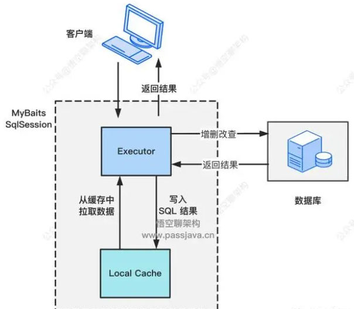

每个SqlSession中持有了Executor，每个Executor中有一个LocalCache。当用户发起查询时，MyBatis根据当前执行的语句生成MappedStatement，在Local Cache进行查询，如果缓存命中的话，直接返回结果给用户，如果缓存没有命中的话，查询数据库，结果写入Local Cache，最后返回结果给用户。

Local Cache 其实是一个 hashmap 的结构：

private Map<Object, Object> cache = new HashMap<Object, Object>();

如下图所示，有两个 SqlSession，分别为 SqlSession1 和 SqlSession2，每个 SqlSession 中都有自己的缓存，缓存是 hashmap 结构，存放的键值对。

键是 SQL 语句组成的 Key ：

Statement Id \+ Offset \+ Limmit \+ Sql \+ Params

值是 SQL 查询的结果：

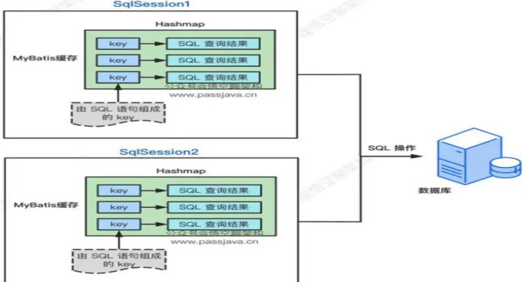

一级缓存配置

在 mybatis-config.xml 文件配置，name=localCacheScope，value有两种值：SESSION 和 STATEMENT
```xml

<configuration>

<settings>

<setting name="localCacheScope" value="SESSION"/>

</settings>

<configuration>

```

SESSION：开启一级缓存功能

STATEMENT：缓存只对当前执行的这一个 SQL 语句有效，也就是没有用到一级缓存功能。

MyBatis 一级缓存失效的场景：

不同的SqlSession对应不同的一级缓存

同一个SqlSession但是查询条件不同

同一个SqlSession两次查询期间执行了任何一次增删改操作

同一个SqlSession两次查询期间手动清空了缓存

### 二级缓存原理：SqlsessionFactory
==实现了SqlSession之间的数据共享，namepace级别，但多表查询时极大可能出现脏数据，有设计缺陷，安全使用的条件比较苛刻。==

 MyBatis的二级缓存相对于一级缓存来说，实现了SqlSession之间缓存数据的共享，同时粒度更加的细，能够到namespace级别，通过Cache接口实现类不同的组合，对Cache的可控性也更强。MyBatis在多表查询时，极大可能会出现脏数据，有设计上的缺陷，安全使用二级缓存的条件比较苛刻

一级缓存最大的共享范围就是一个 SqlSession 内部，如果多个 SqlSession 之间需要共享缓存，则需要使用到二级缓存。

开启二级缓存后，会使用 CachingExecutor 装饰 Executor，进入一级缓存的查询流程前，先在CachingExecutor 进行二级缓存的查询。

二级缓存开启后，同一个 namespace下的所有操作语句，都影响着同一个Cache


每个 Mapper 文件只能配置一个 namespace，用来做 Mapper 文件级别的缓存共享。

<mapper namespace="mapper.StudentMapper"></mapper>

二级缓存被同一个 namespace 下的多个 SqlSession 共享，是一个全局的变量。MyBatis 的二级缓存不适应用于映射文件中存在多表查询的情况。

通常我们会为每个单表创建单独的映射文件，由于MyBatis的二级缓存是基于namespace的，多表查询语句所在的namspace无法感应到其他namespace中的语句对多表查询中涉及的表进行的修改，引发脏数据问题

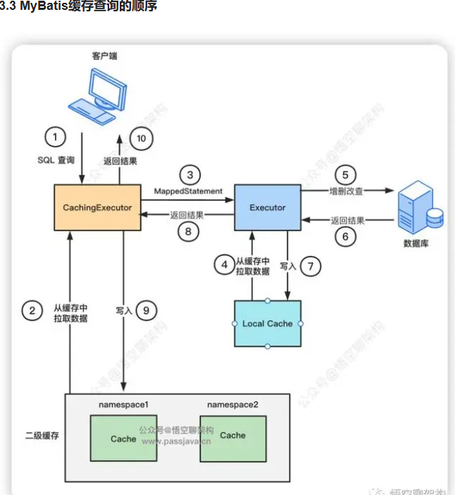

先查询二级缓存，因为二级缓存中可能会有其他程序已经查出来的数据，可以拿来直接使用

如果二级缓存没有命中，再查询一级缓存

如果一级缓存也没有命中，则查询数据库

SqlSession关闭之后，一级缓存中的数据会写入二级缓存。

二级缓存配置

开启二级缓存需要在 mybatis-config.xml 中配置：

<settingname="cacheEnabled"value="true"/>

---

# Mysql 相关知识：

## 二叉树，红黑树，B树，B\+树？

1. 二叉树：只有二个叉，大数据量情况下，层架较深，查找次数过多。可能出现单叉的坏情况
2. 红黑树（平衡二叉树）：在算法上比二叉快一点。依然只有二个叉，大数据量情况下，层架较深，查找次数过多
3. B-Tree(多阶多路平衡多叉树): 每个节点最多有5阶的叉，存储数据更多，层级更短。查询次数少效率就高。叶子节点和非叶子  节点上都存储了索引和数据，在查找最终数据的过程中需要加载大量数据，影响效率
4. B+Tree：在b-tree 的基础上改进，数据放在叶子节点。中间只加载索引和指针。效率大大提高
5. ·
## 1.MySQL数据库索引的类型有哪些？

主键索引, 唯一索引, 普通索引，复合索引(联合索引)

## 2.主建索引，唯一索引区别?

唯一性索引列允许空值,而主键列不允许为空值

## 3.mysql索引是不是越多越好？

CREATE INDEX idx_iotId_functionId_time ON device_data (iot_id,function_id,alarm_time)---创建索引

MySQL索引不是越多越好。索引可以提高查询性能，但它们也会占用更多的存储空间，并且在插入、删除和更新数据时会增加额外的开销，因为索引也需要被更新。过多的索引可能导致性能问题，因为数据库需要更多的时间来维护这些索引

## 4.索引失效场景？

1. like 通配符% 错误使用---左模糊会失效

2. 索引列使用MySQL函数，索引失效

3. 索引列存在计算，使用（+、-、* 、/），索引失效

4. 使用（！= 或者 < >，not in），导致索引失效

5. 使用了select * ，导致索引效率低

6. 联合索引不满足最左匹配原则

## 5.数据库事物特性?

数据库事务的特性通常被称为[ACID特性](https://www.baidu.com/s?wd=ACID%E7%89%B9%E6%80%A7&rsv_idx=2&tn=baiduhome_pg&usm=2&ie=utf-8&rsv_pq=b21cccad0397ab2f&oq=%E6%95%B0%E6%8D%AE%E5%BA%93%E4%BA%8B%E7%89%A9%E7%89%B9%E6%80%A7&rsv_t=77b68deXsOSiNB7s5RhgzumlFmM0wVqY%2BHeQP%2FNbzPASzcu%2BJHW6grUj%2FCRtKGjQDSVS&sa=re_dqa_zy&icon=1" \t "_self)，这四个特性分别是：

    ‌原子性‌：事务里的操作要么全成功，要么全失败，不会只做一半，靠回滚日志保证 。
    ‌一致性‌：数据始终符合业务规则，如转账前后总金额保持不变，是最终目标 。
    ‌隔离性‌：多个事务同时进行互不干扰，防止数据读取错乱，通过隔离级别控制 。
    ‌持久性‌：一旦提交，数据永久保存，即使断电也不会丢失，靠重做日志保证 。‌‌

1. 原子性（Atomicity）：事务是一个不可分割的工作单位，事务中的所有操作要么全部执行，要么全部不执行。这意味着事务的操作序列要么完全应用到数据库，要么完全不影响数据库。
2. 一致性（Consistency）：事务的执行必须使数据库从一个一致性状态变换到另一个一致性状态。这意味着事务的执行必须满足所有数据的完整性约束条件，例如，在转账的例子中，无论转账如何进行，参与转账的账户总金额应保持不变。
3. 隔离性（Isolation）：在并发环境中，多个事务的执行应相互隔离。这意味着一个事务的内部操作及其使用的数据对其他并发事务是隔离的，并发执行的事务之间不能互相干扰。数据库系统提供了多种隔离级别来确保事务的隔离性。
4. 持久性（Durability）：一旦事务被提交，它对数据库中数据的改变就是永久性的，即使系统或介质发生故障，已提交事务的更新不会被丢失。这意味着事务日志等机制被用来确保即使在故障发生后，已提交事务的更改仍然可以被恢复、

## 6.SQL语句如何调优? 100%

SQL调优通常涉及以下方面：

1.  对表的设计方面

    创建表结构字段尽量不要太多

    Sql 语句的where 条件使用频繁可以创建索引

2.  Sql 语句上进行优化

    like 通配符% 不能加左边
    
    索引列不能使用MySQL函数，索引失效
    
    索引列不能，使用（+、-、* 、/），索引失效
    
    不使用（！= 或者 < >，not in），导致索引失效
    
    不使用了select * ，导致索引效率低
    
    联合索引满足最左匹配原则

3.  使用explain 慢sql计划 分析


possible_key 当前sql可能会使用到的索引

key 当前sql实际命中的索引

key_len 本次查询实际使用了索引中多少个字节的长度

## 7.mysql的外连接和内连接有什么区别

外连接：
  左外连接（left outer join）：以左边的表为主表
  
  右外连接（right outer join）：以右边的表为主表
  
  以某一个表为主表，进行关联查询，不管能不能关联的上，主表的数据都会保留，关联不上的以NULL显示

内连接：取两张表数据的交集

## 8.回表知道吗，怎么避免回表查询？

使用覆盖索引；避免使用select * 查询 ；使用缓存数据库；聚簇索引查询

聚簇索引（聚集索引）：数据与索引放到一块，B\+树的叶子节点保存了整行数据，有且只有一个

非聚簇索引（二级索引）：数据与索引分开存储，B\+树的叶子节点保存对应的主键，可以有多个

覆盖索引是指查询使用了索引，并且需要返回的列，在该索引中已经全部能够找到 。

（条件创建三个索引字段，返回列是2个条件索引列。满足覆盖索引）

回表----通过列字段查询，找到id,再通过主键索引找整行数据。

    二级索引叶子节点的 ID 列表虽然按逻辑排序，但映射到聚簇索引后，这些 ID 所在的物理数据页在磁盘上往往相隔甚远（跨 Extent）。这导致回表操作无法利用 B+ 树叶子节点的'物理相邻预读'特性，每一次读取都退化为独立的、需要完整磁盘寻道的单页随机 I/O，从而严重拖慢性能。

1. 数据库的隔离级别？

读未提交；读已提交；可重复读；串行化


## 9.数据库的引擎？

InnoDB（默认）：支持事务管理，行级锁

MyISAM：不支持事务管理，表级锁

BDB

Memory

Merge

## 10.mysql的快照读和当前读？

快照读=无锁历史版本，当前读=加锁最新版本

    MySQL中的快照读和当前读是事务隔离级别的概念，不是指具体的代码实现或功能。

快照读（Snapshot Read）: 快照读是一种不加锁的读操作，它可以读取已经提交的数据。快照读在MySQL的REPEATABLE READ隔离级别以及更低级别的隔离级别下都可以使用。

当前读（Current Read）: 当前读是一种加锁的读操作，它读取记录的最新版本，并且会对读取的记录加锁，保证其他事务不会并发修改这些记录。一般在SERIALIZABLE隔离级下使用
（SERIALIZABLE隔离级会强制把所有读变成当前读）。

在实际操作中，快照读通常是隐式的，而当前读则可以通过显式锁定语句来实现，如SELECT ... FOR UPDATE或者SELECT ... LOCK IN SHARE MODE

    **当前读是一种操作指令（我要改/我要锁），快照读是一种读取策略（我看历史照片）。它们由 SQL 类型决定，不由隔离级别决定。隔离级别只是决定了快照读拍照片的'频率'（RR拍一次，RC拍多次），而 SERIALIZABLE 级别是强行把'看照片'的动作直接变成'现场查封**

## 11.mysql的MVCC？

自己去看

## 12.Mysql 乐观锁和悲观锁？（数据库层面）(高并发) === redis 分布式锁 （业务层进行高并发控制）

   乐观锁：认为在多线程下，数据不会被多个同时修改 set version = version\+1  where version = 0

悲观锁：认为在多线程的情况下，数据会被多个同时修改

    在修改之前就要加索， 查询时加一个select * from user for update。

## 13.mysql大数据量的优化题？

现在我有一张表 这张表 有 6000万 数据量，我怎么在这张中查询或者分页 我想要的数据 1 s ?  id --→嵌套sql

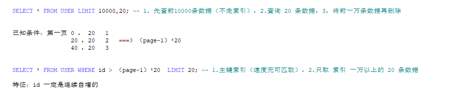

---


# Redis 缓存相关：

## 1. 什么是redis 的缓存雪崩，击穿，穿透？怎么解决？
缓存雪崩：大量的高并发请求在同一时刻访问redis 里大量的缓存key,但是这些key              在同一时刻过期或失效，导致访问mysql ,引起服务宕机

解决：**使用锁进行控制，对同一类型信息的key设置不同的过期时间，、缓存定时预热**

击穿：在高并发环境下，大量请求同时访问某一个key,该key缓存失效或者过期，导致这些请求访问到数据库。这会对数据库造成严重的压力

解决：使用锁，热点数据不过期，缓存预热，热点数据查询降级处理

穿透：请求查询一个不存在的数据，由于缓存层不存在这个数据，所以请求会穿过缓存层 直接查询数据库，导致数据库压力增加（这种属于非法访问）（布隆过滤器---bit array—二进制）

解决：缓存空值或特殊值，布隆过滤器

## 2.redis 持久化方式有几种？区别是什么？
  RDB:将内存数据全量打包成rdb文件
  Aof:将输入的数据指令存入到aof文件中

## 2.5 redis 过期策略和内存淘汰策略

内存过期策略: 惰性删除（key 到过期时间一个个删），定期删除（批量删）

内存淘汰策略（当内存使用达到阈值时就会主动挑选部分KEY删除以释放更多内存

）：Redis支持8种不同的内存淘汰策略：

1）noeviction： 不删除，直接返回报错信息。

2）volatile-lfu：在设置了过期时间的key中，移除最近最少（最少频率使用）使用的key。

4）volatile-lru：在设置了过期时间的key中，移除最近最久未使用的key。

3）volatile-ttl： 在设置了过期时间的key中，移除准备过期的key。

5）volatile-random：在设置了过期时间的key中，随机移除某个key。

6）allkeys-random：随机移除某个key。

7）allkeys-lru：移除最久未使用的key。

8）allkeys-lfu：移除最近最少使用的key。

## 3.主从搭建的步骤？
起动两台redis 服务器。让其中一台redis
服务作为slave 从机 slaveof 指令去连主机即可

## 4.哨兵的作用？
监控，故障转移，通知。
哨兵的搭建步骤？
  1. 先准备一个一主加两次的主从结构redis
  2. 准备三台sentinel 哨兵redis
  3. sentinel.conf文件，添加下面的内容：
  port   27001
  sentinel announce-ip 192.168.109.131
  sentinel monitor mymaster 192.168.109.131 7001 2
  sentinel down-after-milliseconds mymaster 5000
  sentinel failover-timeout mymaster 60000
  dir "/tmp/s1"
  4. 启动
  \# 第1个redis-sentinel s1/sentinel.conf
  \# 第2个redis-sentinel s2/sentinel.conf
  \# 第3个redis-sentinel s3/sentinel.conf

## 5.为什么要搭建分片集群？
主从和哨兵可以解决高可用、高并发读的问题。但是依然有两个问题没有解决：
- 海量数据存储问题
- 高并发写的问题
搭建分片集群的步骤?
搭建一个最小的分片集群，包含3个master节点，每个master包含一个slave节点，

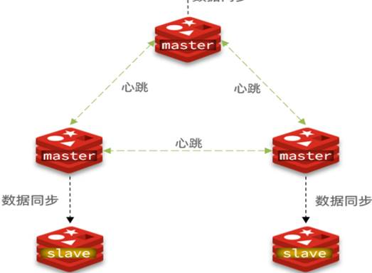

准备一个新的redis.conf文件
port 6379
\# 开启集群功能
cluster-enabled yes
\# 集群的配置文件名称，不需要我们创建，由redis自己维护
cluster-config-file /tmp/6379/nodes.conf
\# 节点心跳失败的超时时间
cluster-node-timeout 5000
\# 持久化文件存放目录
dir /tmp/6379
\# 绑定地址
bind 0.0.0.0
\# 让redis后台运行
daemonize yes
\# 注册的实例ip
replica-announce-ip 192.168.109.131
\# 保护模式
protected-mode no
\# 数据库数量
databases 1
\# 日志
logfile /tmp/6379/run.log

\# 创建集群指令
./redis-trib.rb create --replicas 1
192.168.150.101:7001 192.168.150.101:7002 192.168.150.101:7003
192.168.150.101:8001 192.168.150.101:8002 192.168.150.101:8003
## 6.分片集群的分槽了不了解？
槽一共有16384个区间。会根据key 进行hashcode 进行计算，然后对槽数量进行取摩操作这样会将数据放到哪个区间

---

# Docker和Linux 相关知识：

## 1.Docker 镜像相关操作？

docker pull 镜像名:tag      //拉取镜像

docker images              //查看镜像

docker save -o 压缩包.tar 镜像名:tag     //导出镜像

docker load -i 压缩包.tar      //导入镜像

docker rmi 镜像名:tag       //移除镜像

## 2.Docker 容器相关操作？

docker run --name 容器名 -v 数据卷目录:容器目录 -p 宿主机端口:容器端口 -d 镜像名:tag   
//容器启动命令，涵盖了命名、数据持久化、网络通信、后台运行四大关键配置。

docker ps              //查看正在运行的容器

docker ps -a           //查看所有容器

docker logs -f 容器名    //查看日志

docker exec -it 容器名 bash    //进入一个正在运行的 Docker 容器，并启动一个交互式的 Bash 终端

## 3.Linux 相关指令操作？

ps -ef | grep 进程名     //查看所有进程并过滤

kill -9 进程号        //强制杀进程

mkdir                 //创建文件夹

touch                 //创建文件

mv                    //移动/重命名

cp                    //复制

cat 文件名             //查看全部

tail -f 文件名         //动态查看

netstat               //查看开放端口号

top                   //查看机器的性能

---

# Springcloud 相关知识：

## 1.Springcloud主要的五大组件是什么？

答：注册中心组件，远程调用组件，负载均衡组件，网关组件，微服务保护组件

## 2.Springcloud是如何进行远程通信？原理是什么？

答：通过远程fegin 的调用。

原理：fegin 的本质是通过http 协议发送调用请求，满足几个要素（服务名称，请求方式，路径，参数）。服务调用者和提供者将服务注册到注册中心，通过服务名称去拉取服务下的多个实例，然后负载均衡去选择一个实例的ip + 端口去发起调用。

## 3.说下网关的作用？

答：路由的转发与负载均衡，身份认证和校验

## 4.说下网关具体路由怎么配置的？身份是怎么认证的？

gateway:

  routes:

    - id: order-service

    uri: lb://order-service  \#如果满足就走负载均衡去注册中心找这个服务名

    predicates:

    - Path=/order/**  \#判断是否满足url的路径规则

    - id: user-service

    uri: lb://userservice  \#如果满足就走负载均衡去注册中心找这个服务名

    predicates:

    - Path=/user/**  \#判断是否满足url的路径规则

    - After=2017-01-20T17:42:47.789-07:00\[America/Denver\]

    filters:

    - AddRequestHeader=name,blue

  default-filters:  \# 对所有请求或者响应做过滤

    - AddRequestHeader=name,blue

  globalcors: \# 全局的跨域处理

    add-to-simple-url-handler-mapping: true \# 解决options请求被拦截问题

    corsConfigurations:

    '\[/**\]':

    allowedOrigins: "*"\# 允许哪些网站的跨域请求

    allowedMethods: "*"\# 允许的跨域ajax的请求方式

    allowedHeaders: "*" \# 允许在请求中携带的头信息

    allowCredentials: true \# 是否允许携带cookie

    maxAge: 360000 \# 这次跨域检测的有效期

身份认证：创建一个类去实现GloableFilter 接口，在接口里编写校验的业务逻辑。如果有多个拦截器可以用@Order(-1) 注解来区分前后

## 5.nacos 的配置中心热更新有几种方式？

有两种方式：@RefreshScope\+@Value  ; @ConfigurationProperties

## 6.Springcloud 的版本使用的多少？

目前使用的版本是Hoxton.SR10，2021

## 7.springcloud 的常用注解

@EnableFeignClients  @SpringBootApplication  @EurekaServer  @Controller  @Service

@Value

---

# Sentinel相关：

## Sentinel 如何进行微服务保护？

源头控制：

流量控制：直接限流；关联模式，链路模式

         

流控效果：直接失败；warmup; 排队等待

     

熔断降级：

熔断：断路器默认是close关闭,设置触发的熔断规则（自己设置：慢调用，异常比例，异常数）时则open 打开，到达熔断时长时则会half-open放开一个链接去进行访问，如果成功则断路器close,如果失败则断路器open.持续上面的过程


降级：业务失败后，不能直接报错，而应该返回用户一个友好提示或者默认结果，这个就是失败降级逻辑。给FeignClient编写失败后的降级逻辑
      
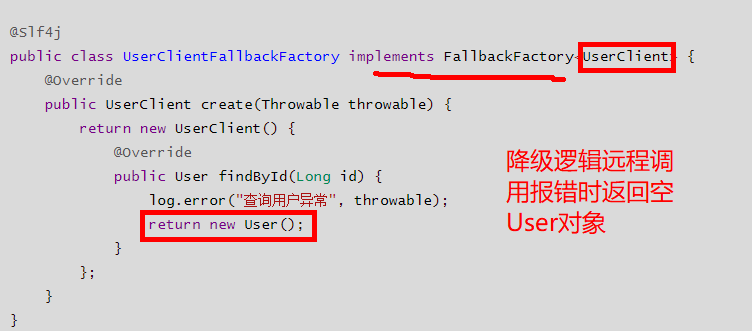      

---

# 微服务组件相关知识MQ：


RabbitMQ 相关:

## 1.MQ 的结构组成？

交换机，队列，虚拟主机

## 2.MQ 的几种类型？

Helloworld模型，workqueue工作模型，发布订阅模型（广播，路由，主题）

## 3.MQ 的业务使用场景？

Feign 同步调用；mq 异步高并发调用

## 4.MQ 如何保证消息不丢失（或者消息被正确消费）？

1. 生产者确认机制：

Public-confirm: 交换机成功，交换机失败的ack 确认

    发送消息的时候通过CorrelationData 调用callback 回调，返回isack 和 nack.确认发送消息成功还是失败。

Public-return: 交换机成功但到队列失败

    实现一个接口applicationAware 获取RabbitTemplate 对象，returnCallback 回调获取到队列失败的消息。重新再发

1. Mq持久化：交换机，队列，消息默认都是持久化（重启服务不会丢失）
2. 消费者确认机制：

  将消费者被拒绝的消息绑定一个死信交换机和死信队列，被拒绝的消息会转发到死信队列

1. 补偿机制：消息不丢失，消息发送到消费者还是失败，开启定时任务，主动去查询数据的状态，主动去更新表

## 5.MQ 的消息重复消费如何处理？

使用幂等性判断

1. 使用messageid 去查询一便业务数据库，有就不插入，没有就插入
2. 根据业务状态判断（UPDATE \`order\` SET status = ? , pay_time = ? WHERE id = ? AND status = 1）

## 6.MQ 的消息堆积？

增加多个消费者

可以开启一个消费者的多线程

增加队列的容积大小

---

# 微服务如何进行分布式事务处理？

## Cap 理论 和Base 理论？

C 是 一致性，A是可用性。P是分区容错。当P存在时，C和A不能同时满足

BASE理论是对CAP中的一致性和可用性进行一个权衡的结果，无法做到强一致，用适当的方式来使系统达到最终一致性。（基本可用，软状态，最终一致性）

- AP模式：各子事务分别执行和提交，允许出现结果不一致，然后采用弥补措施恢复数据即可，实现最终一致。

- CP模式：各个子事务执行后互相等待，同时提交，同时回滚，达成强一致。

## Seata 组成三种角色？

TC ----- 事务协调者

TM------全局事务

RM------分支事务

## Seata 的四种模式？

XA 模式的两阶段提交：

第一阶段：本地事务执行完成后报告事务执行状态给事务协调者，只执行sql, 此时事务不提交，继续持有数据库锁

第二阶段：等待所有的sql 执行完，在提交事务，由TC 判断结果进行是否回滚

AT 模式的两阶段提交：

第一阶段：undolog 快照表进行记录数据, 分支事务各自执行各自的sql 并提交

第二阶段：由TC判断提交结果是否各自回滚

TCC模式的提交：

- Try：资源的检测和预留；

- Confirm：完成资源操作业务；要求 Try 成功 Confirm 一定要能成功。

- Cancel：预留资源释放，可以理解为try的反向操作。

SAGA模式：

  手动编写业务

代码：

在yml 文件配置

seata:

  data-source-proxy-mode: AT \# 默认就是AT

全局注解：@GloableTransactional

需要创建一个undo_log 日志表用来记录回滚日志快照

如何启动seata?

![](data:image/x-emf;base64,AQAAAGwAAAAFAAAAAQAAAF8AAABDAAAAAAAAAAAAAAAiBgAAbAQAACBFTUYAAAEA5BUAABUAAAACAAAAAAAAAAAAAAAAAAAAgAcAADgEAAAmAQAApQAAAAAAAAAAAAAAAAAAAHB8BACIhAIAGAAAAAwAAAAAAAAAGQAAAAwAAAD///8AcgAAAKAQAAAjAAAAAQAAAEIAAAAgAAAAIwAAAAEAAAAgAAAAIAAAAACA/wEAAAAAAAAAAAAAgD8AAAAAAAAAAAAAgD8AAAAAAAAAAP///wAAAAAAbAAAADQAAACgAAAAABAAACAAAAAgAAAAKAAAACAAAAAgAAAAAQAgAAMAAAAAEAAAAAAAAAAAAAAAAAAAAAAAAAAA/wAA/wAA/wAAAAAAAAAAAAAAAAAAAAAAAAAAAAAAAAAAAAAAAAICAgIUAAAACwAAAAAAAAAAAAAAAAAAAAAAAAAAAAAAAAAAAAAAAAAAAAAAAAAAAAAAAAAAAAAAAAAAAAAAAAAAAAAAAAAAAAAAAAAAAAAAAAAAAAAAAAAAAAAAAAAAAAAAAAAAAAAAAAAAAAAAAAAAAAAAAAAAAAAAAAAABwcHDrKyssC0tLTEjY2NoWZmZn1CQkJaIiIiOQsLCx8AAAAMAAAAAQAAAAAAAAAAAAAAAAAAAAAAAAAAAAAAAAAAAAAAAAAAAAAAAAAAAAAAAAAAAAAAAAAAAAAAAAAAAAAAAAAAAAAAAAAAAAAAAAAAAAAAAAAAAAAAAAAAAAAcHBwl8/Pz9//////////////////////z8/P53d3d5r6+vs2ZmZmtcnJyiUxMTGUrKytDERERJwEBAREAAAAEAAAAAAAAAAAAAAAAAAAAAAAAAAAAAAAAAAAAAAAAAAAAAAAAAAAAAAAAAAAAAAAAAAAAAAAAAAAAAAAAAAAAADk5OUT+/v7/9vb2//X19f/19fX/9vb2//j4+P/7+/z///////////////////////j4+P3l5eXtycnJ1qWlpbd/f3+VWFhYcDU1NU0ZGRkvBQUFFwAAAAgAAAAAAAAAAAAAAAAAAAAAAAAAAAAAAAAAAAAAAAAAAAAAAAAAAAAAXV1daP/////19fX/9fX1//X19f/19fX/9fX1//T09P/09PT/8/P0//Pz8//z8/T/9PT0//j4+P/9/f3//////////////////f39/+zs7PPT09PesbGxwnZ2dooBAQEHAAAAAAAAAAAAAAAAAAAAAAAAAAAAAAAAAAAAAAAAAACEhISO//////X19f/19fX/9fX1//X19f/19fX/9PT1//T09P/z8/T/8/Pz//Ly8v/x8fH/8fHx//Dw8P/w8PD/8PDw//Hx8f/y8vL/9fX1//r6+v//////xMTEygEBAQMAAAAAAAAAAAAAAAAAAAAAAAAAAAAAAAAAAAAAAAAAAKurq7P/////9fX2//X19f/19fX/9fX1//X19f/09PX/9PT0//Pz9P/z8/P/8fHy//Hx8f/x8fH/8fHx//Dw8P/w8PD/7+/v/+/v7//t7e3//////5WVlZ8AAAAAAAAAAAAAAAAAAAAAAAAAAAAAAAAAAAAAAAAAAMDAwnNzc3U/v7+//b29v/19fb/9fX1//X19f/19fX/9fX1//T09P/z8/T/8/Pz//Hx8v/x8fH/8fHx//Dw8P/w8PD/8PDw/+/v7//v7+//7u7u//////9ubm55AAAAAAAAAAAAAAAAAAAAAAAAAAAAAAAAAAAAAAAAAAAVFBQd6Ojo7fv7/P/29vb/9vb2//X19f/19fX/9fX1//X19f/09PT/8/P0//Pz8//x8fL/8fHx//Hx8f/w8PH/8PDw/+/v7//v7+//7+/v/+7u7v//////SEhIUwAAAAAAAAAAAAAAAAAAAAAAAAAAAAAAAAAAAAAAAAAALy8vOfr6+v35+fn/9vb4//b29//29vb/9fX1//X19f/19fX/9PT1//T09P/z8/P/8fHx//Hx8f/w8PD/8PDw/+/v7//v7+//7+/v/+7u7v/w8PD/9fX1+igpKDAAAAAAAAAAAAAAAAAAAAAAAAAAAAAAAAAAAAAAAAAAFFRUVy//////j4+f/4+Pj/+fn7//n5+f/29vb/9fX1//X19f/09PX/9PT0//Ly8//x8fH/8fHx//Dw8P/w8PD/7+/v/+/v7//v7+//u7u7/7u7u//T09P/i4eHoDg4OFwAAAAAAAAAAAAAAAAAAAAAAAAAAAAAAAAAAAAAAAAAAeHh4gv/////4+Pn/+fn6/+Hh4f/h4eL/8vLz//b29v/1vX2//X19f/39/f/09PT/8fHx//Hx8f/w8PD/7+/v/+/v7//u7u7/7u7u/+7u7v/u7u7/+fn5/8XFxc0BAQEFAAAAAAAAAAAAAAAAAAAAAAAAAAAAAAAAAAAAAAAAAACenp6n//////n5+f/6+vv/kZGS/3Fxcv/R0dL/+/v8//b29v/09PT/2tra/+Pj4//w8PD/8PDw/+/v7//v7+//7+/v/+7u7v/u7u7/7u7u/+7u7v/+/v7/oqKhrQAAAAAAAAAAAAAAAAAAAAAAAAAAAAAAAAAAAAAAAAAAAAAAAbi4uMD/////+Pj4//f3+P/7+/z//Pz+//r6+//29vb/9vb3/+7u7v+1tbb/o6Ok/+np6f/09PT/9vb2/5+fn/9jY2T/s7Oz//b29v/x8fH/8PDw//////+Hh4eRAAAAAAAAAAAAAAAAAAAAAAAAAAAAAAAAAAAAAAAAAAAICAgP2NjY3v39/v/29vj/9vb4//b29//29vb/9vb2//X19v/19fX/9vb2//v7+//n5+v/19fX/8/Pz//T09P/Nzc7/p6en/9TU1f/09PT/8fHx//Hx8f//////YGBgawAAAAAAAAAAAAAAAAAAAAAAAAAAAAAAAAAAAAAAAAAAHBwcJvDw8PT5+fv/9vb3//b29v/29vb/9vb2//X19v/19fX/9fX1//X19f/19fX/9PT1//T09P/z8/P/8/Pz//X19f/39/f/8/Pz//Hx8f/x8fH/8vLy//39/f88PDxHAAAAAAAAAAAAAAAAAAAAAAAAAAAAAAAAAAAAAAAAAAA6OjpF/v7+//f39//29vb/9vb2//b29v/19fb/9fX1//X19f/19fX/9fX1//X19f/09PX/9PT0//Pz8//z8/P/8fHx//Hx8f/x8fH/8fHx//T09P/v7+31Hh4dKAAAAAAAAAAAAAAAAAAAAAAAAAAAAAAAAAAAAAAAAAAAF9fX2n/////+9vb/9vb2//b29v/19fb/9fX1//X19f/19fX/9fX1//X19f/19fX/9PT1//T09P/z8/T/8/Pz//Pz8//y8vP/8fHx//Hx8f/4+Pj/0dHRXwgHBxAAAAAAAAAAAAAAAAAAAAAAAAAAAAAAAAAAAAAAAAAAAAaGhpD/////9vb2//b29v/19fb/9fX2//X19f/19fX/9fX1//X19f/19fX/9fX1//T09P/09PT/09PT/8/Pz//Pz8//z8/P/8fHy//Hx8f/x8fH//f39/5mZmcEAAAACAAAAAAAAAAAAAAAAAAAAAAAAAAAAAAAAAAAAAAAAAACsrKy0//////X19v/19fb/9fX2//X19f/19fX/9fX1//X19f/19fX/9fX1//X19f/09PX/9PT0//T09P/z8/P/8/Pz//Pz8//y8vP/8fHx//7+/v+goKCtAAAAAAAAAAAAAAAAAAAAAAAAAAAAAAAAAAAAAAAAAAAAEBASitLS0tf////89fX2//X19v/19fX/9fX1//X19f/19fX/9fX1//X19f/19fX/9PT1//T09P/09PT/9PT0//Pz8//z8/P/8/Pz//Pz8//x8fP/8PDw//////+ZmZm0AAAAAAAAAAAAAAAAAAAAAAAAAAAAAAAAAAAAAAAAAAAAEBARF8fHy8/j4+Pj//////////////////////Pz8//j4+P/29vb/9fX1//X19f/09PX/9PT0//T09P/09PT/8/P0//Pz8//z8/P/8/Pz//Pz8//x8fL//////DQ0NEwAAAAAAAAAAAAAAAAAAAAAAAAAAAAAAAAAAAAAAAAAAAAEBAAQEBAQKCgoK0lJSURvb29xlZWVmLu7u73a2trc8fHx8//////////////////////8/Pz/+Pj4//X19f/z8/T/8/Pz//Pz8//z8/P/09PX/9fX16iYmJjEAAAAAAAAAAAAAAAAAAAAAAAAAAAAAAAAAAAAAAAAAAAAAAAAAAAAAAAAAAAAAAAAAAAAAAAAAAAAAAAAJCQkLICAgIj4+PkBiYmJliYmJi6+vr7LR0dHT6urq7Pv7+/79/f3///////39/f/4+Pj/+vr6/+Hh4ecODg0XAAAAAAAAAAAAAAAAAAAAAAAAAAAAAAAAAAAAAAAAAAAAAAAAAAAAAAAAAAAAAAAAAAAAAAAAAAAAAAAAAAAAAAAAAAAAAAAAAAAAAAAAAAAAAAAAEBAQGFxcXGTMzM2VlZWWX19fX+jo6Omx8fHyePj4+X4+Pj6xsbGzQEBAQUAAAAAAAAAAAAAAAAAAAAAAAAAAAAAAAAAAAAAAAAAAAAAAAAAAAAAAAAAAAAAAAAAAAAAAAAAAAAAAAAAAAAAAAAAAAAAAAAAAAAAAAAAAAAAAAAAAAAAAAAAAAAAAAAAAAAAAAAAAAAAAAAAAAAAERAQEE0tLS4vLy8zAAAAAAAAAAAAAAAAAAAAAAAAAAAAAAAAAAAAABgAAAAwAAAAAAACAAAAAAAADAAAAAQAAAFIAAABwAQAAAQAAAEQAAAAAAAAAAAAAAAAAAAAvAIAAAAAAIYBAgIiUwB5AHMAdABlAG0AAAAAAAAAAAAAAAAAAAAAAAAAAAAAAAAAAAAAAAAAAAAAAAAAAAAAAAAAAAAAAAAAAAAAAAAAAAAAIbuSKgEAAMBSE4gDAAAAAAAAAAAAAABwBLOgKgEAABCR4+L7fwAA2MTTkioBAAAAAAAAAAAAAAAAeQBzAHQAZQBtAAAAAAAAAAAAAAAAAAcAAAAAAAAAAAB5AHMAdABlAG0AAAAAAAAAAAAAAAAABwAAAAAAAAAYkXIzAAAAAAAAAAAAAAAAwFITiAMAAAB4BregKgEAAHAEs6AqAQAAcASzoCoBAACZUROIAwAAAAEAAAAAAAAA1krRnAAAAAAAAAAAAAAAAHDSMasqAQAAwFITiAMAAABrMdzg+38AAMBSE4gDAAAAmVETiAMAAABwBLOgKgEAAAEEs6BkdgAIAAAAACUAAAAMAAAAAQAAACUAAAAMAAAADQAAgCgAAAAMAAAAAQAAAFIAAABwAQAAAQAAAPT///8AAAAAAAAAAAAAAACQAQAAAAAAhgAAAABNAGkAYwByAG8AcwBvAGYAdAAgAFkAYQBIAGUAaQAgAFUASQAAAAAAAAAAAAAAAAAAAAAAAAAAAAAAAAAAAAAAAAAAAGDJ3ZIqAQAAMAAAAAAAAAAAAAAAAAAAAHAEs6AqAQAAoLITiAIAAADYxNOSKgEAAAAAAAAAAAAAoVst4/t/AABg032SKgEAAAAAAAAAAAAABwAAAAAAAAAAAN2SKgEAADQAAMAAAAAAAAAAAAAAAACwOJ2QKgEAAKUAAAAAAAAAAAAAAAAAAAAwmt2SKgEAAHgGt6AqAQAAcASzoCoBAAAAAIOQKgEAAPmzE4gDAAAAAQAAAAAAAADWStGcAAAAAGy1E4gDAAAAEgAAAAAAAABQtROIAwAAAGsx3OD7fwAAULUTiAMAAAD5sxOIAwAAAHAEs6AqAQAAAQSzoGR2AAgAAAAAJQAAAAwAAAABAAAAVAAAAIgAAAAFAAAAIgAAAF8AAAAyAAAAAQAAAAAAdUHHcXRBBQAAACIAAAAKAAAATAAAAAQAAAAAAAAAAAAAAGYAAABKAAAAYAAAAHMAZQBhAHQAYQCEduiQcn+MVMaWBgAAAAcAAAAHAAAABAAAAAcAAAAMAAAADAAAAAwAAAAMAAAADAAAAFQAAABkAAAAIgAAADMAAABDAAAAQwAAAAEAAAAAAHVBx3F0QSIAAAAzAAAABAAAAEwAAAAEAAAAAAAAAAAAAABmAAAASgAAAFQAAAAQYi4AbQBkAAwAAAADAAAACwAAAAgAAAAlAAAADAAAAA0AAIBGAAAAIAAAABIAAABJAGMAbwBuAE8AbgBsAHkAAAAAAEYAAAAsAAAAHgAAAHMAZQBhAHQAYQCEduiQcn+MVMaWEGIuAG0AZAAAAAAARgAAABAAAAACAAAAAAAAAEYAAAAQAAAABAAAAGwAAABGAAAAIAAAABIAAABJAGMAbwBuAE8AbgBsAHkAAAAAAA4AAAAUAAAAAAAAABAAAAAUAAAA)

Seata 和服务如何进行整合？

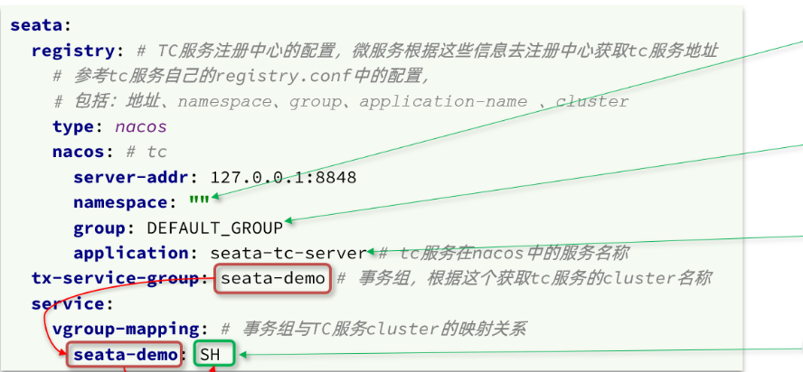

几张表？

global_table , branch_table -----给seata用

lock_table, undo_log ----------给AT模式用的


# 一、Python 基础核心知识

### 1. Python 的基本数据类型和数据容器有哪些？
-   **基本数据类型**：`int`（整数）、`float`（浮点数）、`str`（字符串）、`bool`（布尔值）。
-   **数据容器类型**：`list`（列表）、`tuple`（元组）、`set`（集合）、`dict`（字典）。
-   **特殊类型**：`NoneType`（空值）。

### 2. `*args` 和 `**kwargs` 的区别是什么？
-   **`*args`**：用于接收任意数量的非关键字参数，在函数内部会被打包成一个 **元组 (tuple)**。
-   **`**kwargs`**：用于接收任意数量的关键字参数，在函数内部会被打包成一个 **字典 (dict)**。

### 3. 你用过的 Python 框架有哪些？分别用来做什么？
-   **AI 编排框架**：项目中使用了 **LangChain** 和 **LangGraph**，主要用于与 AI 大模型平台进行对接，实现智能体编排、RAG 流程搭建以及复杂工作流的状态管理。
-   **Web 接口框架**：选用了 **FastAPI** 进行后端接口开发，为前端业务系统提供高性能的 API 调用服务。

---

## 二、AI 应用开发与主流框架对比

### 1. LangChain 的基础组件有哪些？各自的作用是什么？
| 组件名称        | 功能描述                                     |
| :---------- | :--------------------------------------- |
| **Models**  | 提供与大语言模型、向量模型、聊天模型的统一集成接口，屏蔽底层差异。        |
| **Prompts** | 用于构建、管理和动态渲染提示词模板，支持变量注入和格式化。            |
| **Chain**   | 将离散的组件（提示模板、模型、工具等）串联成有序的工作流，处理多步骤复杂任务。  |
| **Agents**  | 赋予语言模型自主决策能力，使其能根据用户意图动态选择并调用外部工具完成任务。   |
| **Memory**  | 实现会话记忆功能，支持短期对话历史和长期知识存储。                |
| **Index**   | 实现 RAG 核心能力，提供文档加载、文本拆分、向量化、存储与检索的全套工具链。 |

### 2. LangChain 和 LangGraph 有什么区别？
-   **LangChain**：是通用型智能体编排工具，将工作流编排为一系列线性或分支节点，使用 **有向无环图 (DAG)** 进行连接，不支持循环回溯。
-   **LangGraph**：核心创新在于采用 **图结构 (Graph)** 作为计算模型，突破了 DAG 的限制。它支持 **循环工作流** 和 **动态状态管理**，用节点 (Node) 表示任务步骤，边 (Edge) 连接节点，并通过全局状态 (State) 在节点间传递和持久化信息，更适合构建复杂的自适应智能体。

### 3. Spring AI 和 LangChain 有什么区别？如何选择？
| 对比维度 | LangChain | Spring AI |
| :--- | :--- | :--- |
| **定位** | 通用型大模型编排框架，专注于解决 LLM + 外部工具组合问题，生态丰富。 | Spring 生态专属框架，致力于将大模型能力无缝融入现有 Spring 体系。 |
| **适用场景** | AI 原生应用（多轮对话、RAG、复杂智能体），记忆/检索/编排能力成熟，适合 Python 技术栈。 | 企业级 Java 后端 + 大模型融合，适合在原有 Java 程序上添加 AI 能力，无需更换技术栈。 |
| **特点** | 灵活度高、社区活跃、文档完善，但学习曲线较陡。 | 贴合企业级 Java 开发规范，学习成本低，与 Spring Boot 集成度高，但 AI 原生能力相对较弱。 |

### 4. Function Calling 实现天气查询的完整思路是什么？
1.  **定义函数描述**：明确函数的名称、用途、入参（城市、日期）和出参（温度、天气状况），并以 JSON Schema 格式提供给大模型。
2.  **调用大模型判断**：将用户提问与函数描述一同发送给大模型，由模型自主判断是否需要调用该函数，若需要则返回标准化的参数 JSON。
3.  **执行本地函数**：后端解析模型返回的参数，调用真实的天气 API（如高德开放平台）获取实时天气数据。
4.  **结果回填生成回答**：将获取到的天气数据作为上下文传回大模型，由大模型基于真实数据生成自然语言回答，最终返回给用户。

---

## 三、RAG 技术与 EduRAG 项目实战详解

### 1. RAG 的核心原理是什么？
**RAG（检索增强生成）** 旨在解决大模型知识更新延迟、领域知识缺失及幻觉问题。其核心流程如下：
1.  将内部资料文档进行切分、向量化后存入向量数据库。
2.  用户提问时，先将问题向量化，从向量库中召回与问题语义相关的文档片段。
3.  将召回的文档片段与原始问题拼装为增强提示词，发送给大模型。
4.  大模型基于增强后的提示词，结合检索到的事实信息输出准确答案。
### 2. 向量数据库的原理及索引结构是怎样的？
#### 核心原理
向量数据库的核心是将文本、图像等非结构化数据转换为高维空间中的向量表示。语义上相似的内容，在高维向量空间中的距离会更近。检索时采用 **ANN（快速近似最近邻搜索）** 算法，通过预先构建的索引结构快速定位候选向量集，并从中选取 Top-K 个最相似的结果返回。
#### 关于索引结构
数据库选型：采用 Milvus，原生支持万亿级向量检索与分布式扩展。
集合字段：包含 id、text（子块文本）、稠密/稀疏向量、父块id、父块内容、来源 等。
索引配置与原理：采用 IVF_FLAT 索引类型，度量方式为余弦相似度。该索引结构通过 IVF（倒排文件） 先将全量向量聚类分区实现粗筛，再在命中分区内进行 FLAT（扁平精确扫描），在保证高召回率的同时将检索复杂度从全量遍历降低到局部比对，兼顾了教育问答场景对速度与精度的双重需求。

#### 相似度度量方式
-   **余弦相似度 (Cosine Similarity)**：衡量两个向量方向的相似程度，常用于文本语义检索。
-   **欧式距离 (Euclidean Distance)**：衡量两点间的直线距离，常用于图像特征检索。
-   **内积 (Inner Product)**：综合考虑向量的方向和模长。

#### 工作流程
选择合适的相似度度量方式 → 将原始数据通过 Embedding 模型转为向量 → 构建 ANN 索引加速检索 → 执行查询并返回结果。

### 3. EduRAG 项目的核心业务流程是怎样的？
#### 3.1 向量数据库准备
-   **数据库选型**：Milvus，支持万亿级向量检索。
-   **集合字段设计**：包含 `id`、`text`（子块文本）、`稠密向量`、`稀疏向量`、`父块id`、`父块内容`、`来源` 等字段。
-   **索引配置**：采用 IVF_FLAT 索引类型，度量方式为余弦相似度。

#### 3.2 文档切分与向量化策略
-   **父子块切分设计**：父块大小设为 1200 token，子块大小设为 300 token，子块之间设置 20 token 的重叠量，既保证检索粒度，又避免语义截断。
-   **双向量模型 (BGE-M3)**：
    -   **稠密向量**（1024维）：对子块整体进行向量化，擅长捕捉深层语义相似性。
    -   **稀疏向量**：对子块进行分词后向量化，输出格式如 `{"4": 0.8565}`，擅长精确匹配关键词和专业术语。
-   **混合检索机制**：稠密向量权重设为 0.7（召回 Top-3），稀疏向量权重设为 0.5（召回 Top-4），通过子块关联对应的父块并进行去重合并。
-   **重排序 (Rerank)**：使用 `bge-reranker` 模型对合并后的父块内容进行精排，取 Top-2 结果送入大模型生成回答。

#### 3.3 智能查询优化策略
-   **提示词分类路由**：使用本地 BERT 模型对用户问题进行分类，区分“通用知识”与“专业知识”。通用问题直接走本地预设模板，专业问题进入 RAG 流程。
-   **多策略提示工程**：针对专业知识问题，经大模型解析后分为直接回答策略、假设性问题推理策略或子查询拆解策略。
-   **多级缓存与 BM25 兜底**：
    -   优先查询 Redis 缓存 → 再查 MySQL 预设问答库。
    -   使用 BM25 算法计算问题与预设问答的相关度，若阈值 > 0.9 则直接返回 MySQL 中的标准答案，否则才进入 RAG 检索流程。
-   **多轮会话记忆管理**：在 MySQL 中存储最近 5 轮对话历史，RAG 查询时将历史记录与当前问题一同封装进提示词，保证上下文连贯性。

### 4. 项目关键技术问题深度解答

#### Q1: 为什么同时使用稠密向量和稀疏向量？
-   **稠密向量**基于整段语义进行检索，能够找到意思相近但表述不同的文档，解决同义表达问题。
-   **稀疏向量**基于关键词进行检索，能够精确匹配特定术语、专有名词或缩写，解决语义漂移问题。
-   **融合目的**：通过加权混合检索，兼顾语义理解的泛化能力和关键词匹配的精确性，显著提升召回准确率。

#### Q2: 父子块是如何关联的？
在文档切分时通过循环遍历设置层级标识：
-   父块 ID 格式：`doc_0_parent_0`
-   子块 ID 格式：`doc_0_parent_0_child_0`
检索时先命中子块，再通过子块 ID 中的父块标识反向查找完整的父块内容，确保送入大模型的上下文完整连贯。

#### Q3: 千问已经支持图形输入，为什么还要单独使用 OCR？
-   **多模态大模型**强在“理解”和“推理”，但对文字、表格、公式的提取精度有限。
-   **OCR 模型**专精于“精确提取”，能够将图片、PPT、PDF 中的内容高保真转换为结构化文本。
-   RAG 系统需要将各类资料统一转换为纯文本存储到向量库，OCR 是构建高质量文本知识库不可或缺的基础环节。

#### Q4: 重排序 (Rerank) 的原理是什么？为什么必须加这一步？
向量检索模型只能找到语义相近的内容，无法精确判断内容与问题的相关性。重排序使用专门的精排模型架构，对检索结果进行细粒度的交叉注意力计算，输出精确的相关性分数。这一步能过滤掉语义相近但实际无关的噪声文档，确保送入大模型的 Top-K 父块高度相关，大幅提升最终回答的精确度和可信度。

#### Q5: RAG 检索返回为空时，兜底策略是什么？
-   **脱敏降级回答**：明确告知用户“未找到相关文档”，并根据常识给出安全的通用回答，避免编造信息。
-   **严格约束提示词**：在系统提示词中明确禁止大模型自由发挥，当无有效检索文本时，直接触发兜底回复，引导用户联系人工客服。

#### Q6: 文档切分时出现语义不连贯如何处理？
-   优先按标题、段落、语义分隔符进行切割，同时设置最大/最小切分数量和重叠量。
-   上线前进行抽样检查，对结构敏感的文档定制专属切分规则，例如使用正则表达式识别章节标题并强制在此处切分，避免跨段落截断。

### 5. RAGAS 评估指标
### 5. RAGAS 评估指标详解
| 指标名称                           | 说明                            |
| :----------------------------- | :---------------------------- |
| **上下文相关性** (context_precision) | 评估检索到的文档段落是否与用户问题真正相关，排除噪声干扰。 |
| **上下文召回率** (context_recall)    | 评估检索系统是否覆盖了回答问题所需的全部关键信息。     |
| **忠实度** (faithfulness)         | 评估生成的答案是否完全基于检索到的上下文，无幻觉、无编造。 |
| **答案相关性** (answer_relevancy)   | 评估最终生成的答案对用户问题的切题程度和完整性。      |

> **【此处插入原文档相关图片：RAGAS 评估指标示例截图】**

---


**Agent+Rag项目面试题库**


# **一、Python基础 & 大模型基础面试题**

## **1. Python的基本数据类型和数据容器？**

**【答案】**

基本类型：int（整数）、float（浮点）、str（字符串）、bool（布尔）、None（空类型）

容器类型：list（列表）、tuple（元组）、set（集合）、dict（字典）

## **2. 在接受参数时，*args 和 **kwargs的区别是什么？**

**【答案】**

*args：接收任意数量的非关键字参数并打包成元组。

**kwargs：接收任意数量的关键字参数并打包成字典。

## **3. Python这块你有用什么框架吗？Web框架用了吗？**

**【答案】**

Python这块我们项目中有用到很多框架，比如说LangChain和LangGraph框架，它们主要是与AI大模型平台进行对接。

Web框架选用的FastAPI来进行接口的开发，供业务系统来调用。

## **4. 简述一下向量数据库的原理？和支持的索引结构**

**【答案】**

向量数据库的核心原理就是将文本、图像此类非结构化数据转换为高维空间的向量。通常来讲，语义相似的内容在向量空间距离更近。在检索的时候采用的是ANN快速近似最近邻搜索，通过构建索引结构，快速定位候选集选取出Top-K。

相似度检索本质上是寻找语义相似的结果，核心思想是将数据转化为高维向量，通过计算向量间数学距离衡量相似性。

它的原理是：先通过一个模型选择使用不同的相似度度量（余弦相似度-文本，欧式距离-图像常用，内积）将数据转换为向量，最后进行索引加速，然后查询执行。

通过索引结构（如IVF_FLAT等）增加查询效率。

## **5. LangChain的基础组件有哪些？**

**【答案】**

Models组件：提供了与各种模型的集成，并为所有模型提供了一个精简的统一接口。支持大模型、向量模型以及聊天模型。

Prompts组件：主要用于构建提示词，可以方便提示词的动态书写。

Chain组件：通过标准化的接口将离散的组件（如提示模板、模型、外部工具等）串联成一个工作流，多用于处理那些需要多步骤协作的复杂任务。

Agents组件：使语言模型能够动态决定任务执行流程，通过与工具的交互完成复杂任务。

Memory组件：实现会话记忆。

Index组件：主要用来实现RAG，组件中提供了文档加载、文档拆分、文档向量化的工具。

## **6. LangChain和LangGraph两个框架有什么优缺点？**

**【答案】**

LangChain是一个通用的智能体编排工具，它把工作编排成一系列的工作节点，用一条工作链把这些节点连接起来，组织成一张有向无环图（DAG）。

LangGraph其核心创新在于采用图结构（Graph）作为计算模型，突破了传统有向无环图（DAG）的限制，支持循环工作流和动态状态管理。用节点（Node）表示任务步骤，用边（Edge）连接节点，用State在全局传递上下文状态。

简单来说：LangChain适合线性、简单的链式任务；LangGraph适合需要循环、分支、复杂状态管理的智能体场景。

## **7. 假设现在让你基于Function Calling制作一个天气查询的功能，后端代码如何写？**

**【答案】**

基于Function Calling做天气查询的后端核心逻辑分4步：

1. 定义函数描述：定义天气查询函数的入参（城市、日期）、出参（温度、天气状况）以及函数功能说明。

2. 调用大模型：把用户提问 + 函数描述传给大模型，让模型判断是否需要调用天气函数，并返回标准化的调用参数。

3. 执行本地函数：解析大模型返回的调用参数，调用真实的天气API（可以对接高德）获取数据。

1. 结果回填：把天气数据传给大模型，让模型生成自然语言回答，返回给用户。

## **8. 聊一聊SpringAI和LangChain之间的区别**

**【答案】**

Spring AI 和 LangChain 核心都是大模型应用开发框架，但定位、生态、使用场景完全不同。

1. 定位和出身不一样：

· LangChain是通用型大模型编排框架，核心解决LLM + 外部工具（检索、函数调用、记忆）的组合问题，更灵活。

· SpringAI是Spring生态专属的大模型框架，本质是把大模型能力融入Spring体系，更贴合企业级Java开发。

2. 适用场景不一样：

· LangChain适合做灵活的AI原生应用（比如多轮对话、RAG问答、智能体），它的记忆、检索、流程编排能力更成熟。

· Spring AI适合做企业级Java后端 + 大模型的融合应用，特别适合在原有Java程序的基础上添加大模型的场景，不用改原有技术栈，学习成本低。

## **9. RAG的原理是什么？**

**【答案】**

RAG，就是检索增强生成。之所以使用它，是因为大模型有两个典型的缺点：知识更新延迟和领域知识缺失。

为了解决这两个问题，就有了RAG技术。它的做法是在调用大模型的时候，需要将跟问题相关的资料提取出来一起发给大模型，进而提高问题回答准确性。

它的整个流程分为这样几步：

2. 将公司内部的一些资料文档向量化之后存储到数据库备用。

3. 当用户提问时，先将用户问题通过嵌入模型向量化，然后从向量数据库中召回相关文档。

4. 将召回的文档和用户的原始问题一起拼装为提示词，然后发送给大模型。

5. 大模型基于增强后的提示词来输出答案。

  

# **二、AgentCenter 多智能体中台项目专项面试题**

项目背景：是一个天机学堂-在线教育的线上商城平台（有用户Ai助手），线上平台可以查询课程，在线学习，购买课程和书籍，在线评论，在线考试。Ai 智能体助手功能：给用户进行推荐课程，查询课程，解答用户问题，在线下单--（搭建智能体中台）

## **1.说一下AgentCenter项目的核心业务流程**

**【答案】**

一．java 微服务架构业务（查询，购买，下单，在线学习）：用户端通过nginx 反向代理，负载均衡到微服务项目的网关Gateway ,网关路由转发和身份认证 到我各种业务服务（Aigc智能服务,order下单服务，trade交易服务，course课程服务），服务通过远程Openfeign 进行调用（都注册到Nacos中心）。页面由Ai助手发送各种请求由Aigc 微服务 转发到 智能体中台请求调用。

**微服务面试问题：**

**1.页面查询：**

①商城的页面检索--ElasticSearch(分布式搜索引擎--倒排索引-BM25)页面的中文模糊检索（from+size,function_score,桶聚合Agg,bool查询，match）

②将后台管理商品数据和商城数据保持数据同步：后台mysql 增删改---同步到Cancal(dump 协议伪装成从机，binlog 二进制文件读取)----RabbitMq ---消费到ElesticSearch 服务中

**2.下单交易服务：**

RedissonClient 分布式锁；

使用场景？

用户下单后点击去收款（订单生成），生成交易单，防止高并发情况下或者网络故障下单会重复根据订单生成多个交易单。使用分布式锁来控制一个订单只能生成一笔交易单

**分布式锁的原理**

使用了redis 的setnx 指令。如果key 存在 就不能重新设置值。如果key 不存在就可以设置值。

Redis setnx 设置一个过期时间，时间设置长不好（影响代码效率和性能），时间设置短也不好（代码没跑完，锁就释放了，脏数据）。

所以为了解决这种setnx 问题，我们使用redis 的客户端对象redissonClient（集成大量的锁，公平锁，红锁，连锁，读写锁等）。redissonClient 调用getFairLock 获取公平锁，RLock 调用tryLock(5l), 下个线程等待时间，unlock() 释放锁。Watch dog 看门狗机制 默认时间是30s。代码没有跑完会自动续时间。

备注：watch dog 本质是定时任务，判断你的当前线程和你跑的业务线程是否相等，判断当前线程跑超时时间1/3 自动刷新redissonClient = redisSetnx + lua 脚本语法（线程原子性）

**3.下单交易中RabbitMQ的使用场景：**

用户点击下单，会创建订单表（订单号，商品信息，订单的状态），根据订单再创建一个交易单表（交易单号，订单号，交易金额，交易状态），去  调第三方支付系统api 接口会返回一个链接给前端用户进行付款，用户点击付款链接会将交易单信息提交到支付宝付钱。支付宝收到钱了，发送一个异步消息给用户支付成功。交易微服务会通过rabbitmq 发送异步消息通知下游系统更新交易单表中的状态（支付已结算），再通知订单表更新状态（订单已完成）。

**4.****采用xxl-job 分布式定时任务（分片）去查询该笔交易付没付**

用户钱付到支付宝，但没收到支付成功的消息。采用XXL-job 分布式定时任务（使用是分片模式）每隔3-5秒去查询一下付款中交易单。通过交易单去查询第三方支付宝商家的交易记录.如果状态不等于付款中，说明异步通知有误，将第三方的交易状态和结果通过rabbitmq通知交易系统，订单系统更新交易状态。

二． Aigc微服务发送OpenFeign 远程调用 智能体网关服务：

①页面Ai 智能助手发送/chat,/history,/hot,/memory请求到智能体网关，网关对该服务做路由的**转发和身份认证**。判断该服务是否有权限能够访问Python智能体中台服务，用户登录系统（Ai 助手）/auth/token 接口被网关放行，去智能体中台查询app-key 和 app-secret 存不存在，存在则生成jwt 的token 返回给Aigc 服务。Aigc 携带请求头token 到网关进行解析，判断它存不存，存在则可以访问智能体中台。

②**网关的限流-**--网关内置了限流器（结合redis 做限流器），定义限流的维度（即按什么维度限制请求频率），每秒恢复 10 个令牌，桶最大容量 20。

③**网关的熔断和降级**---resilience4j，断路器（熔断的策略---失败率50%和超时时间），降级策略-fallbackUri: forward:/fallback/ac  # 熔断后的降级地址，返回一个空对象

三． AgentCenter 智能体中台---机器人智能体（Ai助手）和文本智能体（评论的自动回复）：

**①A2A智能体客户端：**

初始化Qwen3.7-max 大模型---根据用户输入识别意图调用哪个A2A服务端Agent

初始化会话记忆---PG数据库保存长期记忆

初始化Graph 图的流程--start-intent_agent(意图节点)-work_agent(工作节点)-end

细节流程：Graph 图中intent_agent(意图节点)A2A客户端连接A2A服务端地址获取5个服务端的Card卡片信息和skill信息。LLM 根据用户输入的问题和Prompt提示词找出用户需要调用哪个服务端的Agent.执行work_agent(工作节点)调用A2A服务端带上历史会议记忆，得出结果进行流式输出成SSE的数据格式

备注：流式输出时如何进行停止输出？

用户点击页面停止按钮发送请求，会在redis 中set 一个值key 是当前session_id.用户数据在流式一行行的输出，输出时候做了一个redis 的查询判断，判断redis 中的session_id key 是否存在，如果存在就break 停止输出。

**②A2A 智能体服务端：**

初始化服务端实列对象---Card卡片信息 和 请求处理器

Card信息---服务器地址，IP ,端口号，名称，版本和Skills 技能 （该服务Agent 能做哪些事情）

请求处理器---执行智能体执行器（A2A服务端Agent 去执行具体的业务Agent智能体）

具体业务智能体初始化大模型LLM +tools工具 去创建Agent 对象，交给智能体根据用户输出问题通过function_calling 调用工具方法（也可以调用EduRag系统）。tools 工具方法里写的是调用我业务系统查询课程信息，获取naocs 配置中心里的微服务网关IP+端口，拼接请求发送到网关被拦截和认证，最后请求微服务课程。

③评论自动回复文本智能体：

初始化Qwen3.7-max 大模型，创建无工具的大模型智能体对象。用户只要评论就会调用文本智能体和提示词Prompt 完成自动回复

  

# **三、EduRAG项目专项面试题**

## **1. 说一下EduRAG项目的核心业务流程**

**【答案】**

1. 向量数据库准备：使用Milvus数据库，集合名itcast，字段包含（id、text子块、稠密向量、稀疏向量、父块id、父块内容、来源），创建索引IVF_FLAT，相似度度量为余弦相似度。

2. RAG向量检索部分：用户上传大量文档，加载文档后将文档切分为父块（1200token，约一页内容），再将父块切成子块（300token），对子块文档进行向量化（使用的向量化模型是BGE-M3），向量化成两个向量：稠密向量（子块整体进行向量化，1024维度）、稀疏向量（子块切割成多个单词，格式为词条权重字典）。

3. 用户问答流程：用户进行问答时，对用户问题向量化成两个向量，进行混合加权查询（稠密权重0.7查询到3个值，稀疏权重0.5查询到4个值），得到多个子块，通过子块获取父块内容并去重。使用BGE-reranker重排模型对用户问题和父块内容进行重排，获取父块重排之后的得分，从高到低排序获取Top-K前两个。

4. 用户提示词分类：本地有个BERT模型（对本地模型进行预训练，区分通用知识和专业知识）。用户输入问题，通过BERT模型区分是通用还是专业：如果是通用，走本地设置的通用模板结合用户问题走大模型回答；如果是专业知识，走RAG向量库查询。

5. 用户多策略提示词：用户问题分类成专业知识后，再经过多策略提示（直接策略、假设性问题策略——问题比较抽象时大模型解析成具体问题、子查询策略——问题很多个时拆解成多个子问题）。问题被大模型进行解析具体走哪个策略，再去查询RAG。

6. 查询优化（缓存）：用户直接请求RAG系统，流程比较长，查询效率低。会提前收集一些关于本系统相关的常见问题，把这些常见问题和答案预设到MySQL数据库里。当用户查询时会优先从Redis里查询，如果有直接返回，没有就查询MySQL。使用BM25算法将MySQL中的问题进行切割分词存到BM25索引中，匹配度超过阈值（0.9）直接返回，否则走RAG。

7. 查询多轮会话记忆：会将用户多轮会话保存到MySQL数据库中（memory表：id、会话id、问题、答案、时间）。用户输入问题，MySQL查询到答案，把当前会话存一份记录；用户输入问题，走RAG检索查询到答案，也把当前会话存一份记录。MySQL记录最多存5轮（保证token限制）。

8. 兜底策略：当返回的数据不满足条件时，回复并未找到相关的文档，并给出人工客服的电话。写提示词时要杜绝大模型自由发挥，如果未能返回任何有效的文本直接触发兜底策略。

## **2. 你们文档切分是如何来做的，里面的参数是哪些？如何确定这些参数的值？**

**【答案】**

文档格式有PDF、DOCX、MD等，每个文档我们使用不同的文档切割器：

· MD文档：按标题、段落、分隔符切割，文档切成父块（1200字符），再把每个父块切成子块（300字符），子块进行向量化。

· PDF、DOCX等：把超长文档按语义层级拆分，用递归分块器保证段落连贯，每段父块也是1200字符，子段也是300字符。

核心可调参数：分隔符拆分、父块拆分大小、子块拆分大小、重叠大小、返回Top-K个数。

参数确定方式：人工提前对文档资料做了格式化、筛选，抽样测试调整。针对手册类结构化文档，额外用正则识别章节标题，强制在标题处切分。

## **3. 父子分块怎么关联起来的？你怎么知道他是父？怎么知道他是子？**

**【答案】**

一个文档进行父块切割多个父块的时候，循环遍历给该父块设置一个id标识，格式如：doc_0_parent_0。

再对该父块进行切割，循环遍历给子块也进行标识，格式如：doc_0_parent_0_child_0。

Milvus向量库中每条子块数据都存储了「父块id」字段，通过该字段可以关联读取完整父块原文。

## **4. 为什么要做稠密跟稀疏？为什么要分开做？为什么要融合？**

**【答案】**

稠密向量：将一段文本整体向量化之后存储到向量库，用于后期基于整段语义进行相似性检索。它善于找到在意思上相近的文档，即使它们没有完全相同的关键词。

稀疏向量：将一段文本先分词成一个个词条，然后将每个词条单独向量化之后进行存储，用于后期基于问题中关键词的检索。它善于找到包含精确关键词或它们的紧密同义词的文档。

融合目的：使用混合检索（加权检索）提高查询的准确性，同时兼顾语义相似度和关键词精准匹配。

## **5. 你们的文档存储在向量数据库中具体的形式是什么样的？（详细到字段）**

**【答案】**

向量数据库使用Milvus（万亿级检索数据库），集合名itcast，具体字段如下：

· id：向量主键

· text：子块原文文本

· 稠密向量：1024维浮点向量

· 稀疏向量：分词权重字典

· 父块id：关联上层父块的唯一标识

· 父块内容：完整父块原文

· 来源：文档路径/文件名

索引类型：IVF_FLAT；相似度度量：余弦相似度。

## **6. 在这个项目中你们一共用到了几个模型，他们的作用分别是什么？**

**【答案】**

项目中用到了4个模型：

1. Qwen3.7max（LLM）：主大语言模型，负责提示词理解、答案生成、多策略解析。

6. BGE-M3：本地向量化模型，生成稠密向量和稀疏向量。

7. BERT：本地二分类训练模型，用于用户问题进行专业知识和通用知识的区分。

8. BGE-reranker：本地重排序得分模型，对召回的父块进行精排打分。

## **7. BM25算法原理是什么？**

**【答案】**

BM25是一种用于信息检索的排序算法，用来衡量一个查询与文档之间的相关性得分。

它对词频进行压缩，并对文档长度做归一化。将文档和查询拆分为词，通过BM25的算法公式计算得分。

核心思想：高频词权重衰减、文档长度归一化，避免长文档天然得分高。

## **8. RAGAS评测框架是什么？评测哪些指标？**

**【答案】**

RAGAS是检索增强生成的自动评估框架，是一个大模型评测框架，可以评估RAG的效果。

用户需要提前配置好问题和答案作为评测数据集。

评估检索的指标：

· 上下文精确率（context_precision）：检索的段落中相关内容占比

· 上下文召回率（context_recall）：知识库中相关文档被召回的比例

评估生成的指标：

· 忠实度（faithfulness）：衡量生成的信息是否准确无误，是否有幻觉

· 答案相关性（answer_relevancy）：衡量答案对问题的切题程度

得出四个指标的准确率，根据准确率看是否满足要求，不满足再具体调整。

## **9. 千问模型不是可以接受图形形式的输入吗？为什么还要用OCR技术呢？**

**【答案】**

在我们的项目中，为了实现RAG功能，需要将公司内部的一些资料，比如说图片、PPT、PDF等存储到向量数据库。

简单来说，多模态模型强在"理解"，而OCR专精于"精确提取"。

OCR在文字提取的准确率、完整性上更有优势，尤其是表格、小字、公式等内容，多模态模型容易遗漏。

另外，批量离线处理海量文档时，OCR的算力成本也远低于多模态大模型。

## **10. 当用户问题超出知识库范畴时，如何做兜底策略？**

**【答案】**

如果用户问超出知识库范畴，当返回的数据不满足条件时，回复并未找到相关的文档，并给出人工客服的电话。

写提示词时要杜绝大模型自由发挥，如果未能返回任何有效的文本直接触发兜底策略。

降级方案：如果允许补充通用常识，必须明确标注"以下为通用常识，非企业内部知识库内容"。

## **11. 父子块Token切分没有遇到过切分出来的内容语义不连贯的问题？**

**【答案】**

根据父子模块设计的大小，出现此类问题的情况并不多，而且文件也都是大体浏览过的，不会出现那种非常极端的大块情况。

我们也做好了兜底准备，在上线前会对切分结果做抽样检查，特别是手册这类结构敏感内容。如果发现某类文档频繁出现断句问题，会为其定制切分规则（比如用正则识别章节标题，强制在标题处切分）。

具体切分步骤：

9. 按标题或者段落进行切割

10. 按语义分隔符进行切割

11. 每段内容设置最大数量和最小数量

12. 每段之间设置重叠数量

## **12. 是否遇到过多模态的问题？**

**【答案】**

我们目前的文档加载模块支持多格式输入（PDF、图片、Office等），并通过OCR和解析器将它们统一转换为文本，这是构建RAG的基础。

但严格来说，这还属于单模态（文本）系统。

我了解过多模态，核心系统能同时理解并融合不同模态的信息（如文字 + 图像语义 + 表格结构）。

我们这个项目的技术没用到这一块，以后如果有机会用到的话我会做进一步的了解。

## **13. 重排的原理是什么？为什么要重排？**

**【答案】**

向量模型虽然能找到语义相近的内容，但无法实现精确判断。

重排使用的是精排模型，可以计算细粒度的分数，返回Top-K的相关父块送入大模型中，回答会更精确。

简单说：向量检索是粗排，重排是精排，重排可以过滤掉语义看似相近但实际无关的噪声文档，提升最终回答的准确度，降低幻觉。

## **14. RAG返回结果为空，大模型正常返回结果，怎么处理这种情况？**

**【答案】**

常用的方式就是脱敏降级，明确地告诉用户查无此文档，并告知根据常识，其结果是……

一定要明确地告知用户这不是数据库内提取到的内容，而是通用知识搜索来的。

同时可以引导用户联系人工客服获取更专业的解答。